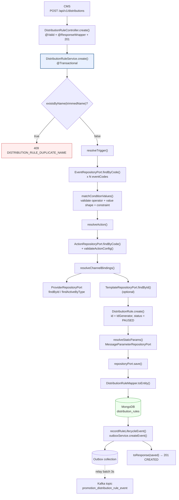
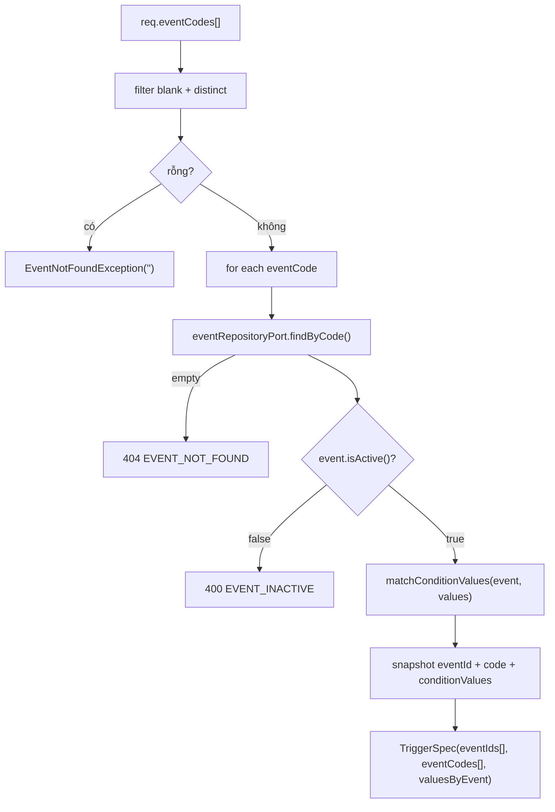
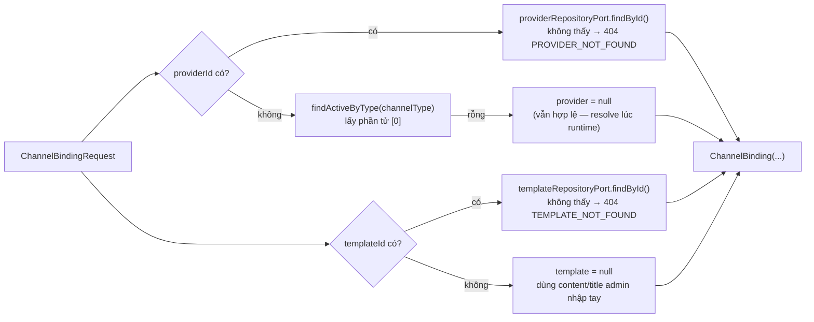
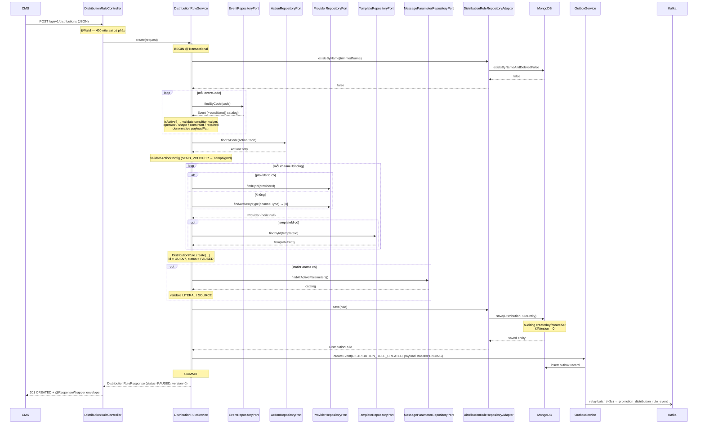

# Phân tích luồng API `create` — `DistributionRuleController`

> Trả lời cụ thể: **request đi qua những lớp nào, validate ở đâu, tra cứu catalog
> gì, ghi Mongo ra sao, phát event thế nào** — và những điểm đang có rủi ro.
>
> Module: `p2_promotion-distribution` · Ngày phân tích: 2026-09-19
> Endpoint: `POST ${spring.application.context-path}/api/v1/distributions`
> (context-path = `promotion/promotion-distribution`)

---

## 1. Tổng quan kiến trúc

Module theo **hexagonal architecture**. Luồng `create` đi xuyên đúng 4 lớp,
không nhảy tầng:

```
adapter/in/web  →  application/port/in  →  application/service  →  application/port/out  →  adapter/out/persistence
DistributionRuleController  DistributionRuleUseCase  DistributionRuleService  *RepositoryPort  *RepositoryAdapter → MongoDB
```

Điểm quan trọng nhất về thiết kế dữ liệu: từ **redesign v3**, `DistributionRule`
là **aggregate root** — `trigger`, `action`, `channelBindings[]`, `staticParams[]`
đều **embedded trong 1 document duy nhất**. Không còn các collection
`Trigger` / `DistributionConfig` / `ChannelConfig` riêng. Nhờ vậy hot-path Kafka
lúc dispatch chỉ cần **1 query** (`trigger.eventCodes`), không `$lookup`.

Hệ quả cho luồng `create`: service phải **denormalize (snapshot)** dữ liệu từ các
catalog (`events`, `actions`, `providers`, `templates`, `message_parameters`) vào
trong rule ngay tại thời điểm tạo.

---

## 2. Sơ đồ luồng tổng thể



---

## 3. Lớp 1 — Controller

**File:** `src/main/java/.../adapter/in/web/DistributionRuleController.java:124-128`

```java
@PostMapping
@ResponseStatus(HttpStatus.CREATED)
public DistributionRuleResponse create(@RequestBody @Valid CreateDistributionRuleRequest request) {
    log.info("Creating distribution rule: {}", request.name());
    return distributionRuleUseCase.create(request);
}
```

Controller **mỏng tuyệt đối** — không chứa logic nghiệp vụ, chỉ:

| Trách nhiệm | Cơ chế |
|---|---|
| Bind + deserialize JSON | `@RequestBody` (Jackson) |
| Validate cú pháp payload | `@Valid` (Jakarta Bean Validation) |
| HTTP status | `@ResponseStatus(HttpStatus.CREATED)` → **201** |
| Bọc response envelope | `@ResponseWrapper` ở class level |
| Ủy quyền | `distributionRuleUseCase.create(request)` |

`@ResponseWrapper` (promix-web starter) bọc body vào envelope chuẩn:

```json
{
  "status": 201,
  "code": "SUCCESS",
  "success": true,
  "message": "Operation completed successfully",
  "timestamp": "2026-09-19T03:12:43.709Z",
  "data": { "id": "...", "name": "...", "status": "PAUSED", "version": 0, ... }
}
```

> Lưu ý: test `DistributionRuleControllerTest` chạy `@WebMvcTest` nên wrapper không
> active — `jsonPath("$.id")` chứ không phải `$.data.id`. Runtime thật thì có `data`.

---

## 4. Lớp 2 — Validate cú pháp (Bean Validation)

**File:** `application/dto/distributionrule/CreateDistributionRuleRequest.java`

Payload phản ánh đúng **3 bước form CMS** (SRS 1.5.2.1):

```java
public record CreateDistributionRuleRequest(
        @NotBlank @Size(max = 255)      String name,
        @Size(max = 1000)               String description,
        @NotNull @Valid                 TriggerRequest trigger,      // Bước 1
        @NotNull @Valid                 ActionRequest action,        // Bước 2
        @NotEmpty @Valid                List<ChannelBindingRequest> channels,  // Bước 3
        @Valid                          List<StaticParamRequest> staticParams  // optional
) implements Serializable
```

Ràng buộc từng sub-DTO:

| DTO | Field | Constraint |
|---|---|---|
| `TriggerRequest` | `eventCodes` | `@NotEmpty` |
| | `conditionValuesByEvent` | `Map<eventCode, List<ConditionValueRequest>>`, `@Valid` |
| `ConditionValueRequest` | `fieldKey` | `@NotBlank` |
| | `operator` | `@NotNull` (`ConditionOperator` canonical) |
| | `value` | `JsonNode` — chấp nhận String/Number/Boolean/**Array** |
| `ActionRequest` | `actionCode` | `@NotBlank` |
| | `config` | `Map<String,Object>` tự do, schema phụ thuộc actionCode |
| `ChannelBindingRequest` | `channelType` | `@NotNull` (SMS / EMAIL / PUSH / IN_APP) |
| | `providerId`, `templateId` | **optional** — FE không cho chọn |
| | `content` / `title` / `iconUrl` / `deepLink` | `@Size` 1000 / 255 / 2048 / 2048 |
| `StaticParamRequest` | `key` | `@NotBlank`, `@Size(max=100)` |
| | `mode` | `@NotNull` (LITERAL / SOURCE) |

Vi phạm ở lớp này → **400** do `promix-error-spring-boot-starter` handle, chưa
vào tới service.

⚠️ `@Valid` trên `Map<String, List<ConditionValueRequest>>`: legacy cascading của
Bean Validation chỉ đi **một tầng container** — vào value của map (ở đây là
`List<...>`) rồi dừng, **không chui tiếp vào phần tử của list**. Muốn cascade thật
phải khai `Map<String, List<@Valid ConditionValueRequest>>`. Thực tế không hở, vì
service kiểm lại đầy đủ `fieldKey`/`operator`/value ở §5.2 — nhưng lỗi sẽ trả về
dưới dạng `EVENT_CONDITION_INVALID` thay vì lỗi validation field-level.

---

## 5. Lớp 3 — Service (trái tim của luồng)

**File:** `application/service/DistributionRuleService.java:149-176`

```java
@Override
public DistributionRuleResponse create(CreateDistributionRuleRequest request) {
    String trimmedName = request.name().trim();

    if (repositoryPort.existsByName(trimmedName)) {                 // (1)
        throw new DistributionRuleNameDuplicateException(trimmedName);
    }

    TriggerSpec trigger = resolveTrigger(request.trigger());        // (2)
    ActionSpec action = resolveAction(request.action());            // (3)
    List<ChannelBinding> channelBindings =
            resolveChannelBindings(request.channels());             // (4)

    DistributionRule rule = DistributionRule.create(                // (5)
            new DistributionRuleId(IdGenerator.generateId()),
            trimmedName,
            request.description() != null ? request.description().trim() : null,
            trigger, action, channelBindings);
    rule.setStaticParams(resolveStaticParams(request.staticParams())); // (6)

    DistributionRule saved = repositoryPort.save(rule);             // (7)
    recordRuleLifecycleEvent(saved, DistributionRuleEvent.Created.EVENT_TYPE); // (8)
    return toResponse(saved);                                       // (9)
}
```

Service mang `@Transactional` ở **class level** → `create` chạy trong transaction
(read-write). `findAll`/`findById`/`checkName` override thành `readOnly = true`.

### 5.1 — Bước (1): check trùng tên

```java
repositoryPort.existsByName(trimmedName)
   → mongoRepository.existsByNameAndDeletedFalse(name)
```

- So khớp **exact, phân biệt hoa/thường + phân biệt dấu**, toàn hệ thống.
- Chỉ tính các rule **chưa soft-delete**.
- Tên luôn được `trim()` trước khi so và trước khi lưu.
- Vi phạm → `DistributionRuleNameDuplicateException` (`ConflictException`,
  code `DISTRIBUTION_RULE_DUPLICATE_NAME`) → **409**.

> FE còn có endpoint check sớm `GET /api/v1/distributions/check-name` (onBlur ở
> Bước 1) dùng chung `existsByName` — nhưng đó chỉ là UX, check thật vẫn ở đây.

### 5.2 — Bước (2): `resolveTrigger()` — nặng nhất

**File:** `DistributionRuleService.java:462-494`



**1 rule có thể bắt nhiều event cùng lúc**, mỗi event có bộ condition riêng
(keyed theo `eventCode`).

#### `matchConditionValues()` — validate từng dòng điều kiện

**File:** `DistributionRuleService.java:517-550`

Với mỗi `ConditionValueRequest`, qua `toConditionValue()`:

| # | Kiểm tra | Lỗi ném ra |
|---|---|---|
| 1 | `fieldKey` phải có trong `event.conditions[]` (catalog) | `EVENT_CONDITION_INVALID` — *fieldKey is not declared in event catalog* |
| 2 | `operator != null` | *operator is required* |
| 3 | `operator ∈ def.allowedOperators` (nếu catalog khai báo) | *operator X is not allowed for this field* |
| 4 | **Value shape** khớp operator — ủy quyền `ConditionValueValidator` (platform) | message từ validator |
| 5 | **Constraint per-field** (min/max/regex/minLength…) — `ConditionConstraintValidator` | message từ validator |
| 6 | Không trùng cặp `fieldKey::operator` | *duplicate condition: field and operator '…' are already used* |
| 7 | Mọi field `required = true` phải có ít nhất 1 entry hợp lệ | *required condition value is missing* |

Quy tắc value-shape (theo `ConditionOperator.valueShape()`):

- `BETWEEN` → array 2 phần tử
- `IN` / `NOT_IN` → array không rỗng
- `EXISTS` / `NOT_EXISTS` / `IS_TRUE` / `IS_FALSE` → `ValueShape.NONE`, **không cần
  value**, và `value` được ghi `null` xuống rule
- còn lại → value khác null

Hàng có operator cần giá trị nhưng `value` blank → **bỏ qua im lặng** (FE gửi
hàng rỗng), rồi rơi vào check `required` ở bước 7 nếu field bắt buộc.

`JsonNode` được chuyển sang giá trị Java thuần bằng `toJavaValue()`:
số → `BigDecimal` (giữ độ chính xác), array → `List` đệ quy, còn lại → text.

#### Kết quả denormalize

```java
new ConditionValue(fieldKey, value, operator, def.payloadPath())
```

`payloadPath` **không do FE gửi** — BE lấy từ catalog. Đây chính là JSONPath mà
runtime engine dùng để rút giá trị khỏi Kafka payload lúc dispatch.

`TriggerSpec` cuối cùng chứa: `eventIds[]`, `eventCodes[]`,
`Map<eventCode, List<ConditionValue>>`.

**Cho phép nhiều entry cùng `fieldKey` với operator khác nhau** → runtime AND.

### 5.3 — Bước (3): `resolveAction()`

**File:** `DistributionRuleService.java:667-689`

```java
ActionEntity actionEntity = actionRepositoryPort.findByCode(req.actionCode())
        .orElseThrow(() -> new ActionNotFoundException(req.actionCode()));   // 404
Map<String, Object> config = req.config() != null ? new HashMap<>(req.config()) : new HashMap<>();
validateActionConfig(actionEntity.getCode(), config);
return new ActionSpec(actionEntity.getId(), actionEntity.getCode(), config);
```

`validateActionConfig` hiện chỉ có **một luật**: action `SEND_VOUCHER` (phát hành
mã code duy nhất từ chiến dịch) **bắt buộc** `config.campaignId` không rỗng,
thiếu → `ACTION_CONFIG_INVALID` (400).

Các action code khác (`SEND_NOTIFICATION`, …) **không validate config** — là chỗ
để mở rộng.

### 5.4 — Bước (4): `resolveChannelBindings()`

**File:** `DistributionRuleService.java:690-737`

Với mỗi `ChannelBindingRequest`:



Snapshot ghi vào rule: `providerId`, `providerName`, `templateId`, `templateCode`,
`content`, `title`, `iconUrl`, `deepLink`, `bindingParamLogic`.

Quan điểm thiết kế: **FE không chọn provider** — BE tự lấy provider active mặc
định theo `channelType`. Template optional; bỏ trống thì nội dung lấy từ
`content`/`title` admin gõ tay.

### 5.5 — Bước (5): tạo aggregate

**File:** `domain/model/DistributionRule.java:56-71`

```java
public static DistributionRule create(...) {
    DistributionRule rule = new DistributionRule();
    ...
    rule.status = DistributionRuleStatus.PAUSED;   // luôn luôn
    return rule;
}
```

- **ID sinh phía ứng dụng**: `IdGenerator.generateId()` (UUIDv7, promix-core) —
  không để Mongo sinh `ObjectId`. `DistributionRuleId` là value object, từ chối
  null/blank (`InvalidDistributionRuleIdException`).
- **Trạng thái khởi tạo luôn là `PAUSED`** (PROM-1303). Rule mới tạo **không
  tham gia dispatch sự kiện** cho tới khi admin bấm Kích hoạt
  (`PUT /{id}/activate`). Đây là ràng buộc nghiệp vụ nằm trong domain model,
  không nằm ở service — đúng chỗ.

### 5.6 — Bước (6): `resolveStaticParams()`

**File:** `DistributionRuleService.java:751-820`

Cấu hình tĩnh cho tham số động `{{key}}` ở phạm vi rule. Load toàn bộ catalog
`message_parameters` active **một lần** rồi map thành `Map<key, entity>`
(tránh N query).

Với mỗi entry:

| Kiểm tra | Lỗi |
|---|---|
| `key` không trùng trong request | `STATIC_PARAM_INVALID` — *duplicate static param for this key* |
| `key` phải có trong catalog `message_parameters` | *key is not declared in message_parameters catalog* |
| `mode != null` | *mode is required* |
| `mode = LITERAL` → `literalValue` không rỗng | *literalValue is required for LITERAL mode* |
| `mode = SOURCE` → `sourceType` + `sourceId` không rỗng | *sourceType/sourceId is required for SOURCE mode* |
| `mode = SOURCE` → catalog entry phải có `campaignField` | *key cannot be resolved from a campaign source (no campaignField)* |

Entry có `key` null/blank → bỏ qua (không ném lỗi).

### 5.7 — Bước (7): persist

**File:** `adapter/out/persistence/DistributionRuleRepositoryAdapter.java:75-83`

```java
DistributionRuleEntity entity = mapper.toEntity(distributionRule);
DistributionRuleEntity saved = mongoRepository.save(entity);
return mapper.toDomain(saved);
```

`DistributionRuleMapper.toEntity()` map domain → document, trong đó
`TriggerSpec`/`ActionSpec`/`ChannelBinding`/`StaticParamBinding` → các
`*Embedded` tương ứng.

Document `distribution_rules` (kế thừa `BaseDocument`):

```
_id            ← DistributionRuleId (UUIDv7, app-generated)
name           ← trimmed, unique (partial index, deleted=false)
description
status         ← PAUSED
trigger        { eventIds[], eventCodes[], conditionValuesByEvent{} }
action         { actionId, code, config{} }
channelBindings[] { channelType, providerId, providerName, templateId, templateCode,
                    content, title, iconUrl, deepLink, bindingParamLogic }
staticParams[]  { key, mode, literalValue, sourceType, sourceId, sourceName }
eventTriggerCount ← 0
createdAt / createdBy      ← @CreatedDate / @CreatedBy (auditing)
lastModifiedAt / lastModifiedBy
version        ← @Version, = 0 sau lần save đầu
deleted        ← false
```

Cơ chế hạ tầng tham gia ở bước này:

- **Auditing**: `@AuditedBy(SecurityContextAuditorSupplier.class)` — `createdBy`
  lấy user id từ JWT qua `SecurityContextUtil`, fallback `"system"` khi không có
  ngữ cảnh đăng nhập (Kafka consumer / batch / scheduler).
- **Optimistic locking**: `@Version Long version` — `create` set `version = 0`,
  các lần update sau mới dùng để so.
- **Field naming**: `promix.data.mongodb.field-naming-strategy=SnakeCaseFieldNamingStrategy`
  → field lưu dưới dạng snake_case trong Mongo.
- **JsonNode converter** (`infrastructure/config/MongoConfig.java`): giá trị
  condition (`JsonNode`) được lưu thành **chuỗi JSON**, không phải `Document`.
  Đây là fix cho bug cũ: điều kiện nhiều giá trị (array — vd nhiều segment id)
  từng ném `JsonConversionException` *"Cannot deserialize LinkedHashMap from Array"*.
- **Index** (mongock `DistributionRuleChangeLog`): `idx_name_deleted_unique` —
  unique partial index trên `name` với filter `deleted = false`.

### 5.8 — Bước (8): phát event qua Outbox

**File:** `DistributionRuleService.java:227-261`

Theo **Transactional Outbox Pattern** — ghi event vào outbox **cùng transaction**
với thao tác lưu rule, relay bất đồng bộ sang Kafka:

```java
DistributionRuleEvent event = new DistributionRuleEvent.Created(
        eventId,                      // IdGenerator UUIDv7
        "DISTRIBUTION_RULE",          // aggregate
        "DISTRIBUTION_RULE_CREATED",  // type
        "pp-distribution",            // source
        ruleId,                       // subject
        Instant.now(), 1,             // occurredAt, schema version
        withPayloadStatus(payload, "PENDING"),   // ⚠ xem ghi chú
        Map.of());

outboxService.createEvent("DISTRIBUTION_RULE", ruleId,
        "DISTRIBUTION_RULE_CREATED", event, "promotion_distribution_rule_event");
```

| Thuộc tính | Giá trị |
|---|---|
| Topic | `promotion_distribution_rule_event` |
| Envelope | `DistributionRuleEvent` — sealed interface + record, **JSON, KHÔNG Avro** |
| Polymorphic | `@JsonTypeInfo` theo field `type` → 1 consumer xử lý mọi loại event |
| Payload | `DistributionRuleEventPayload` — **snapshot TOÀN BỘ rule** (dựng lại từ `toResponse()`) |
| Relay | `promix.outbox.batch.enabled=true`, `interval-ms=3000` (batch ~3s) |
| Retry | max 3 lần, delay 1m → 1h, multiplier 2.0 |

⚠ **Chi tiết dễ sai**: payload của event `Created` bị **ép `status = "PENDING"`**
(hằng `OUTBOX_PAYLOAD_STATUS_PENDING`), trong khi rule thực tế trong DB là
`PAUSED` và **response trả về FE cũng là `PAUSED`**. Đây là yêu cầu nghiệp vụ
(PROM-1305/PROM-1344) cho hệ downstream, áp dụng cho cả `Created` và `Paused`.
Nếu debug lệch trạng thái giữa Kafka và Mongo — nguyên nhân nằm ở đây.

`DistributionRuleEvent` nằm ở module **`p2_schema-service`**
(`vn.viettel.vds.promotion.distribution.event`), dùng chung giữa producer và consumer.

### 5.9 — Bước (9): response

`toResponse(saved)` map từ entity đã save (nên có đủ `createdAt`, `createdBy`,
`version = 0`) sang `DistributionRuleResponse` gồm: `id`, `name`, `description`,
`trigger`, `action`, `channels[]`, `staticParams[]`, `status`, `version`,
`createdAt`, `createdBy`, `updatedAt`, `updatedBy`.

Không cần aggregation pipeline — document đã đầy đủ.

---

## 6. Sequence diagram



---

## 7. Bảng lỗi đầy đủ của endpoint

| HTTP | Error code | Nguồn ném | Nguyên nhân |
|---|---|---|---|
| 400 | (validation) | `@Valid` | name blank/quá 255, thiếu `trigger`/`action`, `channels` rỗng, `eventCodes` rỗng, `fieldKey` blank, `operator` null, `actionCode` blank, `channelType` null, vượt `@Size` |
| 400 | `EVENT_INACTIVE` | `resolveTrigger` | event đã bị deactivate |
| 400 | `EVENT_CONDITION_INVALID` | `matchConditionValues` | fieldKey không có trong catalog / operator không được phép / value shape sai / vi phạm constraint / trùng `fieldKey+operator` / thiếu condition `required` |
| 400 | `ACTION_CONFIG_INVALID` | `validateActionConfig` | `SEND_VOUCHER` thiếu `config.campaignId` |
| 400 | `STATIC_PARAM_INVALID` | `resolveStaticParams` | key trùng / key không có trong catalog / thiếu `mode` / LITERAL thiếu `literalValue` / SOURCE thiếu `sourceType`,`sourceId` / key không resolve được từ campaign |
| 404 | `EVENT_NOT_FOUND` | `resolveTrigger` | `eventCode` không có trong catalog **(và cả khi mọi eventCode đều blank — xem §8.2)** |
| 404 | `ACTION_NOT_FOUND` | `resolveAction` | `actionCode` không có trong catalog |
| 404 | `PROVIDER_NOT_FOUND` | `resolveProvider` | `providerId` gửi lên không tồn tại |
| 404 | `TEMPLATE_NOT_FOUND` | `resolveChannelBindings` | `templateId` gửi lên không tồn tại |
| 409 | `DISTRIBUTION_RULE_DUPLICATE_NAME` | `create` | tên đã tồn tại (chưa soft-delete) |

Mapping exception → HTTP status do `promix-error-spring-boot-starter` đảm nhiệm
thông qua các base class `BadRequestException` / `ResourceNotFoundException` /
`ConflictException`.

---

## 8. Nhận xét & rủi ro phát hiện được

### 8.1 — Race condition trùng tên trả về 500 thay vì 409

`existsByName()` rồi mới `save()` là **check-then-act không nguyên tử**. Hai
request tạo cùng tên đồng thời đều qua được bước (1). Lớp phòng thủ cuối là unique
partial index `idx_name_deleted_unique` — nhưng `create()` **không bắt**
`DuplicateKeyException`, nên request thua cuộc sẽ nhận **500** thay vì 409.

So sánh: `update()` **có** bắt `OptimisticLockingFailureException` và chuyển thành
`DistributionRuleVersionConflictException`. `create()` thiếu lớp bảo vệ tương đương.

> Đề xuất: bọc `repositoryPort.save(rule)` trong try/catch `DuplicateKeyException`
> → ném `DistributionRuleNameDuplicateException`.

### 8.2 — `EventNotFoundException("")` khi mọi `eventCode` đều blank

`DistributionRuleService.java:466-468`:

```java
if (reqEventCodes.isEmpty()) {
    throw new EventNotFoundException("");
}
```

`@NotEmpty` trên `eventCodes` chỉ chặn list rỗng/null — payload
`{"eventCodes": ["", "  "]}` lọt qua, bị filter sạch ở service, rồi trả **404 với
identifier rỗng**. Đúng nghĩa đây là lỗi input → nên là **400** với thông điệp rõ.

### 8.3 — Tính nguyên tử của Outbox phụ thuộc Mongo transaction

Toàn bộ `create` nằm trong `@Transactional`, nhưng MongoDB **chỉ hỗ trợ
transaction khi chạy replica set**. URI hiện tại
(`mongodb://100.69.193.127:27017/distribution`) là **standalone**, và
`mongock.transaction-enabled=false`.

Nếu deployment thật là standalone → `@Transactional` **không có hiệu lực thật sự**,
tức là save rule và ghi outbox **không nguyên tử**. Lỗi giữa hai thao tác sẽ để lại
rule đã tạo mà không có event `DISTRIBUTION_RULE_CREATED` — downstream mất đồng bộ
vĩnh viễn (không có cơ chế reconcile). Cần xác nhận môi trường staging/prod có
replica set.

### 8.4 — Provider mặc định lấy `active.get(0)` — phi tất định

`resolveProvider()` khi không có `providerId`:

```java
List<Provider> active = providerRepositoryPort.findActiveByType(req.channelType().name());
return active.isEmpty() ? null : active.get(0);
```

Không có tiêu chí sắp xếp (priority / displayOrder). Thứ tự Mongo trả về không
đảm bảo ổn định → hai rule tạo ở hai thời điểm có thể bind về hai provider khác
nhau mà admin không hề biết. Nên có field ưu tiên hoặc cờ `isDefault`.

### 8.5 — Snapshot catalog sẽ lệch theo thời gian

Thiết kế cố tình denormalize `providerName`, `templateCode`, `payloadPath`,
`operator` vào rule để hot-path chỉ 1 query. Đánh đổi: khi catalog đổi (đổi tên
provider, sửa `payloadPath` của condition), **rule cũ vẫn giữ giá trị cũ** cho tới
khi được update lại. Không thấy cơ chế backfill/migration cho tình huống này —
cần ý thức khi vận hành.

### 8.6 — `@Indexed(unique = true)` trên `name` xung đột khái niệm với partial index

`DistributionRuleEntity.name` khai `@Indexed(unique = true)` (không có partial
filter), trong khi mongock tạo `idx_name_deleted_unique` **có** filter
`deleted = false`. Hiện không gây lỗi vì Spring Data Mongo 3.0+ mặc định **tắt**
auto-index-creation và properties không bật lại. Nhưng nếu ai đó bật
`spring.data.mongodb.auto-index-creation=true`, index không-partial sẽ khiến
**không thể tạo lại rule trùng tên với một rule đã soft-delete** — sai nghiệp vụ.
Nên bỏ annotation này để nguồn sự thật duy nhất là mongock.

### 8.7 — Điểm làm tốt

- Controller mỏng đúng chuẩn, không rò logic nghiệp vụ lên adapter.
- Ràng buộc "rule mới luôn PAUSED" đặt trong domain model (`DistributionRule.create`),
  không phải trong service — đúng vị trí DDD.
- Validation điều kiện ủy quyền cho `ConditionValueValidator` /
  `ConditionConstraintValidator` của platform → **một nguồn sự thật duy nhất** về
  value-shape cho mọi module điều kiện PP.
- Outbox pattern thay vì publish Kafka trực tiếp trong service.
- Backstop chống trùng `fieldKey+operator` ở BE dù UI đã ẩn — phòng trường hợp
  nạp lại dữ liệu cũ.

---

## 9. Ví dụ payload

```jsonc
POST /promotion/promotion-distribution/api/v1/distributions
{
  "name": "Tặng voucher khi thanh toán đơn > 500k",
  "description": "Áp dụng cho khách hàng thân thiết",

  // Bước 1 — sự kiện kích hoạt
  "trigger": {
    "eventCodes": ["ORDER_PAID"],
    "conditionValuesByEvent": {
      "ORDER_PAID": [
        { "fieldKey": "orderAmount", "operator": "GREATER_THAN", "value": 500000 },
        { "fieldKey": "segmentId",   "operator": "IN",           "value": ["SEG_VIP", "SEG_GOLD"] }
      ]
    }
  },

  // Bước 2 — hành động
  "action": {
    "actionCode": "SEND_VOUCHER",
    "config": { "campaignId": "cmp-0001" }     // bắt buộc với SEND_VOUCHER
  },

  // Bước 3 — kênh phân phối (provider/template để BE tự resolve)
  "channels": [
    { "channelType": "SMS",  "content": "Chuc mung! Ban nhan duoc ma {{voucherCode}}" },
    { "channelType": "PUSH", "title": "Quà tặng", "content": "Bạn có mã {{voucherCode}}",
      "deepLink": "app://vouchers" }
  ],

  // Optional — cấu hình tĩnh tham số động
  "staticParams": [
    { "key": "campaignName", "mode": "SOURCE", "sourceType": "CAMPAIGN",
      "sourceId": "cmp-0001", "sourceName": "Khuyến mãi tháng 9" }
  ]
}
```

Response `201`:

```jsonc
{
  "status": 201, "code": "SUCCESS", "success": true,
  "data": {
    "id": "0192f3a1-...",            // UUIDv7 do app sinh
    "name": "Tặng voucher khi thanh toán đơn > 500k",
    "trigger": { "eventIds": ["..."], "eventCodes": ["ORDER_PAID"],
                 "conditionValuesByEvent": { "ORDER_PAID": [ /* + payloadPath denormalized */ ] } },
    "action":  { "actionId": "...", "code": "SEND_VOUCHER", "config": { "campaignId": "cmp-0001" } },
    "channels": [ /* + providerId, providerName đã resolve */ ],
    "staticParams": [ ... ],
    "status": "PAUSED",              // ⚠ luôn PAUSED — phải activate mới chạy
    "version": 0,
    "createdAt": "2026-09-19T03:12:43.709Z",
    "createdBy": "<userId từ JWT | system>"
  }
}
```

---

## 10. Bảng tra file nhanh

| Vai trò | File |
|---|---|
| Controller | `adapter/in/web/DistributionRuleController.java:124` |
| Inbound port | `application/port/in/DistributionRuleUseCase.java` |
| Request DTO | `application/dto/distributionrule/CreateDistributionRuleRequest.java` |
| Sub-DTO | `.../TriggerRequest.java`, `ActionRequest.java`, `ChannelBindingRequest.java`, `ConditionValueRequest.java`, `StaticParamRequest.java` |
| Service (create) | `application/service/DistributionRuleService.java:149` |
| resolveTrigger | `application/service/DistributionRuleService.java:462` |
| matchConditionValues | `application/service/DistributionRuleService.java:517` |
| resolveAction | `application/service/DistributionRuleService.java:667` |
| resolveChannelBindings | `application/service/DistributionRuleService.java:690` |
| resolveStaticParams | `application/service/DistributionRuleService.java:751` |
| Outbox event | `application/service/DistributionRuleService.java:227` |
| Domain model | `domain/model/DistributionRule.java:56` |
| Outbound port | `application/port/out/DistributionRuleRepositoryPort.java` |
| Repository adapter | `adapter/out/persistence/DistributionRuleRepositoryAdapter.java:75` |
| Mapper | `adapter/out/persistence/mapper/DistributionRuleMapper.java:30` |
| Entity | `adapter/out/persistence/entity/DistributionRuleEntity.java` |
| Base document (audit/version/soft-delete) | `adapter/out/persistence/entity/BaseDocument.java` |
| Mongo repository | `adapter/out/persistence/repository/DistributionRuleMongoRepository.java` |
| JsonNode converter | `infrastructure/config/MongoConfig.java` |
| Index (mongock) | `infrastructure/persistence/mongock/DistributionRuleChangeLog.java` |
| Event envelope | `p2_schema-service/.../distribution/event/DistributionRuleEvent.java` |
| Event payload | `p2_schema-service/.../distribution/event/DistributionRuleEventPayload.java` |
| Test controller | `src/test/java/.../adapter/in/web/DistributionRuleControllerTest.java` |
| Test service | `src/test/java/.../application/service/DistributionRuleServiceTest.java`, `DistributionRuleServiceConditionValidationTest.java` |
