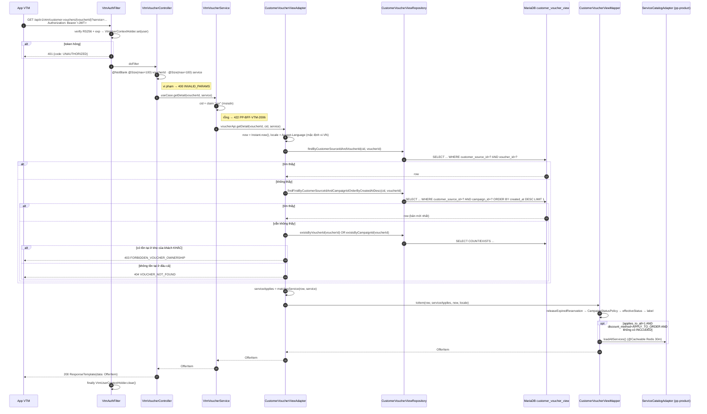
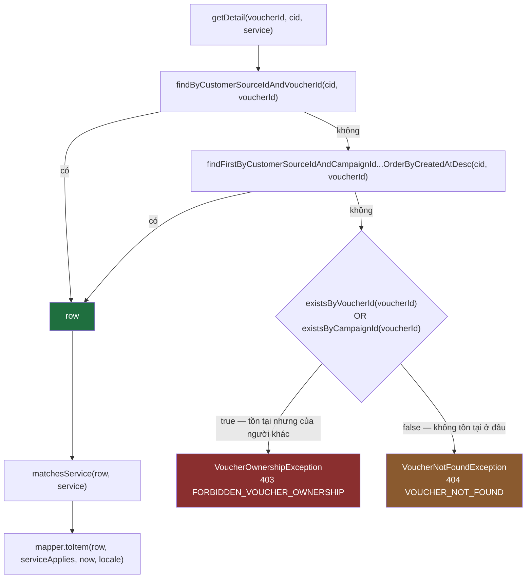

# API #12 — Get Customer Voucher Detail: luồng xử lý đầy đủ

> `GET /promotion/promotion-vtm-bff/api/v1/vtm/customer-vouchers/{voucherId}`
> Entry point: `VtmVoucherController.getDetail` (`adapter/in/web/VtmVoucherController.java:35`)
> Dựng theo **cấu hình trong `src/main/resources/application.properties`**.
> Tài liệu chị em: [`api-13-search-customer-vouchers-flow.md`](api-13-search-customer-vouchers-flow.md) — #12 và #13 dùng chung port, chung read model, chung mapper.

---

## 1. Tóm tắt một dòng

Request → `VtmAuthFilter` verify JWT RS256 lấy msisdn từ claim `usr` → `VtmVoucherService.getDetail` → port `VoucherApiClient` → **`CustomerVoucherViewAdapter`** tra **một hàng** của VIEW `customer_voucher_view` theo `(customer_source_id, voucher_id)`, không thấy thì fallback theo `campaign_id`, vẫn không thấy thì phân biệt **403 vs 404** → `CustomerVoucherViewMapper.toItem` → trả `OfferItem` bọc trong `ResponseTemplate`.

Khác biệt cốt lõi so với #13: **#12 không lọc bỏ voucher theo `service`** — voucher không áp dụng vẫn trả về, chỉ đổi nhãn và gắn `disabledReason`.

---

## 2. Hợp đồng đầu vào

| Tham số | Vị trí | Ràng buộc | Bắt buộc |
|---|---|---|---|
| `voucherId` | path | `@NotBlank @Size(max = 100)` | ✅ |
| `service` | query | `@Size(max = 100)` | — |

Lưu ý tên tham số: #12 dùng **`service`**, #13 dùng **`serviceCode`** — cùng ngữ nghĩa (`products.source_id` phía đối tác) nhưng khác tên trong hợp đồng.

`voucherId` nhận **hai loại giá trị**: `voucher_id` (mã coupon code) hoặc `campaign_id`. Lý do: danh sách #13 và ví #01 phơi `voucher.id` theo hai nguồn khác nhau tuỳ luồng, nên app có thể gọi chi tiết bằng chính giá trị nó nhận được (spec 12 §6.2.1).

---

## 3. Cấu hình quyết định luồng

| Khoá | Giá trị | Ảnh hưởng tới #12 |
|---|---|---|
| `spring.application.context-path` | `/promotion/promotion-vtm-bff` | Tiền tố URL |
| `bff.voucher.read-model.enabled` | `true` | **Chọn `CustomerVoucherViewAdapter`** (đọc MariaDB) |
| `bff.mock.enabled` | `false` | `VoucherApiAdapter` (Feign → pp-redemption) tạo bean nhưng bị `@Primary` che |
| `bff.vtm.auth.enabled` / `public-key` | `true` / RSA X.509 | Verify token, lấy msisdn |
| `bff.voucher.campaign-usable-statuses` | **không khai → `RUNNING`** | Campaign ngoài whitelist ép voucher về `EXPIRED` |
| `bff.eligible.expire-warning-days` | **không khai → `7`** | Không dùng trực tiếp ở #12 (chỉ có ở constructor adapter, phục vụ #13) |
| `bff.image.public-base-url` | `https://api24cdn.vtmoney.vn/promotion-campaign` | Dựng URL logo / banner / HDSD |
| `app.downstream.product.base-url` | `http://10.207.201.204:8083/uatmm` | `pp-product` cho nhánh `applies_to_all` |
| `app.downstream.redemption.base-url` + `context-path` | `http://uat-promotion-redemption-api-java:8080` + `/promotion/promotion-redemption` | Chỉ dùng ở **nhánh Feign dự phòng** |
| `spring.jpa.open-in-view` | `false` | Session đóng khi ra khỏi `@Transactional(readOnly = true)` |

---

## 4. Sơ đồ luồng chính



---

## 5. Cây quyết định tra cứu — nơi sinh ra 403 vs 404



Hai điểm đáng nhớ:

- **Không kiểm tra khách có tồn tại hay không.** `customer_voucher_view` là kho voucher, không phải danh bạ. Danh tính đã do `VtmAuthFilter` xác thực. Vì vậy không có nhánh `CUSTOMER_NOT_FOUND` ở #12.
- **`voucher_id` thắng `campaign_id`.** Nếu một giá trị vừa là `voucher_id` của hàng này vừa là `campaign_id` của hàng khác, lượt tra thứ nhất thắng (test `detail_voucherIdWins_whenBothLookupsWouldMatch`). Với nhánh `campaign_id`, một khách có thể giữ nhiều voucher cùng chiến dịch → lấy hàng `created_at` mới nhất.

Chi phí truy vấn: **1 câu** ở đường thành công phổ biến, **2 câu** khi phải fallback `campaign_id`, tối đa **4 câu** ở đường lỗi (2 lookup + 2 exists).

---

## 6. `matchesService` — nơi #12 rẽ khác #13

```java
if (service == null || service.isBlank()) return true;
String needle = "," + service.toLowerCase(ROOT) + ",";
if (containsCode(row.getExcludedServiceCodes(), needle)) return false;   // loại trừ thắng
return row.isAppliesToAll() || containsCode(row.getApplicableServiceCodes(), needle);
```

`containsCode` hạ chữ thường **cả hai vế** trước khi so.

Đối chiếu với mệnh đề SQL tương ứng ở #13:

```sql
AND ( applies_to_all = 1 OR applicable_service_codes LIKE CONCAT('%,', :svc, ',%') )
AND ( excluded_service_codes IS NULL OR excluded_service_codes NOT LIKE CONCAT('%,', :svc, ',%') )
```

Javadoc yêu cầu hai vế "khớp TỪNG VẾ, nếu không #12 và #13 sẽ nói khác nhau về cùng một voucher". Logic nghiệp vụ đúng là khớp, nhưng **cách xử hoa/thường khác nhau**: #12 hạ chữ thường tường minh trong Java, #13 phó mặc collation của MariaDB. Với collation `*_ci` mặc định thì hai bên cho cùng kết quả; đổi sang collation phân biệt hoa thường là hai API lệch nhau ngay.

**Hệ quả nghiệp vụ của `serviceApplies = false`** (chỉ #12 mới có):

| | #12 `getDetail` | #13 `search` |
|---|---|---|
| Voucher không áp dụng cho `service` | **Vẫn trả về 200** | **Bị loại khỏi `content[]`** |
| `voucher.displayStatusLabel` | `"Không áp dụng cho dịch vụ này"` | — |
| `metadata.usable` | `"false"` | luôn tính với `serviceApplies=true` |
| `metadata.disabledReason` | `"SERVICE_NOT_APPLICABLE"` | `null` / `REDEEMED` / `EXPIRED` |

Nói cách khác: `service` ở #12 là **tham số hiển thị**, ở #13 là **tham số lọc**.

---

## 7. Map row → `OfferItem` (dùng chung với #13)

`CustomerVoucherViewMapper.toItem(row, serviceApplies, now, locale)` — chi tiết đầy đủ ở §7 của tài liệu #13. Chuỗi tính trạng thái:

```
status thô (voucher_ownership.status)
  → VoucherUsability.releaseExpiredReservation(status, reserved_until, now)
        RESERVED đã quá reserved_until → ACTIVE   (phiên pp-redemption hết hạn im lặng, không phát event)
  → CampaignStatusPolicy.isDisabling(campaign_status)
        campaign_status ∉ {RUNNING} và không rỗng → ép EXPIRED
        NULL/rỗng KHÔNG bị chặn (hàng chưa nhận event trạng thái)
  → VoucherStatusLabelSupport.effectiveStatus(preStatus, expiration_date, now)
        ACTIVE/RESERVED/SUSPENDED + đã quá hạn → EXPIRED
        gom về đúng 3 giá trị hợp đồng: ACTIVE | REDEEMED | EXPIRED
  → fixedLabel(locale)  hoặc  notApplicableLabel(locale) nếu !serviceApplies
```

Riêng ở #12, `serviceApplies` có thể là `false` — đây là **điểm gọi duy nhất** trong repo truyền giá trị khác `true` cho mapper.

Các field dựng thêm:

| Field | Nguồn |
|---|---|
| `voucher.id` | `voucher_id` |
| `voucher.brand.logo[]` / `voucher.image` | `logo_url` / `banner_url` → `ImagePreviewUrlResolver` |
| `voucher.guideline` | `usage_guide_url` → `ImagePreviewUrlResolver` → `UsageGuideHtmlRenderer.toHtml` → thẻ `` (URL trỏ ảnh) hoặc `<a href>` (không phải ảnh); `null` → Jackson lược field |
| `voucher.discountType` | `2` nếu `discount_type` bắt đầu bằng `PERCENT`, ngược lại `1` |
| `voucher.discountValue` | `discount_percentage` (nếu %) hoặc `discount_value` |
| `voucher.minOrder` / `maxOrder` | `vr_min_order_value` / `vr_max_order_value` (từ `validation_rule`) |
| `voucher.remainingQty` | `max(0, max_total_uses − current_total_uses)`; `null` nếu `max_total_uses` rỗng |
| `voucher.unlimitedQty` | `max_total_uses == null` |
| `voucher.expiredTime` | `expiration_date` định dạng `yyyy-MM-dd'T'HH:mm:ss` tại `Asia/Ho_Chi_Minh` |
| `voucher.applicableProducts` | `applicable_products` (JSON), hoặc bung cả danh mục `pp-product` — xem dưới |
| `codes[0]` | `{phone: customer_source_id, codex: voucher_code, expiredAt: dd/MM/yyyy, pickedUpAt: dd/MM/yyyy HH:mm:ss}`; rỗng nếu không có `voucher_code` |
| `startDate` / `endDate` | `start_date` / `expiration_date`, ISO local |
| `expiredTimeNumber` | `ChronoUnit.DAYS.between(now, expiration_date)` — **có thể âm** |
| `priority` | `metadata.eligibilityScore` ép về `int`; `null` nếu không có |
| `isYourself` | cố định `1` (voucher của chính khách) |
| `metadata` | `campaign_metadata` ⊕ `voucher_metadata` (voucher ghi đè) + `usable` + `displayMode` + `disabledReason` |

Nhánh `pp-product` (`expandAllServices`) chỉ chạy khi **đủ ba vế**: `applies_to_all = 1` **và** `discount_method = APPLY_TO_ORDER` **và** không có item `INCLUDED` nào trong `applicable_products`. Không đủ ba vế thì trả đúng danh sách đã lưu (bỏ item `EXCLUDED`). Danh mục rỗng (pp-product lỗi) → lùi về hành vi cũ, không ném lỗi ra đường đọc.

---

## 8. Response

`@ResponseWrapper` bọc `OfferItem` vào `data`:

```jsonc
{
  "status": 200, "code": "...", "success": true, "message": "...", "timestamp": "...",
  "data": {
    "voucher": {
      "id": "0193...", 
      "brand": { "name": "...", "logo": ["https://api24cdn.vtmoney.vn/promotion-campaign/..."] },
      "image": "https://api24cdn.vtmoney.vn/promotion-campaign/...",
      "title": "...", "content": "...", "description": "...",
      "guideline": "",
      "discountType": 2, "discountValue": 10, "maxDiscount": 50000,
      "minOrder": 100000, "maxOrder": null,
      "remainingQty": 1, "usedQty": 0, "tags": [...],
      "expiredTime": "2026-10-01T23:59:59",
      "unlimitedQty": false,
      "status": "ACTIVE",                          // ACTIVE | REDEEMED | EXPIRED
      "displayStatusLabel": "Sử dụng",             // hoặc "Không áp dụng cho dịch vụ này"
      "applicableProducts": [ {"productId":"SRC-...","sku":"...","name":"...","image":"...","type":"INCLUDED","itemType":"SKU"} ]
    },
    "codes": [ { "phone": "849...", "codex": "ABC123", "expiredAt": "01/10/2026", "pickedUpAt": "12/09/2026 09:31:07" } ],
    "quantity": 1, "value": 10, "amount": 50000,
    "startDate": "2026-09-01T00:00:00", "endDate": "2026-10-01T23:59:59",
    "expiredTimeNumber": 14, "priority": null, "isYourself": 1,
    "metadata": { "usable": "true", "displayMode": null, "disabledReason": null }
  }
}
```

`OfferItem` là **cùng một khuôn** với mỗi phần tử `content[]` của #13 — chủ ý để app dùng lại một bộ model.

---

## 9. Bảng lỗi

| Tình huống | Nơi phát sinh | HTTP | `code` |
|---|---|---|---|
| Thiếu / sai tiền tố header `Authorization` | `VtmAuthFilter` | 401 | `UNAUTHORIZED` |
| Token sai chữ ký / hết hạn / sai định dạng | `VtmTokenVerifier` | 401 | `UNAUTHORIZED` |
| `voucherId` rỗng hoặc > 100 ký tự, `service` > 100 ký tự | `InvalidParamsExceptionHandler` | 400 | `INVALID_PARAMS` (+ `errors[]`) |
| Claim `usr` rỗng | `VtmVoucherService.resolveCustomerId` | 422 | `PP-BFF-VTM-2006` |
| Voucher tồn tại nhưng thuộc khách khác | `CustomerVoucherViewAdapter` | **403** | `FORBIDDEN_VOUCHER_OWNERSHIP` |
| Voucher không tồn tại ở bất kỳ khách nào | `CustomerVoucherViewAdapter` | **404** | `VOUCHER_NOT_FOUND` |
| *(chỉ nhánh Feign)* downstream 404 | `VoucherApiAdapter` | 404 | `VOUCHER_NOT_FOUND` |
| *(chỉ nhánh Feign)* downstream timeout | `DownstreamTimeoutExceptionHandler` | 504 | `PP-BFF-VTM-3002` |
| *(chỉ nhánh Feign)* downstream 5xx / không nối được | `PlatformExceptionHandler` | 502 | `PP-BFF-VTM-3001` |
| *(chỉ nhánh Feign)* circuit breaker mở | `CircuitBreakerExceptionHandler` | 502 | `PP-BFF-VTM-3001` |

Voucher **không áp dụng cho `service`** không phải lỗi — trả 200 kèm nhãn và `disabledReason` (xem §6).

---

## 10. Hai nhánh thay thế (không chạy với cấu hình hiện tại)

### `VoucherApiAdapter.getDetail` — khi `bff.voucher.read-model.enabled=false`

```java
@CircuitBreaker(name = "redemption")
@Retry(name = "redemption")
public OfferItem getDetail(String voucherId, String customerId, String service) {
    return voucherDetailFeign.getDetail(voucherId, customerId, service);   // pp-redemption
}
```

`GET {app.downstream.redemption.base-url}{context-path}/v1/customer-vouchers/{voucherId}?customerId=&service=` — tức **pass-through gần như thuần**: pp-redemption tự trả `OfferItem` đã dựng sẵn, BFF không map lại gì.

Ba điểm cần biết về nhánh này:

1. **Downstream khác hẳn #13.** `getDetail` gọi **pp-redemption**, còn `search` ở cùng adapter lại gọi **pp-customer** (`voucher_warehouse`). Hai API anh em đi hai service khác nhau ở nhánh dự phòng.
2. **`@CircuitBreaker` / `@Retry` là no-op.** Repo chỉ kéo `resilience4j-annotations`, thiếu `resilience4j-spring-boot3` (chứa aspect), nên block `resilience4j.circuitbreaker.instances.redemption.*` trong `application.properties` không được bind và annotation không có tác dụng. `CircuitBreakerExceptionHandler` vẫn hữu ích vì `CallNotPermittedException` còn đến từ `CircuitBreakerCache` của promix (tầng Redis).
3. **Không phân biệt 403/404.** Downstream trả 404 → `VoucherNotFoundException`; không có nhánh ownership. Đây là hành vi khác hẳn read model.

### `MockVoucherApiClient.getDetail` — khi `bff.mock.enabled=true`
Dựng một `OfferItem` tĩnh (`camp-mock-0001`, hết hạn sau 5 ngày), có xét `serviceApplies` theo danh sách dịch vụ mock. Dùng cho local dev.

---

## 11. Read model và module liên quan

Nguồn dữ liệu giống hệt #13 — VIEW `customer_voucher_view` join `voucher_ownership` ⋈ `campaign_offer` ⋈ `coupon_display` ⋈ `validation_rule`, nuôi bằng 6 Kafka projection. Xem §11 của tài liệu #13 cho sơ đồ đầy đủ.

Riêng #12 phụ thuộc thêm vài cột mà #13 không đụng tới: `vr_min_order_value` / `vr_max_order_value` (từ **pp-validation**), `discount_percentage` / `discount_label` (từ **pp-pricing-engine** qua `p2_promotion-discount`), `usage_guide_url` (từ **pp-coupon** qua `coupon_display`).

| Vai trò trong luồng #12 | Repo | Có sẵn |
|---|---|---|
| BFF, chủ thể của API | `p2_promotion-vtm-bff` | ✅ |
| `@ResponseWrapper`, `ResponseTemplate`, `PlatformExceptionHandler`, `BusinessRuleException`, `ExternalServiceException`, cache Redisson | `p2_promotion-promix-platform` | ✅ |
| Hợp đồng event | `p2_schema-service` | ✅ |
| `voucher_ownership` | `p2_promotion-customer` | ✅ |
| `coupon_display` (title, merchant, logo/banner, **usage_guide_url**) + trạng thái mã | `p2_promotion-coupon` | ✅ |
| `campaign_offer` (campaign_status, service codes, applies_to_all, discount_method) | `p2_promotion-campaign` | ✅ |
| `discount_*` của `campaign_offer` | `p2_promotion-discount` | ✅ |
| **`validation_rule`** → `minOrder`/`maxOrder` của #12 | `p2_promotion-validation` | ✅ |
| `ServiceCatalogPort` — bung `applicableProducts` | `p2_promotion-product` | ✅ |
| **Nhánh Feign dự phòng của #12** (`/v1/customer-vouchers/{id}`) | `p2_promotion-redemption` | ✅ |

Không thiếu repo nào. Thứ còn thiếu vẫn là cấu hình ngoài repo (`app.kafka.topics.customer-event`, định nghĩa VIEW thật trên môi trường, spec `12-get-customer-voucher-detail.md`) — chi tiết ở §12 của tài liệu #13.

---

## 12. Quan sát trong lúc đọc code

- **`#12` không lọc `group_type`.** `findByCustomerSourceIdAndVoucherId` và `findFirstByCustomerSourceIdAndCampaignId...` đều **không** ràng buộc `group_type = 'MY'`, trong khi `#13` ràng buộc cứng `GROUP_OWNED = "MY"` trong `base()`. Nếu read model có hàng `OTHER` (voucher khách có thể nhận nhưng chưa sở hữu) cho cùng `(customer_source_id, voucher_id)`, #12 sẽ trả hàng đó như voucher đã sở hữu — kèm `isYourself = 1` và `codes[]` dựng từ `voucher_code`. Hai API sẽ nói khác nhau về cùng một voucher.
- **Javadoc của port nói sai claim.** `VtmVoucherUseCase.getDetail` ghi "resolve từ claim `sub`", nhưng `VtmVoucherService.resolveCustomerId()` đọc `user.msisdn()` — tức claim **`usr`**. Javadoc của chính service đã ghi đúng và còn cảnh báo "`sub` là định danh phiên, KHÔNG dùng để tra voucher". Javadoc ở port là bản cũ chưa cập nhật.
- **`bff.image.preview-base-url` là cấu hình chết.** `application.properties` khai `bff.image.preview-base-url=https://api24cdn.vtmoney.vn/uatmm/promotion/promotion-vtm-bff/images`, nhưng không một class Java nào đọc khoá này — `ImagePreviewUrlResolver` chỉ dùng `bff.image.public-base-url`. Hệ quả kéo theo: `UsageGuideHtmlRenderer.pointsToImage` nhận diện ảnh theo hậu tố `/preview`, mà URL do resolver sinh ra **không bao giờ** có hậu tố đó — nên nhánh này chỉ còn dựa vào đuôi file trong object key. Object key không có đuôi ảnh (`.png`/`.jpg`/…) sẽ được bọc thành `<a href>` thay vì ``, tức app hiện một đường link thay vì tấm ảnh HDSD — đúng cái bug PROM-1419 định chữa.
- **`expiredTimeNumber` âm là hợp lệ ở #12.** Vì #12 không lọc theo hạn dùng, voucher đã hết hạn vẫn trả về với số ngày âm và `status = EXPIRED`. Client không được giả định giá trị này ≥ 0.
- **Xử hoa/thường của `service` không đồng nhất giữa #12 và #13** (xem §6) — hiện vô hại nhờ collation `*_ci` của MariaDB, nhưng là một phụ thuộc ngầm vào cấu hình DB.
