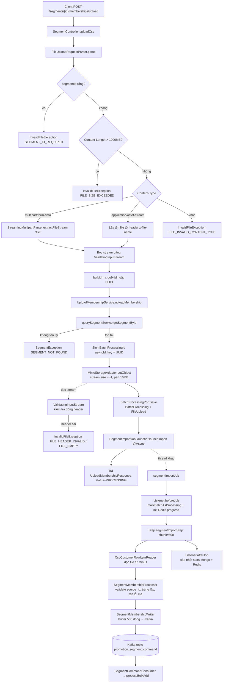
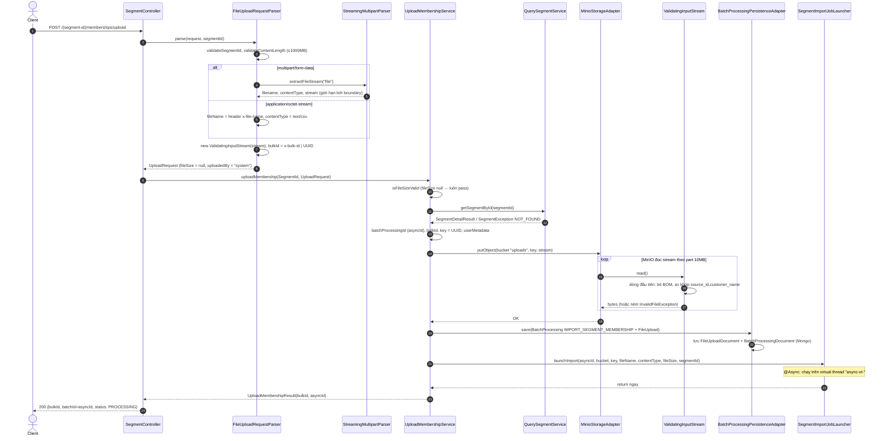
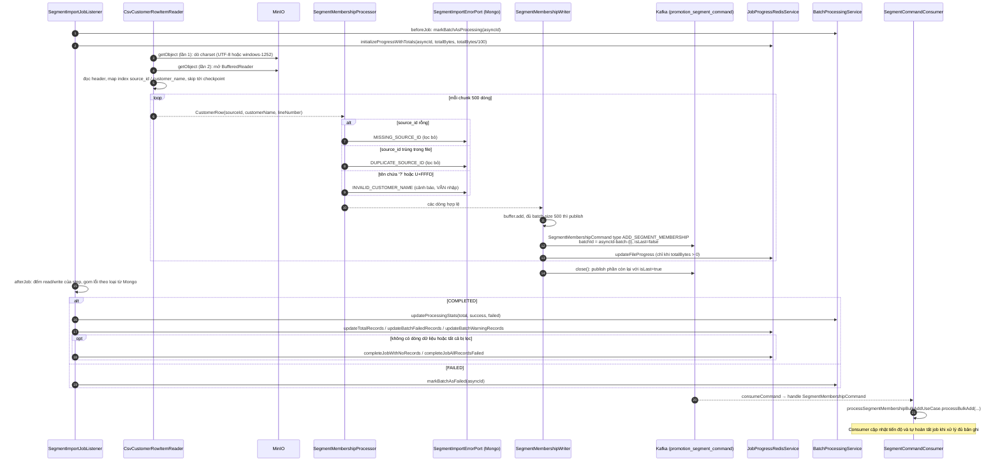
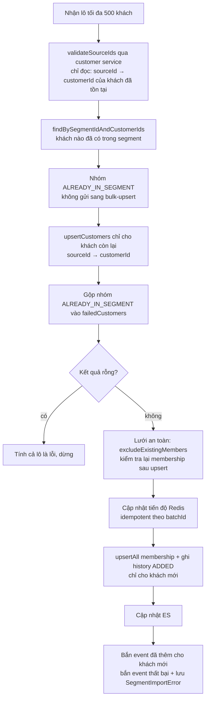

# Luồng chạy API `uploadCsv` (upload thành viên segment bằng CSV)

```
POST /promotion/promotion-segment/api/segments/{segment-id}/memberships/upload
```

Entry point: `SegmentController#uploadCsv` (`src/main/java/vn/viettel/vds/promotion/segment/adapter/in/web/SegmentController.java:156`)

API chia làm **2 pha**:

1. **Pha đồng bộ (trong HTTP request)**: parse request → stream file thẳng lên MinIO (vừa stream vừa validate header) → lưu bản ghi `BatchProcessing` → bắn job Spring Batch bất đồng bộ → trả `bulkId` + `batchId` với status `PROCESSING`.
2. **Pha bất đồng bộ (Spring Batch job `segmentImportJob`)**: đọc lại file từ MinIO → validate từng dòng → gom 500 dòng/lô → publish Kafka → `SegmentCommandConsumer` xử lý thêm thành viên vào segment.

---

## 1. Request đầu vào

| Thành phần | Giá trị |
|---|---|
| Path variable | `segment-id` |
| Content-Type hỗ trợ | `multipart/form-data` (field `file`) hoặc `application/octet-stream` |
| Header `x-file-name` | Bắt buộc khi dùng `application/octet-stream` |
| Header `x-bulk-id` | Tuỳ chọn; không có thì sinh UUID |
| Giới hạn kích thước | `Content-Length` ≤ 1000 MB (`FileUploadRequestParser.MAX_FILE_SIZE`) |
| Header CSV bắt buộc | `source_id,customer_name` (đúng thứ tự, không phân biệt hoa thường, cho phép BOM UTF-8) |

> Multipart của Spring bị tắt (`spring.servlet.multipart.enabled=false`) nên controller nhận `HttpServletRequest` thô và tự parse bằng `StreamingMultipartParser`: file không bị nạp hết vào RAM.

Response (`UploadMembershipResponse`):

```json
{
  "bulkId": "<x-bulk-id hoặc UUID>",
  "batchId": "<asyncId = BatchProcessingId>",
  "status": "PROCESSING",
  "message": "Upload initiated successfully. Use the batch ID to track progress."
}
```

---

## 2. Sơ đồ tổng quan



---

## 3. Sơ đồ tuần tự: pha đồng bộ



### Chi tiết từng bước

| # | Class / method | Việc làm |
|---|---|---|
| 1 | `SegmentController#uploadCsv` | Log, gọi parser → use case → `mapToResponse` |
| 2 | `FileUploadRequestParser#parse` | Validate `segmentId`, `Content-Length`; tách metadata theo Content-Type; bọc `ValidatingInputStream`; lấy/sinh `bulkId` |
| 3 | `StreamingMultipartParser#extractFileStream` | Lấy boundary từ Content-Type, bỏ qua các part khác, trả stream của part `file` qua `BoundaryLimitedInputStream` |
| 4 | `ValidatingInputStream` | Đọc từng byte tới hết dòng đầu, rồi kiểm tra: rỗng → `FILE_EMPTY`; số cột ≠ 2 hoặc tên cột sai → `FILE_HEADER_INVALID`. Sau đó chuyển sang đọc bulk. **Header vẫn được giữ trong file** |
| 5 | `UploadMembershipService#uploadMembership` | Kiểm tra segment tồn tại → upload MinIO → lưu `BatchProcessing` → launch job |
| 6 | `MinioStorageAdapter#putObject` | `minioClient.putObject` với size `-1` (streaming), part 10MB; unwrap `InvalidFileException` từ cause, lỗi khác → `ServiceUnavailableException` |
| 7 | `BatchProcessingPersistenceAdapter#save` | Lưu `FileUploadDocument` rồi `BatchProcessingDocument` (có `fileUploadId`) |
| 8 | `SegmentImportJobLauncher#launchImport` | `@Async`: build `JobParameters` (`asyncId, bucket, key, originalFileName, contentType, startAt, totalBytes, segmentId`) và `jobLauncher.run(segmentImportJob)` |

---

## 4. Sơ đồ tuần tự: pha bất đồng bộ (Spring Batch)

Cấu hình: `SegmentImportJobConfig`. Step `segmentImportStep`: `chunk(500)`, `faultTolerant`, `skip(Exception)` với `skipLimit = Integer.MAX_VALUE`, `retry(Exception)`.



### Payload Kafka

```
SegmentMembershipCommand {
  id, type: "ADD_SEGMENT_MEMBERSHIP", source: "/segment-batch-job",
  subject: segmentId, occurredAt, version: 1,
  payload: SegmentMembershipCommandPayload {
    segmentId, asyncId, batchId: "{asyncId}-batch-{index}",
    batchIndex, totalBatches (ước lượng), isLast,
    customers: [ { sourceId, customerName, lineNumber } ]  // tối đa 500
  }
}
```

Key của message là `segmentId`, nên mọi lô của cùng segment vào cùng partition.

### Xử lý một lô ở consumer (`ProcessSegmentMembershipBulkAddService#processBulkAdd`)



- Khách đã là thành viên của segment bị tính là **lỗi** và lưu `SegmentImportError` với `errorType = ALREADY_IN_SEGMENT`, message "Khách hàng đã tồn tại trong segment". Họ không được ghi membership/history, không cập nhật ES và không có trong event "đã thêm".
- Việc kiểm tra chạy **trước** `bulk-upsert`. Lý do: `bulk-upsert` của `p2_promotion-customer` luôn ghi đè tên và phát `CustomerUpdatedEvent` cho mọi khách đã tồn tại, nên khách đã có trong segment không được gửi sang đó.
- `validateSourceIds` không có circuit breaker và khi lỗi thì trả về "không tìm thấy ai". Vì vậy sau upsert vẫn có bước kiểm tra lại (`excludeExistingMembers`) làm lưới an toàn. Nếu cả hai lần kiểm tra đều lỗi thì lô được xử lý như trước khi có tính năng này (log `ALREADY_IN_SEGMENT_CHECK_FAILED` / `EXISTING_MEMBER_CHECK_FAILED`).

---

## 5. Nơi lưu dữ liệu

| Hệ thống | Dữ liệu | Ghi ở |
|---|---|---|
| MinIO bucket `uploads` (`promotion.segment.upload.bucket`, mặc định) | File CSV gốc, key = UUID, userMetadata: `filename, bulk-id, batch-id, segment-id, uploaded-by` | `MinioStorageAdapter#putObject` |
| Mongo `BatchProcessingDocument` + `FileUploadDocument` | Trạng thái lô, thống kê total/success/failed | `BatchProcessingPersistenceAdapter#save`, `BatchProcessingService` |
| Mongo `SegmentImportError` | Lỗi/cảnh báo theo dòng | `SegmentMembershipProcessor#saveError`, `ProcessSegmentMembershipBulkAddService#saveImportErrorsDirectly` |
| Redis | Tiến độ job (bytes, records, failed, warning) | `JobProgressRedisService` |
| Kafka `promotion_segment_command` | Lô 500 khách hàng | `SegmentEventProducer` |
| Spring Batch metadata | JobExecution/StepExecution, checkpoint `lineNumber`, `bytesRead` | `JobRepository` |

---

## 6. Các mã lỗi trả về ở pha đồng bộ

| Điều kiện | Exception / ErrorCode |
|---|---|
| `segment-id` rỗng | `InvalidFileException` `SEGMENT_ID_REQUIRED` |
| `Content-Length` > 1000MB | `InvalidFileException` `FILE_SIZE_EXCEEDED` |
| Content-Type không hỗ trợ / thiếu boundary | `InvalidFileException` `FILE_INVALID_CONTENT_TYPE` |
| Multipart không có field `file` | `InvalidFileException` `FILE_NOT_FOUND` |
| octet-stream thiếu `x-file-name` | `InvalidFileException` `FILE_NAME_REQUIRED` |
| Segment không tồn tại | `SegmentException` `SEGMENT_NOT_FOUND` |
| Header CSV rỗng / sai | `InvalidFileException` `FILE_EMPTY` / `FILE_HEADER_INVALID` → **bị bọc thành `PersistenceException`** (xem mục 7.2) |
| Lỗi MinIO / Mongo | `PersistenceException` |

---

## 7. Điểm cần lưu ý (phát hiện khi đọc code)

Các điểm dưới đây đều đọc ra từ code, chưa chạy thử để xác nhận.

1. **`totalBytes` luôn bằng 0 ở endpoint streaming.** Parser đặt `fileSize = null` → launcher gán `totalBytes = 0`. Hệ quả: `SegmentMembershipWriter` không bao giờ gọi `updateFileProgress` (điều kiện `totalBytes > 0`), `totalBatches` trong payload là `null`, listener không ước lượng được `estimatedTotalRecords`. Check `isFileSizeValid` trong service cũng luôn pass; chỉ còn check `Content-Length` ở parser.
2. **Lỗi header CSV có thể bị trả sai mã HTTP.** `MinioStorageAdapter` cố tình ném lại `InvalidFileException`, nhưng `UploadMembershipService` có `catch (Exception e)` bọc toàn bộ thành `PersistenceException`. Client có thể nhận lỗi 5xx thay vì 400 `FILE_HEADER_INVALID`. Cần kiểm tra global exception handler (nằm ở thư viện `com.promix.platform`, không có trong repo này).
3. **Header không có ký tự xuống dòng thì không được validate lúc upload.** `ValidatingInputStream` chỉ kiểm tra khi gặp `\n` (hoặc `\r` rồi một ký tự khác). File chỉ có một dòng, hoặc kết thúc bằng `\r` rồi EOF, sẽ upload thành công với `PROCESSING`; lỗi chỉ lộ ra khi job fail ở `CsvCustomerRowItemReader#open`.
4. **Lỗi launch job không về tới service.** `launchImport` là `@Async` nên `JobLaunchException` nằm trên thread khác; `BatchProcessing` khi đó giữ nguyên trạng thái ban đầu, không bị đánh dấu FAILED.
5. **`SegmentMembershipProcessor` là singleton có state.** Bean không có `@StepScope` (writer thì có), nhưng giữ `processedSourceIds`, `asyncId`, `segmentId`. Khi 2 file chạy song song: dòng của file này có thể bị báo `DUPLICATE_SOURCE_ID` do file kia, lỗi lưu Mongo có thể mang nhầm `asyncId`, và `beforeStep` của job sau xoá set của job đang chạy. Ngoài ra processor đọc job param `batchId` nhưng launcher không truyền, nên `batchId` trong `SegmentImportError` luôn `null`.
6. **Có thể không có message nào `isLast=true`.** `isLastBatch` chỉ được bật trong `close()` khi buffer còn dữ liệu. Nếu số dòng hợp lệ chia hết cho 500, lô cuối được publish trong `write()` với `isLast=false`. `SegmentCommandConsumer` chỉ gọi `completeJobWithCounts` khi nhận được `isLast=true`, nên trong trường hợp này job không bao giờ được chốt.
7. **Publish Kafka kiểu fire-and-forget.** `SegmentEventProducer` gửi async và chỉ log lỗi trong `whenComplete`; `try/catch` ở writer không bắt được lỗi gửi thật sự. Lô gửi lỗi bị mất mà job vẫn COMPLETED.
8. **Buffer của writer nằm ngoài transaction chunk.** Tối đa 499 dòng đã được tính "written" nhưng chưa publish; nếu job chết rồi restart từ checkpoint thì các dòng này bị mất.
9. **Upload MinIO chạy trước khi lưu `BatchProcessing`.** Nếu lưu Mongo lỗi, file trên MinIO bị mồ côi.
10. **Upload có thể ghi đè tên khách bằng tên rỗng hoặc hỏng** (chưa xử lý, để sau). `BulkUpsertCustomerService` bên `p2_promotion-customer` gọi `updateName(...)` vô điều kiện cho khách đã tồn tại và phát `CustomerUpdatedEvent` kể cả khi tên không đổi. Phía segment gửi `""` khi cột `customer_name` trống và vẫn nhập các dòng tên lỗi bảng mã (`?`, `U+FFFD`). Hệ quả: một file lưu sai bảng mã hoặc bỏ trống cột tên sẽ thay tên tiếng Việt đúng của khách đã tồn tại bằng tên hỏng hoặc rỗng. Cách sửa gốc: bên customer bỏ qua tên rỗng và không cập nhật/không sinh event khi tên không đổi.
11. Chi tiết nhỏ:
    - `segmentTaskExecutor` được inject vào step nhưng không gắn `.taskExecutor(...)`, nên step chạy đơn luồng.
    - `ObjectUploadRequest.partSize` / `fileSize` bị adapter bỏ qua (hard-code 10MB, `-1`).
    - Comment `MAX_FILE_SIZE` trong service ghi 100MB nhưng giá trị thực là 1000MB.
    - `uploadedBy` luôn là `"system"`.
    - `segment.kafka.topics.segment-membership` và `segment-command` cùng trỏ về `promotion_segment_command`.

---

## 8. File liên quan

| Layer | File |
|---|---|
| Web adapter | `adapter/in/web/SegmentController.java`, `FileUploadRequestParser.java`, `StreamingMultipartParser.java`, `ValidatingInputStream.java` |
| Use case | `application/port/in/usecase/membership/UploadMembershipUsecase.java`, `application/service/membership/UploadMembershipService.java` |
| Storage | `adapter/out/storage/MinioStorageAdapter.java` |
| Persistence | `adapter/out/persistence/BatchProcessingPersistenceAdapter.java` |
| Batch | `application/batch/SegmentImportJobLauncher.java`, `SegmentImportJobConfig.java`, `SegmentImportJobListener.java`, `io/CsvCustomerRowItemReader.java`, `io/SegmentFileItemReaderFactory.java`, `process/SegmentMembershipProcessor.java`, `write/SegmentMembershipWriter.java` |
| Messaging | `adapter/out/messaging/SegmentEventProducer.java`, `adapter/in/message/SegmentCommandConsumer.java` |
| Config | `adapter/config/AsyncConfig.java`, `src/main/resources/application.properties` |

(Đường dẫn tương đối từ `src/main/java/vn/viettel/vds/promotion/segment/`.)
