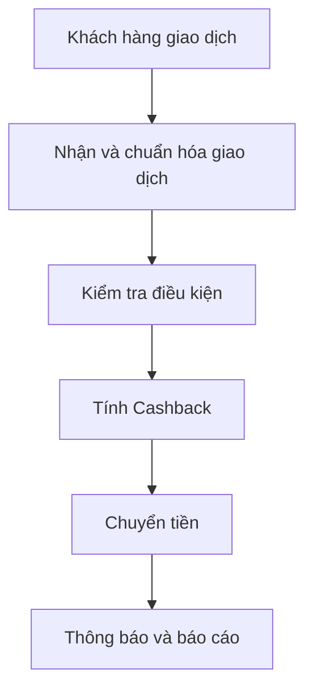
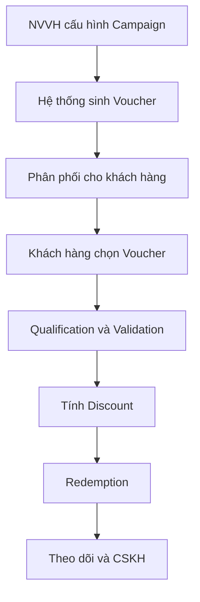

# Tổng quan nghiệp vụ Promotion Management Platform

## 1. Sản phẩm giải quyết bài toán gì?

Promotion Management Platform (PMP/PRM) là nền tảng quản lý khuyến mại tập trung. Nền tảng cho phép doanh nghiệp:

- Tạo và vận hành nhiều loại chương trình ưu đãi.
- Nhắm chọn khách hàng theo Segment, hành vi và dữ liệu giao dịch.
- Cấu hình điều kiện áp dụng và công thức tính ưu đãi.
- Phân phối ưu đãi qua nhiều kênh.
- Xác thực và áp dụng ưu đãi theo thời gian thực.
- Quản lý ngân sách, hạn mức, lịch sử sử dụng và đối soát.
- Theo dõi hiệu quả chiến dịch và xử lý khiếu nại.

Mục tiêu dài hạn là giảm logic khuyến mại bị cài cứng tại từng hệ thống nghiệp vụ, đồng thời cho phép đội vận hành tự cấu hình chiến dịch nhanh hơn.

## 2. Phạm vi Phase 1

Phase 1 là MVP phục vụ thị trường Tanzania, trọng tâm gồm:

- Quản lý tập khách hàng (Segment).
- Quản lý chiến dịch hoàn tiền (Cashback Campaign).
- Cấu hình điều kiện nhận Cashback.
- Cấu hình công thức tính Cashback.
- Tiếp nhận giao dịch từ Transaction Manager.
- Kiểm tra điều kiện, tính tiền và chuyển Cashback.
- Gửi thông báo kết quả cho khách hàng.

Luồng giá trị chính:

## 3. Phạm vi Phase 2

Phase 2 mở rộng năng lực Coupon/Voucher cho VDS:

- Campaign Discount Coupon.
- Voucher/Coupon Code.
- Category và mức ưu tiên.
- Metadata mở rộng.
- Validation Rule.
- Stacking Rule.
- Distribution Rule.
- Redemption và Rollback.
- Tích hợp App Viettel Money.
- Tra cứu voucher cho CSKH.

Luồng giá trị chính:

## 4. Giá trị đối với từng nhóm

| Nhóm | Giá trị nhận được |
|---|---|
| Marketing/CRM | Tự cấu hình và điều chỉnh chương trình ưu đãi |
| Nhân viên vận hành | Quản lý lifecycle, phân phối, ngân sách và lỗi |
| Khách hàng | Nhận và sử dụng ưu đãi phù hợp |
| CSKH | Tra cứu voucher, lịch sử sử dụng và lý do lỗi |
| Quản lý/BI | Báo cáo hiệu quả, tỷ lệ phân phối và sử dụng |
| Hệ thống thanh toán | Dùng một nền tảng chung để kiểm tra và áp dụng ưu đãi |

## 5. Các năng lực nghiệp vụ lõi

1. Quản lý khách hàng và phân khúc.
2. Thiết kế và vận hành chiến dịch.
3. Quản lý Voucher.
4. Kiểm tra điều kiện áp dụng.
5. Tính giá trị ưu đãi.
6. Kiểm soát cộng dồn nhiều ưu đãi.
7. Phân phối ưu đãi.
8. Đổi thưởng và hoàn tác.
9. Quản lý ngân sách/hạn mức.
10. Audit, báo cáo và hỗ trợ khiếu nại.

## 6. Ranh giới cần ghi nhớ

- Campaign định nghĩa chương trình và chính sách tổng thể.
- Voucher là quyền lợi/mã cụ thể được sinh từ Campaign.
- Validation quyết định voucher có áp dụng được trong ngữ cảnh hiện tại không.
- Formula tính ra giá trị ưu đãi.
- Stacking quyết định nhiều voucher có được dùng cùng nhau không.
- Distribution đưa voucher đến khách hàng.
- Redemption chốt việc sử dụng voucher vào một giao dịch.

