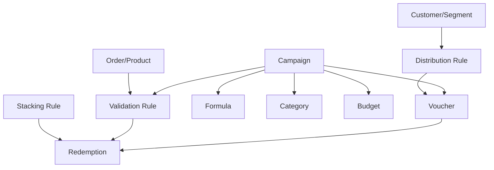

# Thuật ngữ và đối tượng nghiệp vụ

## 1. Glossary

| Thuật ngữ | Ý nghĩa nghiệp vụ |
|---|---|
| Promotion Platform/PMP/PRM | Nền tảng quản lý khuyến mại tập trung |
| Campaign | Chương trình khuyến mại, định nghĩa loại hình, thời gian, ngân sách và chính sách |
| Cashback Campaign | Chiến dịch hoàn tiền sau khi giao dịch thỏa điều kiện |
| Coupon Campaign | Chiến dịch sinh và quản lý mã giảm giá |
| Voucher/Coupon Code | Mã/quyền lợi cụ thể được sinh từ Campaign |
| Bulk Codes | Nhiều mã duy nhất, thường mỗi khách hàng nhận một mã riêng |
| Generic Code | Một mã chung có thể được nhiều khách hàng sử dụng |
| Segment | Nhóm khách hàng được phân loại theo thuộc tính hoặc hành vi |
| Category | Phân loại Campaign; hierarchy dùng xác định ưu tiên khi cộng dồn |
| Metadata | Trường dữ liệu mở rộng key-value cho Campaign, Voucher, Customer, Product, Order... |
| Validation Rule | Bộ điều kiện xác định ưu đãi có hợp lệ hay không |
| Formula Builder | Công cụ định nghĩa công thức tính Cashback/Discount |
| Stacking Rule | Quy tắc kết hợp nhiều ưu đãi trong cùng giao dịch |
| Distribution Rule | Quy tắc tự động phân phối ưu đãi theo event/action/channel |
| Publication | Gán/xuất bản voucher cho một khách hàng cụ thể |
| Qualification | Kiểm tra sơ bộ voucher phù hợp với khách hàng/giao dịch |
| Validation | Kiểm tra đầy đủ điều kiện ngay trước khi áp dụng |
| Hold | Tạm giữ voucher để tránh bị sử dụng đồng thời trong lúc chờ Redemption |
| Redemption | Ghi nhận và chốt việc sử dụng ưu đãi vào giao dịch |
| Rollback | Hoàn tác những thay đổi đã thực hiện khi Redemption lỗi |
| Budget | Ngân sách của Campaign |
| Redemption Limit | Giới hạn số lần sử dụng theo voucher/khách hàng/thời gian |
| NVVH | Nhân viên vận hành |
| CEP | Nền tảng tương tác khách hàng, có thể phát/gán ưu đãi |
| DMP | Nền tảng dữ liệu, cung cấp Customer/Segment/Event/Transaction |

## 2. Quan hệ giữa các đối tượng chính

## 3. Ý nghĩa từng object

### Campaign

Là đơn vị điều phối cao nhất. Campaign trả lời:

- Chương trình áp dụng từ khi nào đến khi nào?
- Khách hàng nào được hưởng?
- Ưu đãi có giá trị bao nhiêu?
- Ngân sách và giới hạn là gì?
- Sinh mã kiểu Bulk hay Generic?
- Rule và Formula nào được áp dụng?

### Voucher

Voucher là mã/quyền lợi cụ thể của Campaign. Cần phân biệt ba chiều trạng thái:

1. Hoạt động: active/inactive theo lifecycle Campaign.
2. Gán: đã/ chưa được publish cho khách hàng.
3. Sử dụng: chưa dùng, thành công, thất bại hoặc được hoàn tác.

### Validation Rule

Rule có thể kiểm tra:

- Customer/Segment.
- Sản phẩm hoặc dịch vụ.
- Giá và số lượng.
- Ngân sách.
- Số lần Redemption.
- Customer Metadata.
- Thời gian và ngữ cảnh giao dịch.

### Stacking Rule

Điều khiển cách dùng nhiều voucher:

- ALL: tất cả voucher phải hợp lệ, một mã lỗi có thể làm cả yêu cầu thất bại.
- PARTIAL: bỏ qua voucher không hợp lệ, vẫn áp dụng các voucher hợp lệ.
- Xác định thứ tự theo Category Hierarchy hoặc thứ tự request.
- Giới hạn tổng số voucher, số voucher theo Category và voucher độc quyền.

### Redemption

Là bằng chứng nghiệp vụ rằng ưu đãi đã được áp dụng vào giao dịch. Redemption cần liên kết được:

- Voucher.
- Customer.
- Transaction/Order.
- Giá trị giảm.
- Kết quả và lý do lỗi.
- Lịch sử rollback nếu có.

