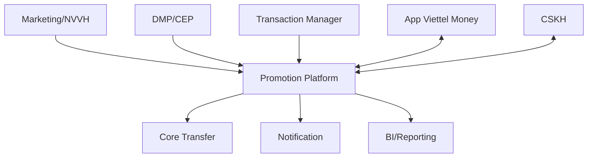

# Actor và hệ thống liên quan

## 1. Actor con người

| Actor | Trách nhiệm chính | Luồng tham gia |
|---|---|---|
| Nhân viên vận hành (NVVH) | Tạo/cập nhật Campaign, Rule, Category, Metadata; kích hoạt/tạm dừng | Campaign, Distribution, Rule |
| Marketing/CRM | Thiết kế chương trình, đối tượng và nội dung ưu đãi | Campaign, Segment, Distribution |
| Khách hàng cuối | Nhận, xem, chọn và sử dụng ưu đãi | Mobile, Validation, Redemption |
| CSKH Front Office | Tra cứu voucher, trạng thái và lý do lỗi | CSKH Lookup |
| CSKH Back Office | Xem audit, trích xuất báo cáo và xử lý case phức tạp | CSKH/Audit |
| Cán bộ quản lý/Lãnh đạo | Xem báo cáo và hiệu quả chương trình | Reporting |
| BI/Data Analyst | Phân tích event, tỷ lệ phân phối/sử dụng | Tracking/Reporting |
| Operation/Finance | Theo dõi ngân sách, đối soát và xử lý thủ công | Budget/Reconciliation |

## 2. Hệ thống bên ngoài

| Hệ thống | Cung cấp cho Promotion | Nhận từ Promotion |
|---|---|---|
| Transaction Manager - Tanzania | Sự kiện giao dịch | Kết quả/trace liên quan Cashback |
| Core Transfer - Tanzania | Kết quả chuyển tiền | Yêu cầu chuyển Cashback |
| DMP | Customer, Segment, Event, Transaction | Có thể nhận trạng thái/xử lý tùy tích hợp |
| CEP | Sự kiện tương tác, yêu cầu phát ưu đãi | Voucher/thông tin phân phối |
| App Viettel Money | Customer, Order, yêu cầu Qualification/Validation/Redemption | Danh sách voucher, giá trị giảm, kết quả |
| Dịch vụ thanh toán | Trạng thái thanh toán | Giá trị giảm và voucher đã chọn |
| Notification System | Kết quả gửi SMS/Push/Email | Yêu cầu gửi thông báo |
| CSKH CMS | Số điện thoại và yêu cầu tra cứu | Voucher, trạng thái, lỗi và audit trail |
| BI/Event Tracking | - | Event hành vi trên app và dữ liệu báo cáo |

## 3. Bản đồ tương tác nghiệp vụ

## 4. Source of truth cần xác nhận

| Dữ liệu | Source of truth dự kiến | Điểm cần xác nhận |
|---|---|---|
| Customer Profile | DMP/hệ thống khách hàng | Promotion lưu bản sao hay chỉ tham chiếu? |
| Segment Membership | DMP hoặc Segment Service | Cơ chế và độ trễ đồng bộ? |
| Order/Transaction | Transaction Manager/App thanh toán | ID nào dùng đối soát xuyên hệ thống? |
| Campaign/Rule/Voucher | Promotion Platform | Có hệ thống nào được phép cập nhật ngoài CMS? |
| Trạng thái thanh toán | Dịch vụ thanh toán | Khi nào Promotion được phép chốt Redemption? |
| Trạng thái chuyển Cashback | Core Transfer | Cơ chế retry/đối soát khi timeout? |
| Ngân sách | Promotion hoặc hệ thống tài chính | Budget reserve/confirm có cần đối soát ngoài? |

