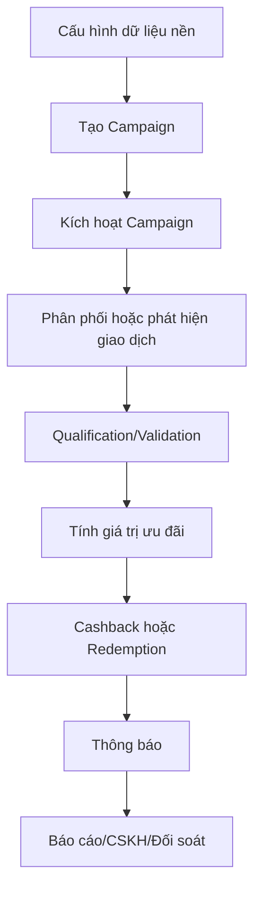
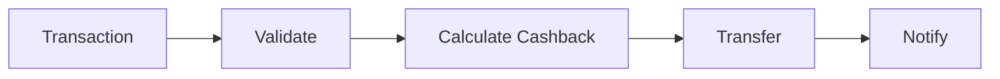
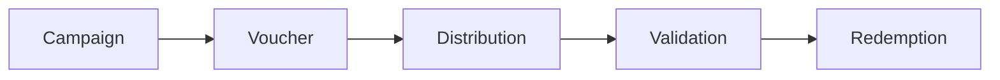

# Bản đồ các luồng nghiệp vụ chính

## 1. Danh sách luồng

| ID | Luồng nghiệp vụ | Phase | Actor khởi tạo | Kết quả | Ưu tiên học |
|---|---|---|---|---|---|
| F01 | Quản lý Segment/Customer/Product | 1 | NVVH/DMP | Có dữ liệu đầu vào cho Rule | P1 |
| F02 | Cấu hình Cashback Campaign | 1 | NVVH | Campaign và rule sẵn sàng chạy | P0 |
| F03 | Xử lý Cashback từ giao dịch | 1 | Transaction Manager | Khách hàng nhận tiền hoàn | P0 |
| F04 | Gửi thông báo kết quả Cashback | 1 | Hệ thống | Khách hàng nhận thông báo | P1 |
| F05 | Tạo Coupon Campaign | 2 | NVVH | Campaign và voucher được khởi tạo | P0 |
| F06 | Kích hoạt/tạm dừng/kết thúc Campaign | 2 | Hệ thống/NVVH | Campaign vận hành đúng hiệu lực | P0 |
| F07 | Quản lý Voucher/Coupon Code | 2 | Hệ thống/NVVH | Mã sẵn sàng phân phối/sử dụng | P1 |
| F08 | Phân phối ưu đãi tự động | 2 | Event | Voucher/thông điệp đến đúng khách hàng | P1 |
| F09 | Qualification/Validation | 2 | App | Biết voucher nào áp dụng được | P0 |
| F10 | Tính Discount và Stacking | 2 | Hệ thống | Giá trị giảm cuối cùng | P0 |
| F11 | Hold Voucher | 2 | Hệ thống | Tránh sử dụng đồng thời | P1 |
| F12 | Redemption | 2 | App/Hệ thống | Chốt sử dụng voucher | P0 |
| F13 | Rollback Redemption | 2 | Hệ thống/Operation | Hoàn tác thay đổi khi lỗi | P0 |
| F14 | Hiển thị và chọn ưu đãi trên app | 2 | Khách hàng | Voucher được chọn cho giao dịch | P1 |
| F15 | Tra cứu và xử lý khiếu nại | 2 | CSKH | Xác định trạng thái và lý do lỗi | P1 |
| F16 | Báo cáo, thống kê, audit | 1/2 | NVVH/Quản lý | Theo dõi hiệu quả và truy vết | P2 |

## 2. Bản đồ end-to-end

## 3. Hai nhánh nghiệp vụ lớn

### Cashback

Đặc điểm: trigger từ giao dịch; kết quả là tiền được chuyển về tài khoản khách hàng.

### Coupon/Voucher

Đặc điểm: voucher được tạo/phân phối trước, sau đó được khách hàng chọn và áp dụng vào giao dịch.

## 4. Cách trace một task

Với mỗi task, trả lời theo thứ tự:

1. Task thuộc flow ID nào?
2. Actor nào kích hoạt?
3. Business object nào thay đổi?
4. Rule nào quyết định kết quả?
5. Trạng thái trước/sau là gì?
6. Nếu lỗi thì rollback hoặc xử lý thủ công thế nào?
7. Khách hàng/NVVH/CSKH nhìn thấy kết quả gì?

