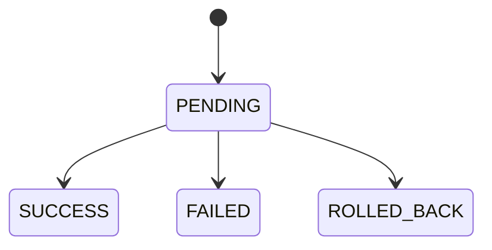

# Vòng đời và trạng thái nghiệp vụ

## 1. Coupon Campaign

### Luồng chuyển trạng thái chính theo SRS

| Trạng thái hiện tại | Trigger | Trạng thái tiếp theo |
|---|---|---|
| Bắt đầu | NVVH tạo Campaign | INITIALIZING |
| INITIALIZING | Khởi tạo thành công | ACTIVE - Chưa chạy |
| INITIALIZING | Khởi tạo thất bại | ERROR |
| ACTIVE | Đến ngày bắt đầu | RUNNING |
| ACTIVE | Hết ngày hiệu lực | EXPIRED |
| RUNNING | NVVH tắt | DISABLED |
| DISABLED | NVVH bật khi còn hiệu lực | RUNNING |
| RUNNING/DISABLED | Hết ngày hiệu lực | EXPIRED |
| ACTIVE/ERROR/DISABLED/EXPIRED | NVVH chỉnh sửa | INITIALIZING/UPDATING tùy mô tả |
| ACTIVE/ERROR/DISABLED/EXPIRED | NVVH xóa | DELETED qua tiến trình DELETING |

### Thao tác theo trạng thái

| Trạng thái | Thao tác chính |
|---|---|
| INITIALIZING | Xem chi tiết |
| ACTIVE | Xem, sửa, xóa |
| RUNNING | Xem, tắt |
| DISABLED | Xem, bật, sửa, xóa |
| EXPIRED | Xem; tài liệu có chỗ cho sửa/xóa cần xác nhận |
| ERROR | Xem lỗi, sửa, xóa |
| UPDATING/DELETING | Chủ yếu xem tiến trình |

## 2. Voucher/Coupon Code

Tài liệu SRS mô tả trạng thái hoạt động của Voucher phụ thuộc trạng thái Campaign:

| Campaign | Voucher |
|---|---|
| INITIALIZING/ERROR/ACTIVE | INACTIVE |
| RUNNING | ACTIVE |
| DISABLED/EXPIRED | INACTIVE |

Tuy nhiên nghiệp vụ Voucher còn các chiều trạng thái khác:

- Publication/Assignment: chưa gán hoặc đã gán khách hàng.
- Usage/Redemption: chưa sử dụng, đã sử dụng, thất bại hoặc rollback.
- Hold: đang được tạm giữ trong lúc chờ Redemption.

Không nên gom tất cả vào một trường "status" khi trao đổi nghiệp vụ.

## 3. Distribution Rule

| Trạng thái | Hành động | Trạng thái tiếp theo |
|---|---|---|
| Chưa có | Tạo Rule | PAUSED |
| PAUSED | Kích hoạt | ACTIVE |
| ACTIVE | Tắt | PAUSED |
| PAUSED | Xóa | DELETED |

Rule chỉ bắt đầu lắng nghe event khi ACTIVE.

## 4. Redemption

Tài liệu quy hoạch DDD mô tả:

Cần làm rõ thêm:

- Có trạng thái PROCESSING/PARTIAL/ROLLBACK_PENDING không?
- Enum thành công chính thức là SUCCESS hay SUCCEEDED?
- Khi manual repair, trạng thái được cập nhật thế nào?
- Parent và child Redemption có thể khác trạng thái không?

## 5. Cashback

Tài liệu tổng quan mô tả luồng nhưng chưa cho ma trận trạng thái đầy đủ. Bộ trạng thái cần hỏi BA/Dev ít nhất phải thể hiện:

- Đã nhận giao dịch.
- Đang kiểm tra điều kiện.
- Không đủ điều kiện.
- Đang tính tiền.
- Đang chuyển tiền.
- Chuyển thành công.
- Chuyển thất bại/chờ retry.
- Cần đối soát/manual handling.

## 6. Điểm chưa thống nhất

Phần DDD dùng lifecycle đơn giản `DRAFT -> ACTIVE -> PAUSED -> COMPLETED`, trong khi SRS chi tiết dùng `INITIALIZING`, `ACTIVE`, `RUNNING`, `DISABLED`, `EXPIRED`, `ERROR`, `UPDATING`, `DELETING`, `DELETED`.

Khuyến nghị khi làm việc:

1. Dùng SRS/module chi tiết để xác định hành vi thực tế.
2. Dùng DDD để hiểu khái niệm, không dùng enum ở đó làm kết luận triển khai.
3. Tạo một state dictionary được BA, Dev và Test cùng xác nhận.
