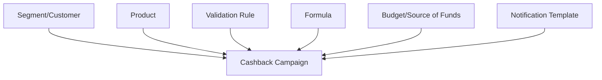

# Phase 1 - Cấu hình nền cho Cashback

## Mục tiêu

Chuẩn bị đầy đủ dữ liệu và rule để một giao dịch có thể được đánh giá và hoàn tiền tự động.

## Actor

- Nhân viên vận hành/Marketing.
- Hệ thống DMP hoặc hệ thống nguồn dữ liệu.
- BA/Operation xác nhận rule và công thức.

## Các bước chính

| Bước | Nội dung | Kết quả nghiệp vụ |
|---:|---|---|
| 1 | Cấu hình Segment | Xác định nhóm khách hàng mục tiêu |
| 2 | Đồng bộ Customer | Có hồ sơ khách hàng và mapping với source ID |
| 3 | Cấu hình Product/Product Collection | Có sản phẩm/dịch vụ dùng trong điều kiện |
| 4 | Cấu hình template thông báo | Sẵn nội dung SMS/Email/Push/Webhook |
| 5 | Tạo Cashback Campaign | Có chương trình, thời gian, ngân sách và nguồn tiền |
| 6 | Tạo Validation Rule | Có bộ điều kiện đủ điều kiện nhận Cashback |
| 7 | Tạo Formula | Có công thức tính số tiền hoàn |
| 8 | Gán Segment/Rule/Formula vào Campaign | Campaign đủ cấu hình để chạy |

## Sơ đồ

## Business rule cần hiểu

- Segment được tạo bằng upload file hay đồng bộ từ hệ thống ngoài?
- Customer được nhận diện bằng customerId, MSISDN hay sourceId?
- Rule dùng AND/OR thế nào?
- Điều kiện có thể dựa trên transaction type, amount, product, customer metadata hay time window nào?
- Formula là số tiền cố định, phần trăm hay có min/max?
- Budget áp dụng toàn Campaign hay còn hạn mức ngày/tháng/khách hàng?
- Source of Funds nào được dùng để trả tiền?
- Khi Campaign đang chạy, cấu hình nào được phép sửa?

## Ngoại lệ

- Upload Segment sai định dạng hoặc trùng khách hàng.
- Customer chưa được đồng bộ khi transaction đến.
- Product code từ transaction không mapping được.
- Rule/Formula chưa publish hoặc chưa được gán.
- Campaign chưa đến hiệu lực, hết hạn hoặc không đủ ngân sách.
- Template thiếu tham số khi gửi thông báo.

## Đầu ra cần kiểm tra

- Campaign có trạng thái cho phép xử lý giao dịch.
- Rule và Formula được gán đúng.
- Segment/Customer/Product tham chiếu tồn tại.
- Budget và Source of Funds hợp lệ.
- Có thể dùng một transaction mẫu để mô phỏng kết quả.

## Câu hỏi cần xác nhận

1. Quy trình phê duyệt trước khi Campaign được chạy là gì?
2. Rule/Formula có versioning không, version nào áp dụng cho transaction đang xử lý?
3. Khi sửa Segment trong lúc Campaign chạy, hiệu lực áp dụng từ thời điểm nào?
4. Budget được reserve ở bước nào?

