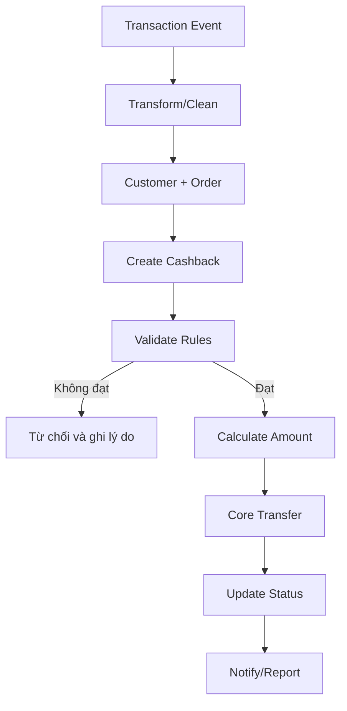

# Phase 1 - Xử lý Cashback từ giao dịch

## Mục tiêu

Tự động nhận giao dịch từ Transaction Manager, xác định khách hàng đủ điều kiện, tính số tiền hoàn, chuyển tiền và thông báo kết quả.

## Trigger

Transaction Manager phát sự kiện giao dịch.

## Happy path

| Bước | Nghiệp vụ | Kết quả |
|---:|---|---|
| 1 | Nhận transaction event | Có sự kiện giao dịch đầu vào |
| 2 | Transform và chuẩn hóa | Dữ liệu theo format Promotion |
| 3 | Làm sạch, loại trùng, kiểm tra dữ liệu bắt buộc | Event hợp lệ |
| 4 | Bóc tách event và route | Các phần dữ liệu đến đúng luồng xử lý |
| 5 | Upsert Customer và tạo Order | Có Customer/Order để trace |
| 6 | Khởi tạo giao dịch Cashback | Có tiến trình hoàn tiền |
| 7 | Validation Rule đánh giá điều kiện | Xác định eligible/ineligible |
| 8 | Formula tính Cashback | Có số tiền cần hoàn |
| 9 | Core Transfer chuyển tiền | Tiền được ghi nhận cho khách hàng |
| 10 | Cập nhật trạng thái và gửi thông báo | Hoàn tất, có audit/notification |

## Business rule trọng yếu

- Idempotency: một transaction chỉ được hoàn tiền một lần.
- Eligibility: phải thỏa Campaign, Segment, Product, thời gian, ngân sách và các Validation Rule.
- Calculation: số tiền hoàn phải tuân thủ Formula và các min/max limit.
- Budget: không được trả vượt ngân sách/hạn mức.
- Traceability: phải liên kết transactionId, orderId, customerId và cashbackId.
- Kết quả chuyển tiền là nguồn quyết định trạng thái cuối của Cashback.

## Nhánh lỗi cần hiểu

| Tình huống | Kết quả nghiệp vụ mong đợi |
|---|---|
| Event trùng | Bỏ qua hoặc trả lại kết quả cũ, không hoàn lần hai |
| Thiếu Customer/Product | Retry, bổ sung dữ liệu hoặc từ chối có lý do |
| Không thỏa rule | Không tạo lệnh chuyển tiền, lưu lý do rõ ràng |
| Hết ngân sách | Từ chối/đưa chờ theo chính sách đã thống nhất |
| Core Transfer timeout | Không được mặc định coi là thất bại; cần query/reconcile |
| Core Transfer thất bại | Cập nhật trạng thái lỗi và áp dụng retry/manual policy |
| Notification thất bại | Không làm thay đổi kết quả chuyển Cashback |

## Điểm kiểm tra khi debug nghiệp vụ

1. Transaction có đến và có bị trùng không?
2. Customer/Order có được tạo đúng không?
3. Campaign nào được match?
4. Rule nào pass/fail và dữ liệu dùng để đánh giá là gì?
5. Formula/version nào tính ra amount?
6. Budget trước/sau xử lý là bao nhiêu?
7. Core Transfer trả kết quả gì?
8. Trạng thái Cashback cuối cùng và thông báo gửi khách hàng là gì?

## Cần xác nhận thêm

- Ma trận trạng thái Cashback đầy đủ và trigger chuyển trạng thái.
- Retry policy, thời gian chờ và quy trình đối soát Core Transfer.
- Cách xử lý reversal/refund giao dịch gốc.
- Cách xử lý khi transaction đến trước dữ liệu Customer/Segment.

