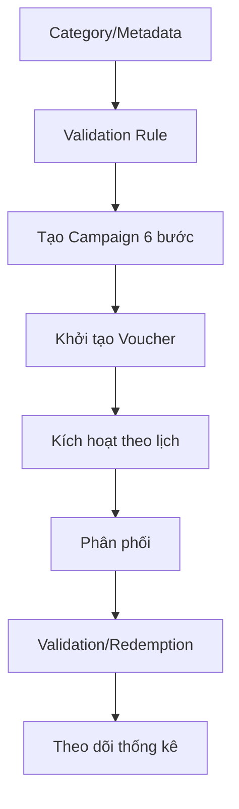
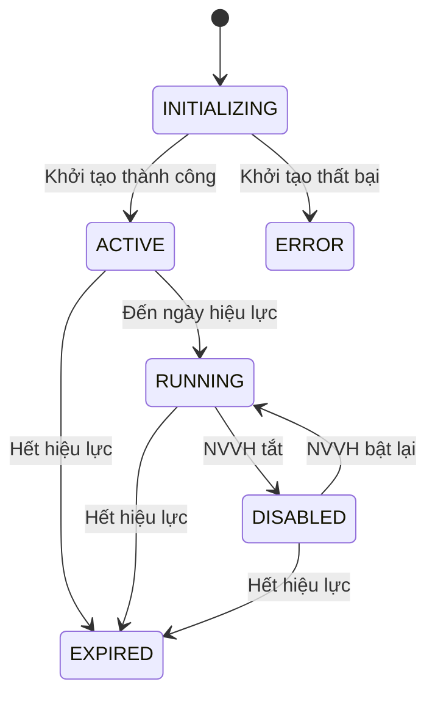

# Phase 2 - Tạo và vận hành Coupon Campaign

## Mục tiêu

Tạo một chiến dịch mã giảm giá hoàn chỉnh, sinh voucher, kích hoạt đúng thời gian và sẵn sàng phân phối/đổi thưởng.

## Actor

- Nhân viên vận hành/Marketing cấu hình.
- Hệ thống tự sinh mã và tự chuyển trạng thái theo thời gian.

## Luồng cấu hình tổng thể

| Bước | Bắt buộc | Nội dung |
|---:|:---:|---|
| 1 | Không | Tạo Category và hierarchy ưu tiên |
| 2 | Không | Tạo Metadata cho Campaign/Voucher/Customer/Product/Order |
| 3 | Không | Tạo Validation Rule và điều kiện |
| 4 | Có | Tạo Campaign theo wizard 6 bước |
| 5 | Có | Kích hoạt Campaign theo lịch hoặc bật lại thủ công |
| 6 | Không | Bổ sung/xem/xuất Voucher |
| 7 | Không | Tạo Distribution Rule để tự động phân phối |
| 8 | Có khi sử dụng | Qualification, Validation và Redemption |
| 9 | Không | Theo dõi lịch sử phân phối, sử dụng và thống kê |

## Wizard tạo Campaign - 6 bước

1. Thông tin Campaign: tên, mô tả, Category.
2. Thời gian: ngày bắt đầu/kết thúc và thời hạn Voucher.
3. Giá trị giảm: loại, phương thức, điều kiện và Formula.
4. Thông tin mã: Standalone/Bulk, charset và pattern.
5. Thuộc tính: giới hạn và Metadata.
6. Tổng kết và xác nhận.

## Lifecycle Campaign chi tiết

Ngoài các trạng thái trên, tài liệu còn nhắc đến UPDATING, DELETING và DELETED trong các thao tác cập nhật/xóa.

## Business rule quan trọng

- Ngày bắt đầu phải nhỏ hơn ngày kết thúc.
- Voucher chỉ được dùng khi Campaign đang RUNNING.
- Category hierarchy có thể quyết định thứ tự cộng dồn.
- Metadata có thể tham gia vào Rule, tìm kiếm và ngữ cảnh Redemption.
- Campaign phải có đủ Discount Config, thời gian, giới hạn và cấu hình mã.
- Bulk Code tạo nhiều mã duy nhất; Generic Code là một mã dùng chung.
- Chỉ một số trạng thái cho phép chỉnh sửa hoặc xóa.
- Xóa Campaign có thể cho phép tái sử dụng mã; cần xác nhận phạm vi và điều kiện.

## Ngoại lệ

- Sinh mã thất bại khiến Campaign vào ERROR.
- Campaign hết hiệu lực trước khi được kích hoạt.
- Mã bị trùng pattern/code.
- Số lượng mã vượt budget hoặc giới hạn.
- Sửa Campaign khi đang RUNNING.
- Xóa Campaign đã có Voucher được publish/redeem.
- Bật lại Campaign khi đã hết thời gian hiệu lực.

## Kết quả đầu ra

- Campaign có trạng thái rõ ràng.
- Voucher được sinh đúng loại và số lượng.
- Rule/Formula/Category/Metadata được gán đúng.
- Có thể phân phối và đổi thưởng trong thời gian hiệu lực.
- Có lịch sử thao tác và thống kê.

