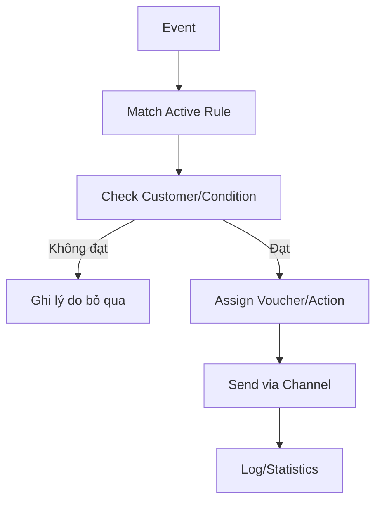
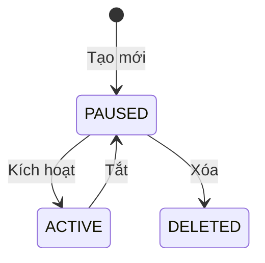

# Phase 2 - Phân phối ưu đãi tự động

## Mục tiêu

Khi một sự kiện nghiệp vụ xảy ra, hệ thống tự xác định khách hàng phù hợp và gửi Voucher/thông điệp qua kênh đã cấu hình.

## Cấu trúc Distribution Rule

```text
Trigger + Condition + Action + Channel + Content
```

Ví dụ:

> Khi khách hàng mới được tạo, nếu thuộc Segment A thì gán Voucher X và gửi Push Notification.

## Happy path

| Bước | Actor | Nội dung |
|---:|---|---|
| 1 | NVVH | Tạo Distribution Rule theo wizard 4 bước |
| 2 | NVVH | Kích hoạt Rule: PAUSED -> ACTIVE |
| 3 | Hệ thống | Nhận event từ DMP/App/hệ thống nội bộ |
| 4 | Hệ thống | Match trigger và kiểm tra điều kiện phân phối |
| 5 | Hệ thống | Thực thi action: gửi Voucher/Notification/cộng điểm |
| 6 | Hệ thống | Ghi log và cập nhật thống kê |

## Wizard tạo Rule

1. Chọn sự kiện: Customer Created, Order Completed, Birthday hoặc Custom Event.
2. Chọn hành động: Send Voucher, Send Notification hoặc Add Points.
3. Chọn kênh: SMS, Push hoặc Voucher.
4. Tổng kết và xác nhận.



## Lifecycle Rule



## Business rule trọng yếu

- Rule PAUSED không được lắng nghe hoặc xử lý event.
- Một event có thể match nhiều Rule; cần biết có thực thi tất cả hay có priority.
- Khách hàng phải đủ điều kiện và có định danh hợp lệ.
- Voucher phải còn tồn tại, có thể publish và không vượt số lượng/ngân sách.
- Cần idempotency để một event không phân phối trùng.
- Kết quả gán Voucher và kết quả gửi Notification là hai kết quả nghiệp vụ khác nhau.

## Ngoại lệ

- Event trùng hoặc đến sai thứ tự.
- Rule bị tắt giữa lúc đang xử lý.
- Không còn Voucher để phân phối.
- Voucher được gán thành công nhưng Notification thất bại.
- Notification thành công nhưng ghi log/thống kê thất bại.
- Customer chuyển Segment sau khi event được phát.
- Một khách hàng nhận quá số lần cho phép.

## Chỉ số nên theo dõi

- Số event nhận được và số event match.
- Số khách hàng đủ/không đủ điều kiện.
- Số Voucher gán thành công/thất bại.
- Tỷ lệ gửi theo từng channel.
- Số trường hợp bị duplicate hoặc hết inventory.

