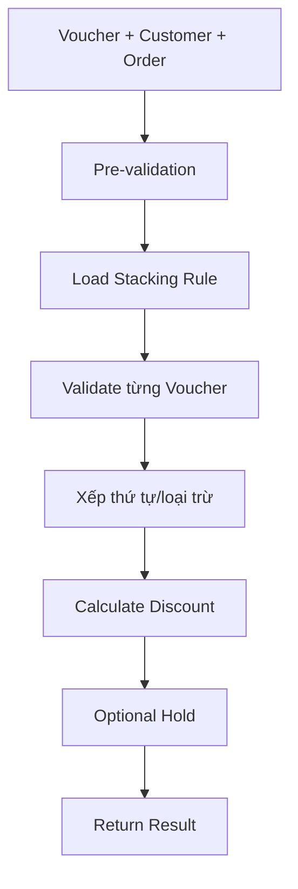

# Phase 2 - Kiểm tra hợp lệ và cộng dồn ưu đãi

## Mục tiêu

Xác định từng Voucher có áp dụng được cho Customer/Order hiện tại không, chọn tập Voucher phù hợp theo Stacking Rule và tính tổng Discount.

## Đầu vào

- Danh sách Voucher (redeemables).
- Customer.
- Order/Product/Amount.
- Session key nếu đã Hold.
- Validation Rules được gán cho Campaign.
- Stacking Rule.

## Luồng Validate Stackable Discounts

| Bước | Nội dung |
|---:|---|
| 1 | App gửi yêu cầu kiểm tra |
| 2 | Kiểm tra format, Voucher trùng và tải Stacking Rule |
| 3 | Đánh giá Validation Rule cho từng Voucher |
| 4 | Xác định APPLICABLE/INAPPLICABLE/SKIPPED |
| 5 | Tính Discount cho các Voucher áp dụng được |
| 6 | Tùy chọn Hold Voucher và trả session key |
| 7 | Trả kết quả tổng và chi tiết |

## Các nhóm điều kiện Validation

- Audience/Customer/Segment.
- Product.
- Price và Quantity.
- Budget.
- Redemption Limit.
- Customer Metadata.
- Thời gian hiệu lực và trạng thái Campaign/Voucher.

## Trạng thái kết quả từng Voucher

| Trạng thái | Ý nghĩa |
|---|---|
| APPLICABLE | Thỏa rule và được chọn áp dụng |
| INAPPLICABLE | Không thỏa điều kiện; phải trả reason rõ ràng |
| SKIPPED | Bị bỏ qua do giới hạn cộng dồn, priority hoặc rule loại trừ |

## Stacking Rule

### Chế độ áp dụng

- ALL: yêu cầu tất cả Voucher hợp lệ; cần xác nhận có từ chối toàn bộ nếu một mã INAPPLICABLE không.
- PARTIAL: áp dụng các mã hợp lệ, bỏ qua mã không hợp lệ.

### Thứ tự xử lý

- CATEGORY_HIERARCHY: Category có số hierarchy nhỏ hơn được ưu tiên trước.
- REQUESTED_ORDER: dùng thứ tự Voucher trong request.

### Giới hạn

- Tổng số Voucher tối đa.
- Số Voucher tối đa theo Category.
- Số Voucher exclusive.
- Quy tắc loại trừ giữa các Campaign/Category.

## Hold Voucher

Hold giúp tránh Voucher bị sử dụng bởi yêu cầu khác trong khoảng chờ khách hàng xác nhận/thanh toán.

Voucher được release khi:

- Hết thời gian Hold.
- Redemption thành công.
- Hủy thủ công hoặc giao dịch bị hủy.

## Rule cần xác nhận

1. Qualification và Validation khác nhau chính xác ở điều kiện nào?
2. Thứ tự tính Discount có làm thay đổi base amount cho Voucher sau không?
3. Tổng Discount có được vượt giá trị Order không?
4. Khi ALL mode có SKIPPED thì kết quả tổng là valid hay invalid?
5. Khi Budget thay đổi giữa Validate và Redeem thì bước nào là quyết định cuối?
6. Hold có giữ cả Voucher, Budget và Redemption Limit hay chỉ Voucher?

