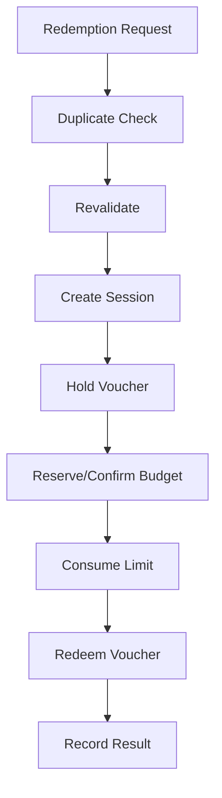
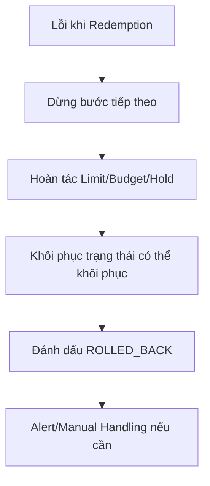

# Phase 2 - Redemption và Rollback

## Mục tiêu

Chốt việc sử dụng một hoặc nhiều Voucher vào giao dịch, cập nhật Budget/Limit/Voucher và đảm bảo có thể hoàn tác khi lỗi.

## Đầu vào

- Danh sách Voucher.
- Customer và Order.
- Session key nếu đã Hold.
- ID duy nhất để chống Redemption trùng.

## Happy path

| Bước | Nghiệp vụ |
|---:|---|
| 1 | App gửi yêu cầu Redemption |
| 2 | Kiểm tra duplicate và đánh giá lại Validation/Stacking |
| 3 | Tạo Redemption session |
| 4 | Tính Discount theo thứ tự ưu tiên |
| 5 | Hold Voucher |
| 6 | Reserve Budget |
| 7 | Trừ Redemption Limit |
| 8 | Confirm Budget |
| 9 | Đổi trạng thái Voucher |
| 10 | Hoàn tất session và ghi Redemption |
| 11 | Trả parent/child result cho App |

## Kết quả

- Parent Redemption đại diện toàn giao dịch.
- Child Redemption đại diện từng Voucher.
- Trạng thái tổng: SUCCEEDED, FAILED hoặc ROLLED_BACK.
- Danh sách INAPPLICABLE/SKIPPED kèm reason.
- Order sau Discount và tổng giá trị giảm.

## Luồng xử lý dữ liệu

Tài liệu mô tả ba cách đánh giá lại Rule:

- Fast-full: đủ dữ liệu trong cache.
- Fast-partial: dùng cache kết hợp gọi Rule Engine.
- Full: đánh giá toàn bộ qua Rule Engine.

Kết quả nghiệp vụ phải tương đương, không phụ thuộc đường xử lý.

## Rollback

Khi một bước lỗi, hệ thống hoàn tác theo thứ tự ngược các bước đã thực hiện.

## Giới hạn Rollback quan trọng

Tài liệu nêu rằng:

- Rollback thực hiện cho toàn bộ giao dịch cộng dồn, không rollback từng Voucher riêng lẻ.
- Bước Confirm Budget và đổi trạng thái Voucher không tự động rollback được trong một số trường hợp.
- Các trường hợp này cần cảnh báo và xử lý thủ công.

## Business rule trọng yếu

- Một request chỉ tạo một kết quả Redemption duy nhất.
- Voucher phải được validate lại tại thời điểm chốt.
- Budget và limit phải đảm bảo nhất quán khi có xử lý đồng thời.
- ALL/PARTIAL quyết định cách xử lý khi một Voucher lỗi.
- Không được trả thành công nếu các thay đổi nghiệp vụ bắt buộc chưa được ghi nhận.
- Mọi bước cần có audit để CSKH và Operation truy vết.

## Edge case

- App retry sau timeout trong khi Redemption thực tế đã thành công.
- Hold hết hạn ngay trước lúc Redeem.
- Budget còn khi Validate nhưng hết khi Redeem.
- Voucher bị dùng bởi request khác.
- Confirm Budget thành công nhưng cập nhật Voucher lỗi.
- Voucher đổi trạng thái thành công nhưng ghi Redemption lỗi.
- App thanh toán thất bại sau khi Promotion đã Redeem.

## Câu hỏi cần xác nhận

1. Điểm commit nghiệp vụ cuối cùng là bước nào?
2. Ai chịu trách nhiệm gọi Redemption: trước hay sau thanh toán?
3. Khi thanh toán thất bại sau Redemption, hệ thống nào phát yêu cầu rollback?
4. Quy trình manual cho Confirm Budget/Voucher không rollback được là gì?
5. SLA xử lý trạng thái PENDING là bao lâu?

