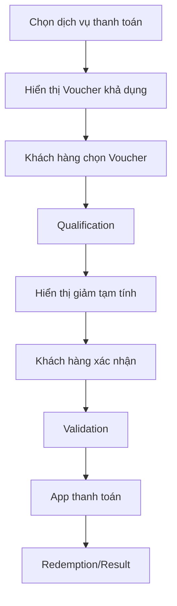

# Phase 2 - Trải nghiệm ưu đãi trên App Viettel Money

## Mục tiêu

Cho phép khách hàng xem, tìm kiếm, chọn và áp dụng Voucher trong luồng thanh toán mà không làm gián đoạn chức năng thanh toán chính.

## Actor

- Khách hàng đã đăng nhập App Viettel Money.
- NVVH cấu hình SDK, whitelist và rollout.
- App host và dịch vụ thanh toán.

## Bốn luồng chính

### 1. ON/OFF Check

SDK gửi MSISDN, feature code, device và app version. Hệ thống kiểm tra:

- Enable SDK.
- Feature được bật hay tắt.
- Whitelist mode.
- Rollout percentage.

Nếu service không phản hồi, SDK dùng kết quả gần nhất; nếu không có cache thì mặc định không cho phép và không chặn luồng thanh toán.

### 2. Xem danh sách ưu đãi

1. Khách hàng vào "Ưu đãi của tôi".
2. SDK chạy ON/OFF Check.
3. Gọi lấy danh sách Voucher theo Customer.
4. Chỉ hiển thị Voucher còn hiệu lực, active và đúng Customer/Segment.
5. Cho phép tab tất cả/sắp hết hạn, tìm kiếm và xem chi tiết.

### 3. Áp dụng ưu đãi

### 4. Event Tracking

Các touch point chính:

- Vào màn Ưu đãi của tôi.
- Xem chi tiết Voucher.
- Xem chi tiết trong luồng thanh toán.
- Tìm kiếm.
- Chọn Voucher.
- Hủy Voucher đã chọn.
- Sử dụng ngay từ màn chi tiết.
- Nhấn Áp dụng.

## Rule hiển thị

- Voucher phải active.
- Thời gian hiện tại nằm trong khoảng hiệu lực.
- Voucher đã publish cho Customer.
- Customer/Segment/Metadata thỏa điều kiện.
- Tab "Sắp hết hạn" dùng ngưỡng ngày cấu hình, mặc định tài liệu nêu 30 ngày.
- Trong phạm vi BRD Mobile hiện tại, chỉ chọn một Voucher/giao dịch.

## Rule vận hành SDK

- Có thể bật/tắt toàn bộ SDK không cần phát hành lại app.
- Có thể bật/tắt từng feature: list, detail, selection, apply, redeem.
- Có thể whitelist theo MSISDN.
- Có thể rollout theo tỷ lệ phần trăm ổn định dựa trên MSISDN và feature code.

## Trường hợp lỗi

- SDK bị tắt hoặc Customer không nằm trong rollout/whitelist.
- Không có Voucher phù hợp.
- Voucher hết hạn/đã dùng/vượt limit.
- Qualification pass nhưng Validation fail.
- Promotion service timeout.
- Thanh toán bị hủy hoặc thất bại.

Nguyên tắc UX: lỗi Voucher không được chặn khách hàng tiếp tục thanh toán không dùng ưu đãi.

## Điểm cần làm rõ

- BRD Mobile gọi phạm vi hiện tại là "Phase 1" nhưng nằm trong tài liệu Promotion Phase 2.
- BRD chỉ cho một Voucher, trong khi backend Phase 2 mô tả Stacking nhiều Voucher.
- Trình tự Payment và Redemption cần thống nhất rõ để xử lý rollback.

