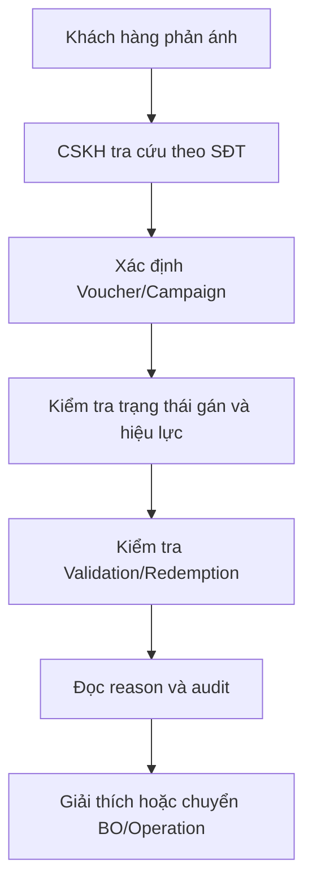

# Phase 2 - Tra cứu Voucher cho CSKH

## Mục tiêu

Giúp CSKH xác định Voucher nào đã được gán/sử dụng, trạng thái hiện tại và lý do áp dụng thất bại để rút ngắn thời gian xử lý khiếu nại.

## Vai trò

| Vai trò | Quyền hạn |
|---|---|
| FO/Điện thoại viên | Tra cứu lịch sử, xem điều kiện Voucher và lý do lỗi |
| BO | Trích xuất báo cáo và xem Audit Trail |

## Đầu vào

- Số điện thoại khách hàng.
- Có thể bổ sung thời gian, Campaign, Voucher code hoặc transactionId tùy công cụ thực tế.

## Đầu ra

| Trường | Ý nghĩa |
|---|---|
| Mã/Tên Voucher | Nhận diện ưu đãi |
| Loại Voucher | Discount, Cashback... |
| Sản phẩm áp dụng | Phạm vi dịch vụ/sản phẩm |
| Thời gian áp dụng | Khoảng hiệu lực |
| Trạng thái hoạt động | Active/Inactive |
| Trạng thái gán | Đã gán/Chưa gán |
| Thời gian gán | Khi nào Voucher được publish cho khách hàng |
| Trạng thái sử dụng | Thành công/Thất bại và lý do |
| Ngày sử dụng | Thời điểm Redemption |
| Audit Trail | Lịch sử các lần tác động trạng thái |

## Luồng xử lý khiếu nại

## Cây chẩn đoán nhanh

1. Không thấy Voucher:
   - Chưa publish.
   - Sai Customer/MSISDN.
   - Không thuộc Segment.
   - Campaign/Voucher đã bị xóa hoặc dữ liệu chưa đồng bộ.
2. Thấy nhưng không áp dụng được:
   - Chưa hiệu lực/hết hạn/inactive.
   - Không thỏa Product/Amount/Metadata.
   - Vượt Budget/Redemption Limit.
   - Bị Stacking Rule loại trừ.
3. Đã áp dụng nhưng khách hàng phản ánh sai:
   - Kiểm tra parent/child Redemption.
   - Kiểm tra kết quả Payment.
   - Kiểm tra Rollback.
   - Kiểm tra Audit Trail và requestId.

## Dữ liệu bắt buộc để hỗ trợ tốt

- Reason code kèm thông điệp dễ hiểu.
- RequestId/TransactionId/RedemptionId.
- Rule nào fail và dữ liệu đánh giá tại thời điểm đó.
- Trạng thái trước/sau của Voucher, Budget và Limit.
- Lịch sử retry/rollback/manual action.

## Câu hỏi cần xác nhận

- Công cụ CSKH hiển thị dữ liệu real-time hay có độ trễ?
- FO có thấy rule chi tiết hay chỉ reason message?
- Ai có quyền thao tác sửa/khôi phục Voucher?
- Quy trình escalation các case Budget/Voucher không rollback tự động?

