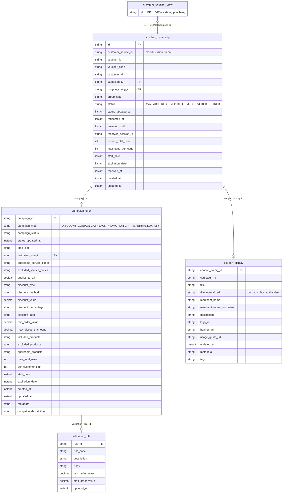
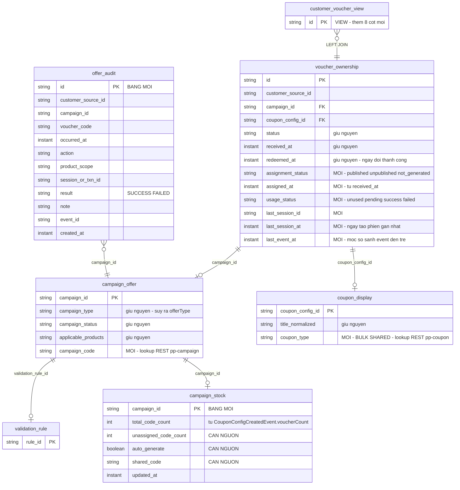
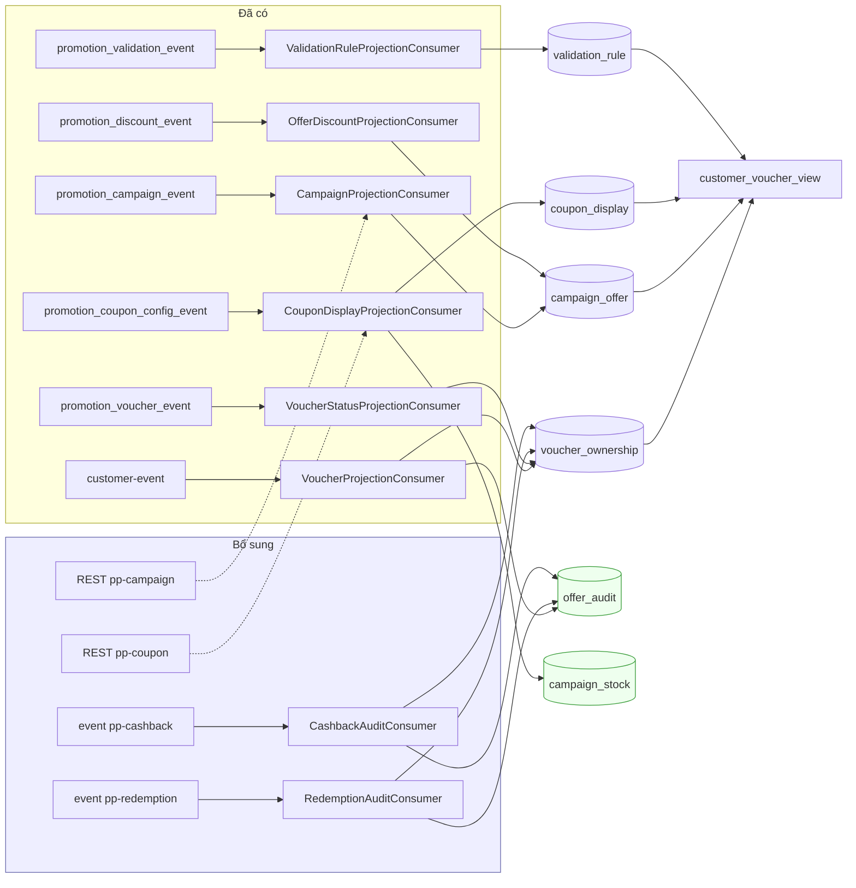

# Read model: hiện tại và đề xuất

Phạm vi: `p2_promotion-vtm-bff`, MariaDB `promotion_vtm_bff`

Ngày lập: 2026-09-30 · Phục vụ: `searchCustomerOffers` và `getAuditTrail` của nhóm API CSKH

> Kế hoạch `KE-HOACH-SEARCH-CUSTOMER-OFFERS.md` có phần cập nhật read model nhưng nằm rải ở
> đầu việc 2, 3 và 4. Tài liệu này gom lại thành một bức tranh để dễ rà và dễ ước lượng.

---

## 1. Read model hiện tại

Bốn bảng nền, một view. View là thứ duy nhất tầng ứng dụng đọc.



### Vai trò của từng bảng

| Bảng | Giữ cái gì | Trả lời câu hỏi nào | Khoá chính |
|---|---|---|---|
| `voucher_ownership` | Quan hệ **một khách hàng sở hữu một mã** — và trạng thái hiện tại của quan hệ đó | "Khách này đang có những mã nào, mỗi mã đang ở trạng thái gì?" | `id` |
| `campaign_offer` | Thuộc tính **mức chiến dịch**: loại, trạng thái, thời gian hiệu lực, phạm vi sản phẩm, cấu hình giảm giá | "Chiến dịch này còn chạy không, áp cho sản phẩm nào, giảm bao nhiêu?" | `campaign_id` |
| `coupon_display` | Thông tin **hiển thị** của một coupon config: tiêu đề, tên đơn vị, mô tả, ảnh | "Hiện cái gì lên màn hình cho mã này?" | `coupon_config_id` |
| `validation_rule` | Luật kiểm tra nhanh khi áp mã: ngưỡng giá trị đơn tối thiểu và tối đa | "Đơn hàng có đủ điều kiện dùng mã không?" | `rule_id` |
| `customer_voucher_view` | **Không giữ gì** — là VIEW ghép 4 bảng trên | Là thứ duy nhất tầng ứng dụng đọc, để truy vấn không phải tự join | — |

Ba điểm đáng chú ý về cách phân chia:

**`voucher_ownership` là bảng sự kiện hoá, không phải danh mục voucher.** Mỗi dòng ứng với một lần
cấp mã cho một khách cụ thể. Chiến dịch chưa phát mã cho ai thì **không có dòng nào** — đây chính
là lý do nghiệp vụ CSKH cần thêm `campaign_stock` (xem mục 2.2).

**`campaign_offer` có hai đường ghi tách bạch** và cố ý không gộp: pp-campaign ghi nhóm meta,
pp-cashback ghi nhóm giảm giá qua `upsertDiscount`. Trộn hai nguồn vào một đường sẽ thành hai bên
cùng ghi đè một nhóm cột.

**Tách `coupon_display` khỏi `campaign_offer`** vì chúng khác khoá: một chiến dịch có thể có nhiều
coupon config. Gộp lại sẽ phải nhân bản thuộc tính chiến dịch cho mỗi config.

### Đường ghi dữ liệu hiện tại

| Bảng | Consumer | Topic | Service nguồn |
|---|---|---|---|
| `voucher_ownership` | `VoucherProjectionConsumer` | `customer-event` | pp-customer |
| | `VoucherStatusProjectionConsumer` | `promotion_voucher_event` | pp-coupon |
| `campaign_offer` | `CampaignProjectionConsumer` | `promotion_campaign_event` | pp-campaign |
| | `OfferDiscountProjectionConsumer` | `promotion_discount_event` | pp-cashback |
| `coupon_display` | `CouponDisplayProjectionConsumer` | `promotion_coupon_config_event` | pp-coupon-config |
| `validation_rule` | `ValidationRuleProjectionConsumer` | `promotion_validation_event` | pp-validation |

`campaign_offer` có **hai đường ghi tách bạch**: pp-campaign ghi nhóm meta, pp-cashback ghi nhóm
giảm giá. Ranh giới này là cố ý — xem chú thích trong `CampaignDetailDto`.

### View `customer_voucher_view`

Định nghĩa mới nhất ở changeset `020-validation-order-bounds.xml`, gồm **53 cột**, join:

```sql
FROM voucher_ownership o
LEFT JOIN campaign_offer  ofr ON ofr.campaign_id    = o.campaign_id
LEFT JOIN coupon_display  d   ON d.coupon_config_id = o.coupon_config_id
LEFT JOIN validation_rule vr  ON vr.rule_id         = ofr.validation_rule_id;
```

View đã bị định nghĩa lại nhiều lần (changeset 006, 007, 009, 010, 011, 012, 014, 015, 016, 018,
019, 020). Mỗi lần thêm cột đều phải `DROP` rồi `CREATE` lại toàn bộ.

### Hạn chế với nghiệp vụ CSKH

| Thiếu gì | Hệ quả |
|---|---|
| Không có bảng lịch sử | `getAuditTrail` không có nguồn |
| Không có trạng thái gán mã, trạng thái sử dụng | 2 trong 13 cột và 2 trong 8 filter của `searchCustomerOffers` không làm được |
| Không có mã chiến dịch, loại chiến dịch (BULK/SHARED) | 2 cột nữa không làm được |
| Không có tồn kho mã | Không phân biệt được "Chưa gán" với "Chưa sinh mã"; không làm được bản ghi giả lập |
| Không có bảng idempotency | Mục 4.4 yêu cầu chống xử lý trùng và xử lý event đến trễ |
| Chỉ xoay quanh voucher đã gán | Chiến dịch Hoàn tiền không có bản ghi nào |

---

## 2. Read model đề xuất

Giữ nguyên bốn bảng nền và view, **thêm 8 cột** và **3 bảng mới**. Không đổi hay bỏ cột nào đang có.



### 2.1 Cột bổ sung

| Bảng | Cột | Kiểu | Nguồn | Phục vụ |
|---|---|---|---|---|
| `voucher_ownership` | `assignment_status` | varchar(32) | suy từ bản ghi + `campaign_stock` | Cột và filter Trạng thái gán mã |
| | `assigned_at` | datetime(6) | `received_at` đang có | Cột Ngày gán |
| | `usage_status` | varchar(32) | consumer redemption và cashback | Cột và filter Trạng thái sử dụng |
| | `last_session_id` | varchar(64) | consumer redemption | Cột Mã phiên ở audit |
| | `last_session_at` | datetime(6) | consumer redemption | Cột Ngày sử dụng |
| | `last_event_at` | datetime(6) | `occurredAt` của event | So sánh event đến trễ |
| `campaign_offer` | `campaign_code` | varchar(64) | lookup REST pp-campaign | Cột Mã chiến dịch |
| `coupon_display` | `coupon_type` | varchar(32) | lookup REST pp-coupon | Cột Loại chiến dịch |

**`last_session_at` khác `redeemed_at`**: SRS yêu cầu ngày tạo phiên gần nhất, còn `redeemed_at`
là ngày đổi thành công. Một phiên có thể tạo rồi huỷ mà không bao giờ redeem, nên phải tách cột,
không tái dùng.

**`assigned_at` tách khỏi `received_at`** để không đổi ngữ nghĩa cột đang phục vụ app khách hàng,
dù giá trị ban đầu chép từ đó. Cần xác nhận `received_at` đúng là thời điểm gán mã.

### 2.2 Bảng mới

| Bảng | Giữ cái gì | Vì sao hôm nay chưa có | Ghi bởi |
|---|---|---|---|
| `offer_audit` | **Lịch sử tác động**: mỗi dòng là một hành động đã xảy ra với một mã hoặc một giao dịch hoàn tiền — gán mã, tạo phiên, xác nhận, huỷ, hoàn tác, phát sinh cashback | Read model hiện chỉ giữ **trạng thái hiện tại**, không giữ diễn biến. `voucher_ownership.status` cho biết mã đang ở đâu nhưng không cho biết nó đã đi qua những bước nào | `RedemptionAuditConsumer`, `CashbackAuditConsumer`, `VoucherProjectionConsumer` mở rộng |
| `campaign_stock` | **Tồn kho mã của chiến dịch**: tổng số mã, số chưa gán, cờ sinh mã tự động, giá trị mã chung | `voucher_ownership` chỉ có dòng khi mã **đã được gán**. Chiến dịch còn mã chưa phát cho ai thì read model hoàn toàn không biết gì về nó | Consumer tồn kho mã của pp-coupon |

Ba bảng đặt tên không tiền tố, đồng bộ với các bảng read model sẵn có
(`voucher_ownership`, `campaign_offer`, `coupon_display`, `validation_rule`).

`campaign_stock` giải quyết hai yêu cầu mà không bảng nào hiện có trả lời được:

- Phân biệt **"Chưa gán"** (chiến dịch còn mã, khách chưa được nhận) với **"Chưa sinh mã"**
  (chiến dịch chưa có mã nào) — hai giá trị khác nhau ở cột Trạng thái gán mã.
- Dựng **bản ghi giả lập** theo SRS mục 4.4: khách chưa có mã nhưng chiến dịch đang chạy thì vẫn
  phải hiện một dòng với nhãn "Còn mã", "-" hoặc giá trị mã chung.

### 2.3 Chỉ mục đề xuất

| Bảng | Chỉ mục | Vì sao |
|---|---|---|
| `voucher_ownership` | `(customer_source_id, campaign_id)` | Điều kiện lọc bắt buộc của `searchCustomerOffers` |
| `offer_audit` | `(customer_source_id, campaign_id, occurred_at DESC)` | Truy vấn chính của `getAuditTrail`, đã kèm thứ tự sắp xếp |
| `offer_audit` | `(voucher_code)` | Lọc theo mã ưu đãi |

### 2.4 Đường ghi dữ liệu sau khi mở rộng



Mũi tên nét đứt là lookup REST lúc xử lý event, theo mẫu `CampaignCreatedAtBackfillService` đang có.

---

## 3. Tổng hợp thay đổi

| Hạng mục | Số lượng |
|---|---|
| Bảng giữ nguyên cấu trúc | 1 (`validation_rule`) |
| Bảng thêm cột | 3 (`voucher_ownership` +6, `campaign_offer` +1, `coupon_display` +1) |
| Bảng mới | 2 |
| View định nghĩa lại | 1 (thêm 8 cột, giữ nguyên 53 cột cũ) |
| Consumer mới | 2 |
| Consumer mở rộng | 3 (`VoucherProjectionConsumer`, `CampaignProjectionConsumer`, `CouponDisplayProjectionConsumer`) |
| Endpoint backfill mới | 2 |
| Changeset Liquibase | tiếp sau `021`, theo mẫu `006-replace-view-customer-voucher.xml` |

**Không xoá hay đổi cột nào đang có** — luồng app khách hàng (API #12, #13, #01) không bị ảnh hưởng
về mặt schema. Vẫn cần chạy hồi quy vì view bị `DROP` rồi `CREATE` lại.

---

## 4. Điểm cần chốt

| # | Vấn đề | Ảnh hưởng |
|---|---|---|
| 1 | Nguồn của `unassigned_code_count`, `auto_generate`, `shared_code` — pp-coupon bổ sung event hay lookup REST? | `campaign_stock` chưa điền được |
| 2 | `received_at` có đúng là thời điểm gán mã không? | `assigned_at` có thể sai ngữ nghĩa |
| 3 | Điều kiện "khách thoả cấu hình segment" của bản ghi giả lập — read model không lưu segment | Có thể phát sinh bảng thứ tư |
| 4 | Ba trạng thái `DISABLING`, `DELETING`, `DELETED` của pp-campaign gom về đâu | Ánh xạ `campaign_status` |

---

## Phụ lục — Lệnh dựng lại tài liệu này

```bash
cd /mnt/data/Data/code/staging_promotion/p2_promotion-vtm-bff

# Bon bang nen va khoa chinh
for f in src/main/java/vn/viettel/vds/promotion/bff/vtm/adapter/out/persistence/entity/*.java; do
  echo "--- $f"; grep -E "@Table|^\s+private " "$f"
done

# Dinh nghia view moi nhat
sed -n '/CREATE VIEW customer_voucher_view/,/;$/p' \
  src/main/resources/db/changelog/changes/020-validation-order-bounds.xml

# Cac changeset da tung dinh nghia lai view
grep -ln "CREATE VIEW customer_voucher_view" src/main/resources/db/changelog/changes/*.xml

# Consumer va topic
grep -rn "topics = " src/main/java/vn/viettel/vds/promotion/bff/vtm/adapter/in/messaging/
```
