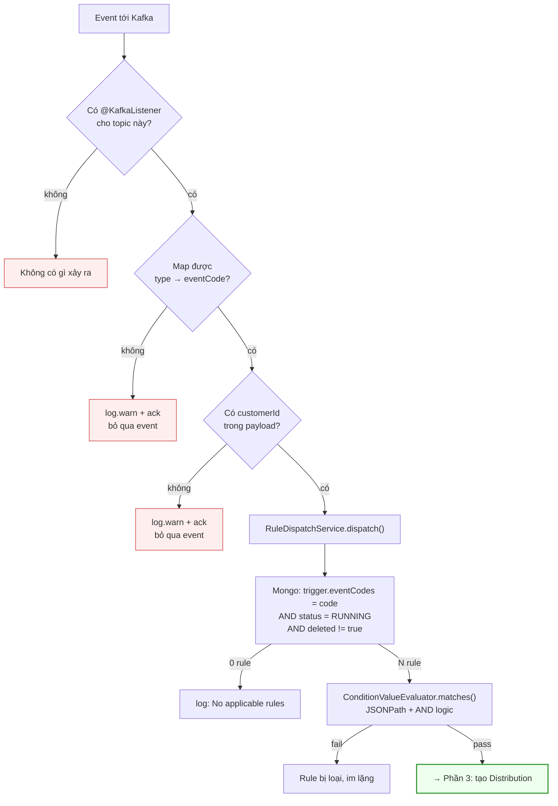

# Phần 2 — Rule bật xong sẽ trigger những loại event nào?

> Giả định: vừa `POST /api/v1/distributions` xong, gọi luôn
> `PUT /api/v1/distributions/{id}/activate` → `status = RUNNING`.
>
> Module: `p2_promotion-distribution` · Ngày phân tích: 2026-09-19

---

## 1. Điều kiện cần để một event chạm được rule

Một event chỉ kích hoạt được rule khi **thoả đủ 3 tầng**, thiếu 1 tầng là im lặng:

```
Tầng 1 — CÓ CONSUMER      : phải có @KafkaListener đọc topic chứa event đó
Tầng 2 — CÓ MAPPING       : consumer phải map được type → eventCode của catalog
Tầng 3 — RULE MATCH       : trigger.eventCodes chứa code + status RUNNING + condition pass
```

Điểm dễ hiểu nhầm nhất: **catalog `events` có ~28 event, nhưng chỉ 9 event thực sự
có đường vào runtime**. CMS vẫn cho admin chọn 28 event đó khi tạo rule, rule vẫn
lưu thành công, vẫn `RUNNING` — nhưng nếu không consumer nào sinh ra code đó thì
rule **không bao giờ chạy**.

---

## 2. Danh sách event THỰC SỰ trigger được (9 code)

Nguồn: 6 consumer trong `adapter/in/messaging/`.

| # | Topic Kafka | `type` trong event | → `eventCode` | Consumer |
|---|---|---|---|---|
| 1 | `promotion_order_event` | `OrderCreatedEvent` | `ORDER_CREATED` | `OrderEventConsumer:21` |
| 2 | `promotion_voucher_event` | `VoucherRedeemedEvent` | `VOUCHER_REDEEMED` | `VoucherEventConsumer:24` |
| 3 | `promotion_voucher_event` | `VoucherPublishedEvent` | `SUCCESSFULLY_PUBLISHED` | `VoucherEventConsumer:24` |
| 4 | `promotion_voucher_event` | `VoucherRevokedEvent` | `VOUCHER_REVOKED` | `VoucherEventConsumer:24` |
| 5 | `promotion_segment_event` | `SegmentMembershipAddedEvent` | `CUSTOMER_ENTERED_SEGMENT` | `SegmentMembershipConsumer:41` |
| 6 | `promotion_segment_event` | `SegmentMembershipRemovedEvent` | `CUSTOMER_LEFT_SEGMENT` | `SegmentMembershipConsumer:41` |
| 7 | `promotion-cashback-events` | `CashbackSuccessEvent` | `CASHBACK_SUCCEEDED` | `CashbackEventConsumer:25` |
| 8 | `promotion_redemption_confirmed` | *(hardcode, không map)* | `REWARD_REDEEMED` | `RedemptionConfirmedConsumer:20` |
| 9 | `promotion_custom_event` | **`$.type` dùng trực tiếp** | **bất kỳ code nào** | `CustomEventConsumer:29` |

### Ý nghĩa của dòng số 9

`CustomEventConsumer` là **cửa generic**: nó không có bảng map cứng, lấy thẳng
`$.type` làm `eventCode`.

```java
// CustomEventConsumer.java:43
String code = eventMap.get("type") != null ? eventMap.get("type").toString() : null;
```

Nghĩa là **mọi event code** đều có thể trigger được nếu hệ thống nguồn chịu bắn
vào topic `promotion_custom_event` với đúng `$.type`. Đây là đường vào cho các
event catalog chưa có consumer riêng (xem §3).

Mongock `AddCustomEventsChangeLog` seed sẵn 3 custom event vào catalog:
`APP_INSTALLED`, `SUPPORT_TICKET_CLOSED`, `EXTERNAL_PURCHASE`.

---

## 3. Event có trong catalog nhưng KHÔNG có consumer riêng

Seed tại `infrastructure/persistence/mongock/EventCatalogSeedData.java:181`.
Những code dưới đây admin **chọn được trên CMS** nhưng chỉ chạy nếu đi qua
`promotion_custom_event`:

| Nhóm (category) | Event code |
|---|---|
| `CART` | `ORDER_UPDATED`, `ORDER_PAID`, `ORDER_CANCELED` |
| `CUSTOMER_REWARDS` | `GIFT_CREDITS_ADJUSTED`, `LOYALTY_POINTS_ADJUSTED`, `LOYALTY_POINTS_EXPIRED`, `LOYALTY_PENDING_POINTS_ADJUSTED`, `LOYALTY_PENDING_POINTS_UPDATED`, `LOYALTY_PENDING_POINTS_ACTIVATED`, `LOYALTY_PENDING_POINTS_CANCELED` |
| `CUSTOMER_REWARDS` | `CUSTOMER_ENTERED_LOYALTY_TIER_STRUCTURE`, `CUSTOMER_LEFT_LOYALTY_TIER_STRUCTURE`, `CUSTOMER_LOYALTY_TIER_UPGRADED`, `CUSTOMER_LOYALTY_TIER_DOWNGRADED`, `CUSTOMER_LOYALTY_TIER_PROLONGED`, `CUSTOMER_REWARDED_LOYALTY_POINTS`, `CUSTOMER_WAS_REFERRED` |
| `VOUCHER` | `VOUCHER_REDEMPTION_ROLLEDBACK` |
| `CUSTOM_EVENTS` | `CUSTOM_EVENT` |

> ⚠️ **`ORDER_PAID` nằm trong nhóm này.** Đây là cái bẫy dễ dính nhất: nó là ví dụ
> trực quan nhất khi demo ("tặng voucher khi thanh toán đơn > 500k"), nhưng
> `OrderEventConsumer` **chỉ map `OrderCreatedEvent` → `ORDER_CREATED`**. Rule gắn
> `ORDER_PAID` sẽ không bao giờ chạy qua topic `promotion_order_event`.

`DeactivateRedemptionRollbackEventChangeLog` đã deactivate
`VOUCHER_REDEMPTION_ROLLEDBACK` — event inactive thì bước create còn chặn trước
(`EVENT_INACTIVE`, 400).

---

## 4. Một rule bắt được NHIỀU event cùng lúc

`trigger.eventCodes` là **array**, mỗi event có bộ điều kiện riêng keyed theo code:

```json
"trigger": {
  "eventCodes": ["ORDER_CREATED", "CASHBACK_SUCCEEDED"],
  "conditionValuesByEvent": {
    "ORDER_CREATED":      [ { "fieldKey": "orderAmount", "operator": "GREATER_THAN", "value": 500000 } ],
    "CASHBACK_SUCCEEDED": [ { "fieldKey": "amount",      "operator": "GREATER_THAN", "value": 100000 } ]
  }
}
```

Query dispatch dùng **multikey index** trên array — MongoDB coi equality trên
array là containment:

```java
// DistributionRuleMongoRepository.java:64
@Query("{ 'trigger.eventCodes': ?0, 'status': 'RUNNING', 'deleted': { $ne: true } }")
```

Khi event `ORDER_CREATED` tới, evaluator **chỉ lấy nhóm điều kiện của chính
`ORDER_CREATED`** (`trigger.getConditionValuesFor(eventCode)`), không đụng nhóm
của event khác. Hai event trong cùng rule là quan hệ **OR** (event nào tới cũng
kích hoạt được), còn các condition trong cùng một event là **AND**.

---

## 5. Sơ đồ quyết định



---

## 6. Điều kiện được đánh giá thế nào

`domain/service/ConditionValueEvaluator.java` — chạy **in-memory** sau khi đã lấy
candidate từ Mongo.

Với mỗi `ConditionValue` (đã snapshot lúc create):

1. Dùng **JSONPath** `payloadPath` (BE denormalize từ catalog, FE không gửi) rút
   giá trị khỏi event.
2. So với `value` admin nhập theo `operator`.
3. **Tất cả phải pass (AND)**; một cái fail là loại cả rule.

Quy ước quan trọng:

| Tình huống | Kết quả |
|---|---|
| `conditionValues` rỗng/null | **match all** — chỉ cần khớp event code |
| `payloadPath` không tồn tại trong payload | **không khớp** (trừ `EXISTS`/`NOT_EXISTS`) |
| `payload` null | không khớp |
| Lỗi extract / cast / regex | log DEBUG + `false` (**fail-safe**) |
| `operator` null trên rule cũ | log WARN + `false` |
| So sánh số | quy về `BigDecimal` — tránh lệch float/int |

Operator hỗ trợ: `EQUALS`, `NOT_EQUALS`, `GREATER_THAN`, `GREATER_OR_EQUAL`,
`LESS_THAN`, `LESS_OR_EQUAL`, `IN`, `NOT_IN`, `BETWEEN`, `CONTAINS`,
`NOT_CONTAINS`, `STARTS_WITH`, `ENDS_WITH`, `IS_TRUE`, `IS_FALSE`, `SIZE_GTE`,
`SIZE_LTE`, `MATCHES`, `EXISTS`, `NOT_EXISTS`.

### ⚠️ JSONPath chạy trên TOÀN BỘ envelope, không chỉ `payload`

Consumer truyền **cả event map** xuống dispatch, không phải riêng nhánh `payload`:

```java
// CustomEventConsumer.java — eventMap là toàn bộ envelope
ruleDispatchUseCase.dispatch(new DispatchCommand(topic, code, eventId, customerId, eventMap, rawJson));
```

Nên `payloadPath` trong catalog phải viết **`$.payload.customer_id`**, không phải
`$.customer_id`. Viết sai → rule `RUNNING`, match đúng event code, nhưng condition
luôn false và **không có log ERROR nào** — chỉ có dòng DEBUG:

```
Path {} not found in payload (fieldKey={}, op={}) — no match
```

---

## 7. Không có cache — activate có hiệu lực tức thì

`findActiveByEventCode` query thẳng Mongo **mỗi event**, không qua cache layer.
Hệ quả:

- ✅ Bật/tắt rule có tác dụng ngay, không cần restart, không cần chờ TTL.
- ⚠️ Mỗi event = 1 round-trip Mongo. Có index nên rẻ, nhưng là hot-path — cần để
  ý khi throughput tăng.

Outbox event `DISTRIBUTION_RULE_CREATED` / `_ACTIVATED` **không tham gia** cơ chế
này. Grep toàn workspace: topic `promotion_distribution_rule_event` **không có
consumer nào** — nó chỉ để notify hệ downstream ngoài repo.

---

## 8. Checklist "vì sao rule không trigger"

Theo thứ tự hay gặp:

| # | Nguyên nhân | Cách xác minh |
|---|---|---|
| 1 | `status` vẫn `PAUSED` | `GET /{id}` xem `status` |
| 2 | `eventCode` không có consumer (vd `ORDER_PAID`) | đối chiếu bảng §2 |
| 3 | `payloadPath` catalog thiếu tiền tố `$.payload.` | bật log DEBUG `ConditionValueEvaluator` |
| 4 | Event thiếu `payload.customer_id` | log WARN `missing payload.customer_id — skip` |
| 5 | Condition không match dữ liệu thật | log DEBUG `no match` |
| 6 | Idempotency hit (event/rule/channel đã dispatch) | log INFO `Idempotency hit — skip key=` |
| 7 | `channelBindings[].providerId = null` | rule trigger OK nhưng bản ghi `FAILED` ngay — xem Phần 5 |

Grep nhanh phân biệt 2 tầng:

```bash
# Tầng dispatch (rule có được chọn không)
grep "DISPATCHING-VOUCHER-EVENT" logs/*.log

# Tầng gửi (bản ghi có được gửi không)
grep "Writing .* distribution items" logs/*.log
```

---

**→ Tiếp: [Phần 3 — Luồng dispatch runtime](03-LUONG-DISPATCH.md)**
