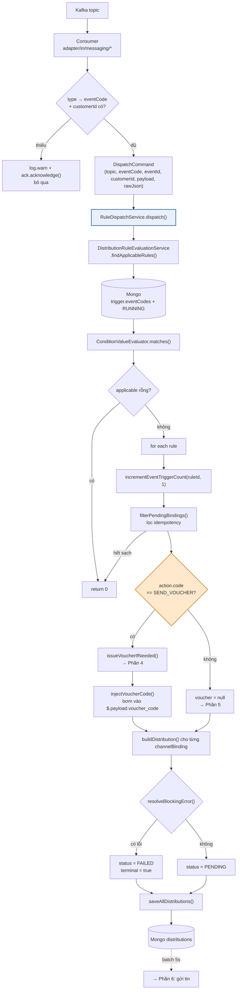

# Phần 3 — Luồng dispatch runtime (chung cho mọi action)

> Từ lúc event chạm Kafka đến lúc sinh ra bản ghi `distributions`.
> Đây là phần **chung**; rẽ nhánh theo `actionCode` nằm ở giữa luồng này.
>
> File chính: `application/service/RuleDispatchService.java`

---

## 1. Sơ đồ tổng



---

## 2. Consumer — cửa vào (`adapter/in/messaging/`)

Thiết kế **Phương án C** (REDESIGN_REPORT.md, chốt 2026-05-19): mỗi topic một
`@KafkaListener` riêng — tường minh, type-safe, error handling riêng từng topic —
tất cả cùng gọi `RuleDispatchService`.

Mọi consumer làm đúng 4 việc rồi `ack`:

```java
1. map type → eventCode catalog      // thiếu → log.warn + ack, bỏ qua
2. lấy customerId từ payload         // thiếu → log.warn + ack, bỏ qua
3. serialize lại rawJson             // để batch resolve {{placeholder}} sau này
4. ruleDispatchUseCase.dispatch(new DispatchCommand(...))
```

`DispatchCommand` (`application/port/in/RuleDispatchUseCase.java`):

| Field | Nguồn | Dùng để |
|---|---|---|
| `topic` | header `kafka_receivedTopic` | thành phần của idempotency key |
| `eventCode` | map từ `type` | query rule |
| `eventId` | `$.id` (fallback `code:customerId`) | idempotency + voucher key |
| `customerId` | `$.payload.customer_id` | người nhận + voucher |
| `payload` | **toàn bộ event map** | JSONPath đánh giá điều kiện |
| `rawEventJson` | event serialize lại | batch resolve placeholder |

> **`ack.acknowledge()` luôn được gọi**, kể cả khi bỏ qua event. Không có DLQ ở
> tầng này — event thiếu `customerId`/`type` là **mất luôn**, chỉ còn lại dòng
> `log.warn`.

---

## 3. `dispatch()` — thân luồng

`RuleDispatchService.java:51`

### 3.1 Guard đầu vào

```java
if (eventCode == null || eventCode.isBlank()) return 0;   // ignore
String eventId = (command.eventId() == null || blank)
        ? IdGenerator.generateId()                        // fallback UUIDv7
        : command.eventId();
```

⚠️ `eventId` fallback sinh mới **mỗi lần gọi** → idempotency key cũng mới →
event không có `$.id` sẽ **không được dedup**. Gửi lại 2 lần = 2 bản ghi = khách
nhận 2 tin.

### 3.2 Chọn rule

```java
List<DistributionRule> applicable =
        distributionRuleEvaluationUseCase.findApplicableRules(eventCode, payload);
```

Chi tiết đánh giá điều kiện: xem [Phần 2 §6](02-EVENT-NAO-TRIGGER.md).

### 3.3 Đếm metric "Số lần kích hoạt sự kiện"

```java
distributionRuleRepositoryPort.incrementEventTriggerCount(ruleId, 1L);
```

`$inc` atomic trên `distribution_rules.eventTriggerCount`. Đếm **mỗi lần event
pass điều kiện**, độc lập với:
- số kênh của rule,
- số bản ghi distribution sinh ra,
- kết quả gửi thành công hay không,
- **cả idempotency** — gọi trước bước lọc dedup.

> ⚠️ Vì đứng **trước** `filterPendingBindings()`, event trùng lặp vẫn cộng counter
> dù không sinh distribution nào. Metric này đếm "số lần rule khớp event", không
> phải "số lần thực sự phân phối".

### 3.4 Lọc idempotency

```java
String key = topic + ":" + eventId + ":" + ruleId + ":" + channelType;
if (distributionRepositoryPort.findByIdempotencyKey(key).isPresent()) → skip binding
```

Key gồm **4 thành phần**, có `channelType` → mỗi kênh của rule là một bản ghi độc
lập. Nếu mọi binding đều trùng → rule không sinh gì, log:

```
All distributions deduped by idempotency — topic={}, eventId={}
```

### 3.5 Rẽ nhánh theo action ← **điểm phân kỳ**

```java
// RuleDispatchService.java — issueVoucherIfNeeded()
ActionSpec action = rule.getAction();
if (action == null || !ActionType.SEND_VOUCHER.name().equals(action.getCode())) {
    return null;          // ← MỌI action khác đi đường này
}
```

**Đây là chỗ duy nhất trong toàn bộ runtime mà `actionCode` được đọc.**

| `action.code` | Xử lý |
|---|---|
| `SEND_VOUCHER` | gọi pp-coupon phát mã → [Phần 4](04-ACTION-SEND-VOUCHER.md) |
| `SEND_NOTIFICATION` | `voucher = null`, đi thẳng gửi tin → [Phần 5](05-ACTION-SEND-NOTIFICATION.md) |
| bất kỳ giá trị nào khác | **giống hệt `SEND_NOTIFICATION`** |
| `null` | **giống hệt `SEND_NOTIFICATION`** |

Catalog `actions` (mongock `SeedActionsCatalogChangeLog`) chỉ seed **2 code**:
`SEND_VOUCHER` và `SEND_NOTIFICATION`. Enum `ActionType` còn có `ADD_POINTS`
nhưng **không được seed** → `resolveAction()` lúc create sẽ ném 404
`ACTION_NOT_FOUND`, không dùng được.

### 3.6 Dựng bản ghi `Distribution`

Một bản ghi **cho mỗi channelBinding còn lại** sau lọc idempotency:

```
_id                 UUIDv7
distributionRuleId  rule nào sinh ra
channelType         SMS / EMAIL / PUSH / IN_APP
customerId          từ event
event               rawEventJson (đã bơm voucher_code nếu có)
retry               0
idempotencyKey      topic:eventId:ruleId:channelType
voucherRequestKey   eventId:ruleId:customerId   (chỉ khi SEND_VOUCHER)
voucherCode         mã đã phát            (chỉ khi SEND_VOUCHER thành công)
status              PENDING | FAILED
terminal            true nếu FAILED ngay tại đây
errorMessage        lý do fail
```

### 3.7 `resolveBlockingError()` — chặn sớm bản ghi chắc chắn hỏng

```java
if (voucher != null && !voucher.success())  return voucher.errorMessage();
if (!StringUtils.hasText(binding.getProviderId()))
    return "Missing providerId on channelBinding channelType=... for rule ...";
return null;
```

Hai trường hợp được đánh **`FAILED` + `terminal = true` ngay lập tức**, không xếp
hàng chờ:

1. **Phát voucher thất bại** — không có mã thì gửi tin vô nghĩa.
2. **`providerId` rỗng** — không có nhà cung cấp thì không gửi được.

Comment trong code giải thích rõ lý do thêm case số 2:

> *Trước đây kênh chưa gán nhà cung cấp vẫn được xếp PENDING rồi chờ batch đánh
> trượt. Khi batch không chạy, đống PENDING đó nằm lại vĩnh viễn: thống kê chỉ
> cộng vào Tổng nên màn hình đọc ra "đã phân phối" trong khi thực tế chưa gửi gì.*

`terminal = true` để reader của batch **không đọc lại** (reader vốn lấy cả
`FAILED` còn lượt retry).

> 🔗 Đây chính là hậu quả trực tiếp của vấn đề nêu ở
> [Phần 1 §8.4](01-TAO-RULE.md): lúc tạo rule, nếu không có provider active nào
> theo `channelType` thì `providerId` được lưu `null` **mà API vẫn trả 201**.
> Rule trông "tạo thành công", bật lên vẫn `RUNNING`, trigger vẫn đúng — nhưng
> **mọi bản ghi đều FAILED vĩnh viễn**.

### 3.8 Ghi và trả về

```java
distributionRepositoryPort.saveAllDistributions(toPersist);
return toPersist.size();
```

`dispatch()` **không có `@Transactional`**. Nếu `saveAllDistributions` hỏng sau khi
đã phát voucher (SEND_VOUCHER), mã đã cấp cho khách nhưng không có bản ghi nào gửi
tin — khách có voucher trong ví mà không biết.

---

## 4. Một event → bao nhiêu bản ghi?

```
Số bản ghi = Σ (số channelBinding của mỗi rule khớp)  −  số binding trùng idempotency
```

Ví dụ: event `ORDER_CREATED` khớp 2 rule, rule A có 2 kênh (SMS + PUSH), rule B có
1 kênh (SMS) → **3 bản ghi** `distributions`, 3 tin nhắn tới cùng một khách.

Với `SEND_VOUCHER`: **1 mã voucher cho mỗi rule** (không phải mỗi kênh) — key phát
mã `eventId:ruleId:customerId` **cố tình không kèm channel**, mọi kênh của cùng
một lần kích hoạt dùng chung một mã.

---

## 5. Bảng log để trace

| Log | Ý nghĩa |
|---|---|
| `[DISPATCHING-VOUCHER-EVENT] dispatch called with null/blank eventCode` | consumer gọi sai |
| `[DISPATCHING-VOUCHER-EVENT] No applicable rules — topic=..., eventCode=...` | không rule nào khớp (sai code, chưa activate, hoặc condition fail) |
| `[DISPATCHING-VOUCHER-EVENT] Dispatching event ... candidates=N` | có N rule khớp |
| `Idempotency hit — skip key=... existingId=...` | đã dispatch trước đó |
| `All distributions deduped by idempotency` | toàn bộ binding đều trùng |
| `Publishing voucher — campaignId=..., customerId=...` | bắt đầu gọi pp-coupon |
| `Distribution không gửi được — ruleId=... reason=...` | bị `resolveBlockingError` chặn |
| `Saved N distribution(s)` | đã ghi Mongo, chờ batch |

---

**→ Tiếp: [Phần 4 — action SEND_VOUCHER](04-ACTION-SEND-VOUCHER.md)**
