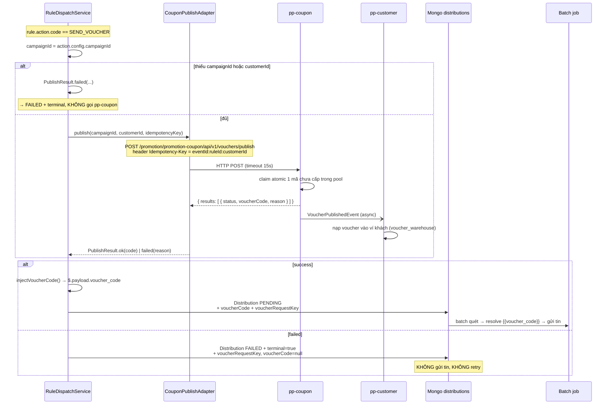

# Phần 4 — Action `SEND_VOUCHER`

> "Phát hành mã ưu đãi duy nhất từ một chiến dịch rồi nhắn mã đó cho khách."
>
> Đây là action **duy nhất** có xử lý riêng trong runtime. Mọi action khác đi
> đường mặc định ([Phần 5](05-ACTION-SEND-NOTIFICATION.md)).

---

## 1. Ràng buộc từ lúc tạo rule

`action.config.campaignId` là **bắt buộc**, kiểm ngay tại
`DistributionRuleService.validateActionConfig()`:

```java
if (ActionType.SEND_VOUCHER.name().equals(actionCode)) {
    Object campaignId = config.get("campaignId");
    if (campaignId == null || String.valueOf(campaignId).isBlank()) {
        throw new ActionConfigInvalidException(actionCode, "campaignId is required");
    }
}
```

Thiếu → **400 `ACTION_CONFIG_INVALID`**, rule không được tạo.

`campaignId` phải trỏ tới campaign loại **discount-coupon** (có pool mã) bên
pp-coupon. **Không có validate campaign tồn tại hay đúng loại** ở bước create —
sai campaignId chỉ lộ ra lúc runtime, dưới dạng mọi bản ghi `FAILED`.

---

## 2. Sơ đồ luồng



---

## 3. Phát hành mã — `issueVoucherIfNeeded()`

`RuleDispatchService.java`

```java
ActionSpec action = rule.getAction();
if (action == null || !ActionType.SEND_VOUCHER.name().equals(action.getCode())) {
    return null;                                    // không phải SEND_VOUCHER
}

String campaignId = asString(action.getConfig().get("campaignId"));
if (!StringUtils.hasText(campaignId))  return PublishResult.failed("Missing campaignId in SEND_VOUCHER action config");
if (!StringUtils.hasText(command.customerId())) return PublishResult.failed("Missing customerId in event for SEND_VOUCHER");

String idempotencyKey = eventId + ":" + ruleId + ":" + customerId;
return couponPublishPort.publish(new PublishCommand(
        campaignId, customerId, "DISTRIBUTION", idempotencyKey, ruleId, eventId));
```

### Ba tính chất quan trọng

**1. Gọi MỘT lần cho mỗi (event, rule, customer) — trước vòng lặp channel.**
Key phát mã `eventId:ruleId:customerId` **cố tình không kèm `channelType`**:

> *Mọi kênh của cùng một lần kích hoạt dùng chung một mã.*

Rule có SMS + PUSH → khách nhận **1 mã**, nhắn qua 2 kênh. Không phải 2 mã.

**2. Đồng bộ, chặn luồng consumer.** `WebClient...block()` với timeout mặc định
15s (`distribution.coupon-service.timeout-seconds`). Kafka consumer đứng chờ
pp-coupon trả lời trước khi `ack`.

**3. Idempotent hai tầng.** Header `Idempotency-Key` gửi sang pp-coupon để nó trả
cùng kết quả khi gọi lại; cộng với bộ lọc idempotency của distribution ở tầng
trên → retry an toàn, không phát trùng mã.

---

## 4. Adapter gọi pp-coupon

`adapter/out/external/coupon/CouponPublishAdapter.java`

**Endpoint:** `POST {distribution.coupon-service.url}/promotion/promotion-coupon/api/v1/vouchers/publish`

**Request:**

```json
{
  "campaignId": "cmp-0001",
  "customers": [ { "customerId": "cus-123", "channel": "DISTRIBUTION" } ],
  "publishedBy": "pp-distribution",
  "metadata": { "source": "distribution-action", "ruleId": "...", "eventId": "..." }
}
```

**Response** (tự bóc envelope `data` của `@ResponseWrapper` bên pp-coupon):

```json
{ "data": { "results": [ { "status": "PUBLISHED", "voucherCode": "ABC123XYZ" } ] } }
```

Chỉ coi là thành công khi **`status == "PUBLISHED"` VÀ `voucherCode` không rỗng**.
Mọi trường hợp khác → `failed("Voucher not published (status=..., reason=...)")`.

### Khác biệt so với các adapter khác

> *Khác với các adapter resolve tham số (fail-safe trả empty), adapter này phân
> biệt rõ thành công/thất bại để caller quyết định gửi tin hay đánh dấu FAILED.*

⚠️ Nhưng cách hiện thực **nuốt phân loại lỗi**: cả `onStatus(isError)` lẫn
`onErrorResume` đều `return Mono.empty()` → về tới `mapResponse` thành
`"Empty response from coupon service"`. Nghĩa là **timeout mạng, pp-coupon 500,
và pool hết mã đều cho ra cùng một thông điệp lỗi**, trong khi bản chất khác hẳn:
hai cái đầu đáng retry, cái sau thì không. Chi tiết lỗi thật chỉ còn trong log.

---

## 5. Bơm mã vào nội dung tin

```java
// injectVoucherCode()
JsonNode root = objectMapper.readTree(rawEventJson);
payload.put("voucher_code", voucherCode);
root.set("payload", payload);
```

Mã được ghi vào **`$.payload.voucher_code`** của event JSON lưu trong bản ghi
`distributions`. Sau đó batch resolve placeholder `{{voucher_code}}` trong nội
dung tin từ chính đường dẫn này (qua catalog `message_parameters.resolvePaths`).

Lỗi parse JSON → giữ nguyên event gốc, tin sẽ gửi đi với `{{voucher_code}}` **thô,
không thay thế** (xem [Phần 6 §5](06-PIPELINE-GUI-TIN.md) — placeholder không
resolve được sẽ giữ nguyên chuỗi gốc, không fail).

---

## 6. Dấu vết phát hành trên bản ghi

```java
if (voucher != null) {
    distribution.setVoucherRequestKey(eventId + ":" + ruleId + ":" + customerId);
    distribution.setVoucherCode(voucher.success() ? voucher.voucherCode() : null);
}
```

Mục đích (theo comment trong code):

> *Ghi lại dấu vết phát hành ngay trên bản ghi phân phối để thống kê "Số lượng mã
> phát hành" đếm được mà không phải hỏi pp-coupon.*

`voucherRequestKey` là khoá gom nhóm khi đếm — nhiều kênh cùng một lần phát mã
chia sẻ một key, nên `distinct(voucherRequestKey)` cho ra đúng số mã đã phát.

Với `SEND_NOTIFICATION`: `voucher == null` → **cả hai field để trống**.

---

## 7. Điểm rủi ro riêng của nhánh này

| # | Vấn đề | Hậu quả |
|---|---|---|
| 1 | **Phát mã nằm ngoài transaction** — `dispatch()` không có `@Transactional`. Nếu `saveAllDistributions()` hỏng sau khi pp-coupon đã cấp mã | Khách có voucher trong ví nhưng **không nhận được tin nào**, không biết mình có mã. Không có cơ chế hoàn/reconcile |
| 2 | **Gọi HTTP đồng bộ trong consumer**, timeout 15s | pp-coupon chậm → consumer lag dồn; N rule `SEND_VOUCHER` cùng khớp 1 event = N lần gọi tuần tự, tối đa N×15s |
| 3 | **`campaignId` không được validate lúc create** | Sai id / campaign không phải loại coupon → **100% bản ghi FAILED terminal**, phát hiện muộn ở runtime |
| 4 | **Mọi lỗi HTTP quy về "Empty response"** | Không phân biệt được pool hết mã (đừng retry) với lỗi mạng (nên retry) |
| 5 | **Phát mã thành công nhưng gửi tin fail** → bản ghi `FAILED`, batch retry gửi lại tin, **mã không phát lại** (đúng) | Đúng về mã, nhưng nếu hết lượt retry thì mã đã cấp vẫn không tới tay khách |
| 6 | `eventId` fallback `IdGenerator.generateId()` khi event thiếu `$.id` | Idempotency key mới mỗi lần → **replay event = phát mã mới** |

---

## 8. Cấu hình liên quan

```properties
distribution.coupon-service.url=...
distribution.coupon-service.timeout-seconds=15
distribution.coupon-service.publish-path=/promotion/promotion-coupon/api/v1/vouchers/publish
```

---

**→ Tiếp: [Phần 5 — action SEND_NOTIFICATION](05-ACTION-SEND-NOTIFICATION.md)**
