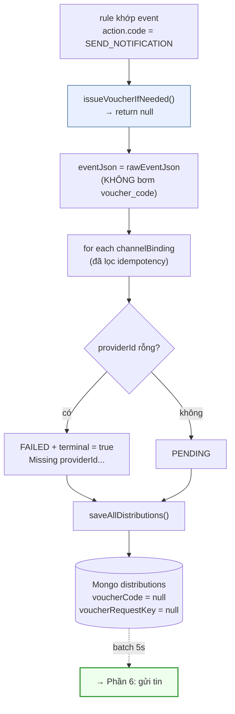

# Phần 5 — Action `SEND_NOTIFICATION`

> "Gửi tin nhắn thông thường cho khách khi sự kiện xảy ra."

---

## 1. Điểm mấu chốt: đây là luồng MẶC ĐỊNH, không phải luồng riêng

Khác với `SEND_VOUCHER`, `SEND_NOTIFICATION` **không có một dòng code nào xử lý
riêng cho nó** trong toàn bộ runtime. Grep cả module:

```bash
$ grep -rn "SEND_NOTIFICATION" src/main/java/
# → chỉ xuất hiện ở: enum ActionType, mongock seed catalog
#   KHÔNG xuất hiện trong RuleDispatchService, batch, provider
```

Cơ chế thật là **phủ định**:

```java
// RuleDispatchService.issueVoucherIfNeeded()
if (action == null || !ActionType.SEND_VOUCHER.name().equals(action.getCode())) {
    return null;        // ← SEND_NOTIFICATION rơi vào đây
}
```

`voucher = null` → bỏ qua toàn bộ nhánh phát mã → đi thẳng tới dựng bản ghi
`Distribution` và gửi tin.

### Hệ quả

| Giá trị `action.code` | Runtime xử lý |
|---|---|
| `SEND_NOTIFICATION` | gửi tin thường |
| `ADD_POINTS` *(nếu có trong catalog)* | **gửi tin thường — KHÔNG cộng điểm** |
| chuỗi bất kỳ khác | **gửi tin thường** |
| `null` | **gửi tin thường** |

`ActionType` khai 3 giá trị (`SEND_VOUCHER`, `SEND_NOTIFICATION`, `ADD_POINTS`)
nhưng mongock chỉ seed **2** vào catalog `actions`. `ADD_POINTS` không seed →
`resolveAction()` lúc create ném **404 `ACTION_NOT_FOUND`** → hiện tại không dùng
được. Nếu sau này ai đó seed `ADD_POINTS` vào catalog mà quên sửa
`RuleDispatchService`, rule sẽ **tạo được, chạy được, nhưng chỉ gửi tin chứ không
cộng điểm** — sai âm thầm, không có lỗi nào.

---

## 2. Sơ đồ luồng



So với `SEND_VOUCHER`, nhánh này **bỏ qua đúng 3 việc**:

1. Không gọi pp-coupon (`CouponPublishPort`).
2. Không `injectVoucherCode()` — event JSON giữ nguyên.
3. Không set `voucherCode` / `voucherRequestKey` trên bản ghi.

Còn lại **giống hệt nhau**.

---

## 3. `action.config` không được dùng

```java
// validateActionConfig() — chỉ có 1 luật duy nhất
if (ActionType.SEND_VOUCHER.name().equals(actionCode)) { ... }
```

Với `SEND_NOTIFICATION`, `config` được **lưu nguyên xi vào rule nhưng không ai
đọc**. Admin gửi gì cũng nhận 201, runtime bỏ qua hoàn toàn. Nội dung tin đến từ
`channelBindings[].content` / `title` hoặc template, không phải từ `config`.

---

## 4. Khác biệt khi vận hành

| | `SEND_VOUCHER` | `SEND_NOTIFICATION` |
|---|---|---|
| Gọi service ngoài lúc dispatch | ✅ pp-coupon, đồng bộ, 15s timeout | ❌ không |
| Độ trễ dispatch | phụ thuộc pp-coupon | gần như tức thì |
| Có thể FAILED ngay tại dispatch | ✅ (phát mã hỏng **hoặc** thiếu provider) | ✅ (chỉ thiếu provider) |
| `{{voucher_code}}` trong nội dung | resolve được | **giữ nguyên chuỗi thô** |
| Field `voucherCode`, `voucherRequestKey` | có giá trị | `null` |
| Thống kê "Số lượng mã phát hành" | đếm được | luôn 0 |
| Rủi ro mất tiền khi lỗi | có (mã đã cấp) | không |

> ⚠️ Nếu admin gắn `{{voucher_code}}` vào nội dung của rule `SEND_NOTIFICATION`,
> tin gửi đi sẽ chứa **nguyên chuỗi `{{voucher_code}}`** — không có lỗi, không có
> cảnh báo. Xem [Phần 6 §5](06-PIPELINE-GUI-TIN.md).

---

## 5. Khi nào dùng nhánh nào

Theo mô tả catalog (mongock `SeedActionsCatalogChangeLog`):

- **`SEND_VOUCHER`** — sự kiện cần **kèm ưu đãi**: khách vào tệp VIP → tặng mã
  giảm giá; thanh toán đơn lớn → tặng mã lần sau.
- **`SEND_NOTIFICATION`** — sự kiện chỉ cần **báo tin**: đơn hàng được tạo,
  điểm thưởng hết hạn, voucher bị thu hồi, ticket đã đóng.

---

**→ Tiếp: [Phần 6 — Pipeline gửi tin (chung cả 2 action)](06-PIPELINE-GUI-TIN.md)**
