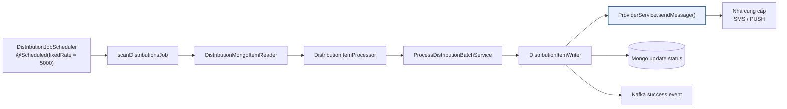
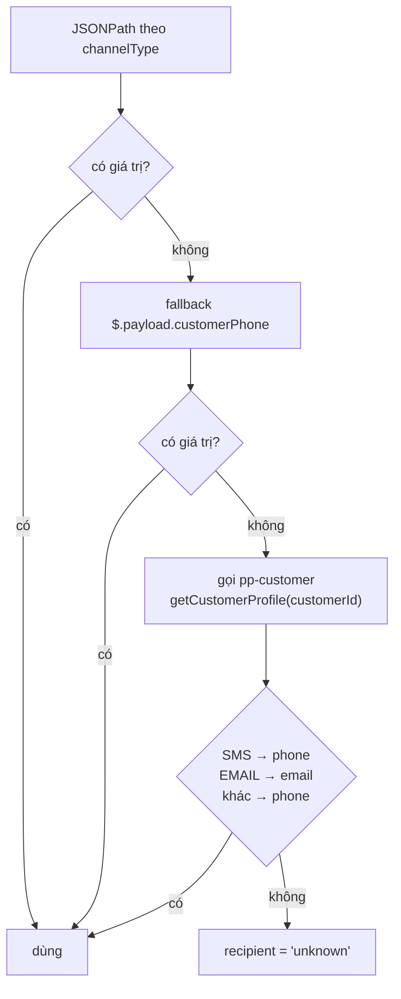
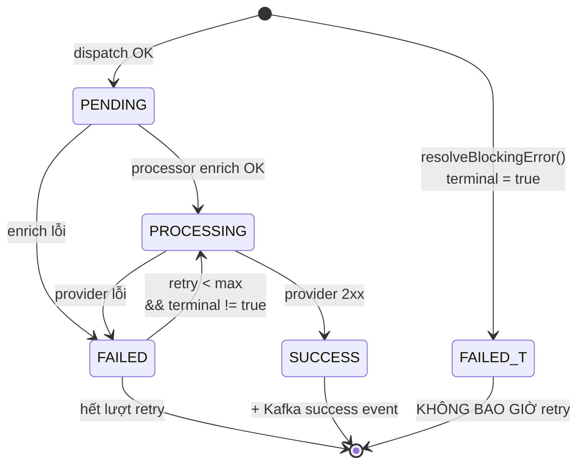

# Phần 6 — Pipeline gửi tin (chung cho cả 2 action)

> Từ bản ghi `distributions` status `PENDING` đến lúc tin thật sự ra khỏi hệ thống.
> Hai nhánh action đã hội tụ tại đây — pipeline này **không đọc `actionCode`**.

---

## 1. Sơ đồ Spring Batch



Chu kỳ **5 giây** (`DistributionJobScheduler.java:41`).

---

## 2. Reader — chọn bản ghi nào

`batch/reader/DistributionMongoItemReader.java:48`

```java
Criteria criteria = new Criteria().orOperator(
    Criteria.where("status").is(PENDING),
    Criteria.where("status").is(FAILED)
            .and("retry").lt(maxRetries)
            .and("terminal").ne(true)
);
// sort: retry ASC, createdAt ASC
```

| Trạng thái | Có được đọc lại? |
|---|---|
| `PENDING` | ✅ luôn |
| `FAILED` + còn lượt retry + `terminal != true` | ✅ |
| `FAILED` + `terminal = true` | ❌ **không bao giờ** |
| `FAILED` + hết lượt retry | ❌ |
| `SUCCESS` | ❌ |

`terminal = true` chính là cờ mà `resolveBlockingError()` đặt lúc dispatch
([Phần 3 §3.7](03-LUONG-DISPATCH.md)) — phát voucher hỏng hoặc thiếu `providerId`.

---

## 3. Processor — enrich (`DistributionItemProcessor`)

Load lại rule aggregate root, ghép với catalog provider/template:

```
1. distributionRuleId  → findById()           → rule not found         ⇒ fail
2. channelType         → tìm binding khớp     → No channelBinding...   ⇒ fail
3. binding.providerId  → có?                  → Missing providerId...  ⇒ fail
4. providerId          → findById()           → Provider not found     ⇒ fail
5. provider.active     → true?                → Provider inactive      ⇒ fail
6. nội dung tin        → binding.content, rỗng thì template.body
```

> Provider **endpoint + credentials + payloadMapping vẫn lookup catalog**, không
> denormalize vào rule — security boundary (REDESIGN_REPORT.md §4.3). Chỉ
> `providerName` được snapshot để hiển thị.

⚠️ Bước 3 trùng lặp với `resolveBlockingError()` ở dispatch. Comment trong code
xác nhận là **cố ý**: *"khớp đúng lỗi mà DistributionItemProcessor sẽ trả nếu batch
có chạy, nên kết cục cuối cùng của bản ghi không đổi — chỉ là biết sớm hơn"*.

---

## 4. Xác định người nhận

`ProcessDistributionBatchService.extractRecipient()`



JSONPath mặc định theo kênh:

| `channelType` | Path |
|---|---|
| `SMS` | `$.payload.customerPhone` |
| `EMAIL` | `$.payload.customerEmail` |
| `PUSH` | `$.payload.deviceId` |
| khác | `$.recipient` |

> ⚠️ Không tìm được người nhận thì trả chuỗi **`"unknown"`** chứ không fail. Bản
> ghi vẫn đi tiếp tới `ProviderService` và gửi tới địa chỉ `"unknown"` — lỗi chỉ
> lộ ra ở phía nhà cung cấp.

---

## 5. Sinh nội dung tin — resolve `{{placeholder}}`

`MessageGenerationService` (domain service thuần, regex `\{\{([^}]+)}}`).

Thứ tự ưu tiên khi resolve một key:

```
Tầng 0  staticParams[] của rule (LITERAL / SOURCE)   ← THẮNG mọi nguồn động
Tầng 1  bindingParamsLogic (JSONPath mapping, legacy)
Tầng 2  catalog message_parameters:
          2a. resolvePaths[]  → đọc JSONPath trên event payload
          2b. enrichField     → gọi pp-customer (name / phone / email)
          2c. campaignField   → gọi pp-campaign (campaign_id suy từ event)
          2d. current_date    → LocalDate.now()
          2e. defaultValue
```

`{{voucher_code}}` của nhánh `SEND_VOUCHER` được resolve ở **tầng 2a** — đọc
`$.payload.voucher_code` mà `injectVoucherCode()` đã bơm vào lúc dispatch.

Các lời gọi pp-customer / pp-campaign đều **memoize** — nhiều placeholder cùng
nguồn chỉ gọi 1 lần cho mỗi bản ghi.

### ⚠️ Placeholder không resolve được thì GIỮ NGUYÊN

```java
Object value = params.get(key);
if (value != null) {
    result = result.replace(placeholder, value.toString());
}
// value == null → không thay thế, không log, không fail
```

Tin gửi đi chứa nguyên chuỗi `{{ten_tham_so}}`. Đây là lý do rule
`SEND_NOTIFICATION` gắn `{{voucher_code}}` sẽ gửi tin lỗi mà không ai biết.

### 🐛 Bug: placeholder trong `title` của PUSH không bao giờ resolve

`ProcessDistributionBatchService.augmentWithCatalog()`:

```java
String template = context.templateMessage();
if (templateType.equals("title")) {
    template = context.templateMessage();   // ← nhánh này LÀM ĐÚNG Y HỆT nhánh trên
}
```

Đáng lẽ phải là `context.templateTitle()`. Hệ quả: `titleParams` được rút
placeholder từ **nội dung tin**, rồi đem áp vào **tiêu đề**. Một `{{key}}` chỉ
xuất hiện trong title (không có trong content) sẽ **không nằm trong params** →
tiêu đề push hiện nguyên `{{key}}`.

Chỉ ảnh hưởng PUSH (kênh duy nhất dùng `title`). Sửa 1 dòng.

---

## 6. Writer — gửi thật và cập nhật

`batch/writer/DistributionItemWriter.java`

```java
for (item : chunk) {
    if (item.status() == PROCESSING)  response = providerService.sendMessage(item);
    else                              response = createFailedResponse(item);
}
updateDistributionStatuses(responses);   // updateFirst theo _id, inc version
publishSuccessEvents(responses);         // chỉ SUCCESS → Kafka
```

Gửi **tuần tự** từng item trong chunk, không song song.

---

## 7. `ProviderService` — mắt xích cuối

`batch/service/ProviderService.java:73`

```java
if (mockEnabled) return sendMessageMock(item);

protocol = protocolResolver.resolve(item.providerProtocol(), item.payloadMapping());
strategy = selectStrategy(protocol);
tokenInfo = acquireTokenIfNeeded(item, protocol);
return executeWithStrategy(strategy, item, tokenInfo);
```

Protocol hỗ trợ: **`JSON_REST`** và **`SMS_BANKING_SOAP`**
(`adapter/out/provider/strategy/`). Resolver có heuristic: `payloadMapping` bắt
đầu bằng `<` mà protocol khai `JSON_REST` → báo lỗi cấu hình
*"missing protocol = SMS_BANKING_SOAP?"*.

`TokenAcquisitionException` được bắt và finalize thành FAILED/retry **tại chỗ**,
không để ném ra Writer — comment giải thích: nếu ném ra sẽ fail cả chunk, bản ghi
giữ nguyên `PENDING` và **bị scheduler quét lại vô hạn mỗi 5 giây**.

> Chi tiết endpoint / body / auth của tầng này đã có tài liệu riêng:
> `p2_promotion-distribution/PROVIDER_SEND_FLOW.md`.

---

## 8. Vòng đời trạng thái đầy đủ



---

## 9. Hai tầng cần phân biệt khi debug

| | Tầng dispatch (Phần 3) | Tầng gửi (Phần 6) |
|---|---|---|
| Nơi chạy | Kafka consumer | Spring Batch, mỗi 5s |
| Đầu ra | bản ghi `distributions` | tin thật + cập nhật status |
| Log nhận dạng | `[DISPATCHING-VOUCHER-EVENT]` | `Writing N distribution items` |
| Hỏng thì thấy gì | không có bản ghi nào | bản ghi kẹt `PENDING` |

**Bản ghi `PENDING` tồn đọng = rule trigger đúng, batch không chạy.** Không phải
lỗi cấu hình rule.

---

**→ Tiếp: [Phần 7 — Tổng hợp rủi ro & checklist](07-RUI-RO-VA-CHECKLIST.md)**
