# Phần 8 — Sơ đồ đầy đủ luồng phân phối

> Toàn cảnh end-to-end trên một tài liệu: **3 cửa vào → chọn rule → rẽ nhánh action
> → ghi `distributions` → batch gửi tin → kết quả**, kèm mọi nhánh lỗi, retry, DLQ
> và ranh giới thread.
>
> Module `p2_promotion-distribution` · Cập nhật: 2026-09-21
> Bổ sung so với Phần 3–6: **cửa vào thứ 2 và thứ 3**, DLQ, cấu hình batch thật,
> backoff của provider, ranh giới thread.

---

## 1. Toàn cảnh một trang

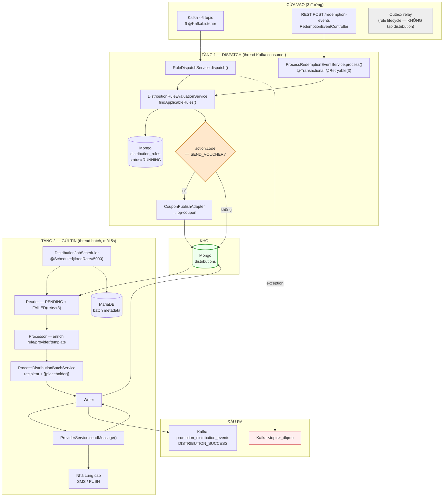

> **Cửa vào thứ 3 không tạo distribution**: outbox `promotion_distribution_rule_event`
> chỉ phát sự kiện vòng đời rule (CREATED/UPDATED/ACTIVATED/PAUSED/DELETED) cho hệ
> downstream. Grep toàn workspace: **không có consumer nào**. Vẽ ở đây để khỏi nhầm.

---

## 2. Cửa vào chi tiết

### 2.1 — Sáu consumer Kafka

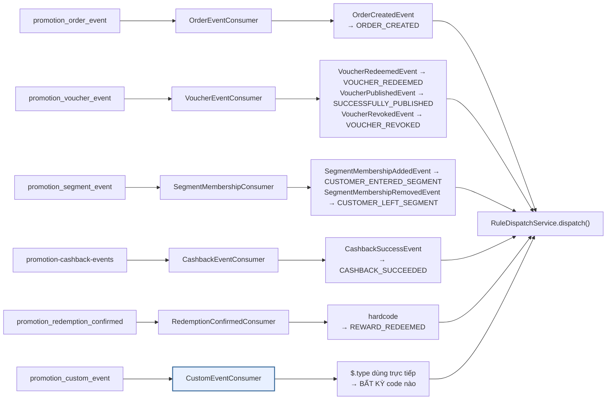

Mỗi consumer làm đúng 4 bước rồi `ack`:

```
1. map type → eventCode      → thiếu: log.warn + ack + return   ⚠ MẤT MESSAGE
2. lấy payload.customer_id   → thiếu: log.warn + ack + return   ⚠ MẤT MESSAGE
3. serialize lại rawJson
4. dispatch(DispatchCommand)
```

### 2.2 — Cửa REST (ít ai biết)

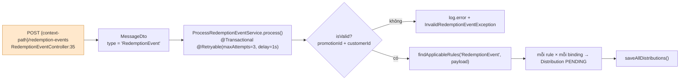

Khác biệt so với đường Kafka — **cần biết để không hiểu nhầm khi debug**:

| | Đường Kafka (`RuleDispatchService`) | Đường REST (`ProcessRedemptionEventService`) |
|---|---|---|
| `@Transactional` | ❌ không | ✅ có, `rollbackFor = Exception.class` |
| Retry | qua Kafka error handler + DLQ | `@Retryable(3, backoff 1s)` tại chỗ |
| Lọc idempotency | ✅ `filterPendingBindings()` | ❌ **không có** |
| Đếm `eventTriggerCount` | ✅ | ❌ **không đếm** |
| Phát voucher `SEND_VOUCHER` | ✅ | ❌ **không phát** — dù rule là SEND_VOUCHER |
| `eventCode` dùng để match | từ bảng map của consumer | luôn là chuỗi `"RedemptionEvent"` |

> ⚠️ Đường REST **bỏ qua hoàn toàn nhánh action**. Rule `SEND_VOUCHER` khớp qua cửa
> này sẽ gửi tin mà **không có mã**, `{{voucher_code}}` giữ nguyên chuỗi thô.
> Javadoc của service còn tham chiếu `ProcessCashbackEventService` — class này
> **không còn tồn tại**.

---

## 3. Tầng 1 — Dispatch đầy đủ

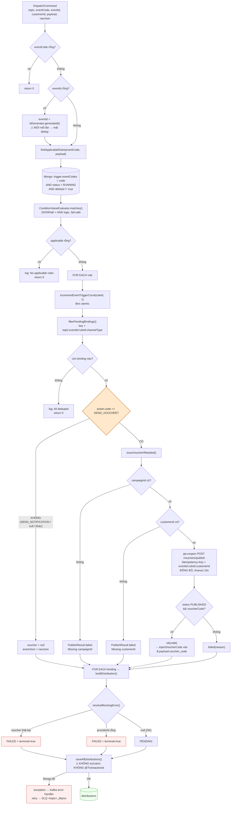

### Bốn nhánh xử lý lỗi của consumer

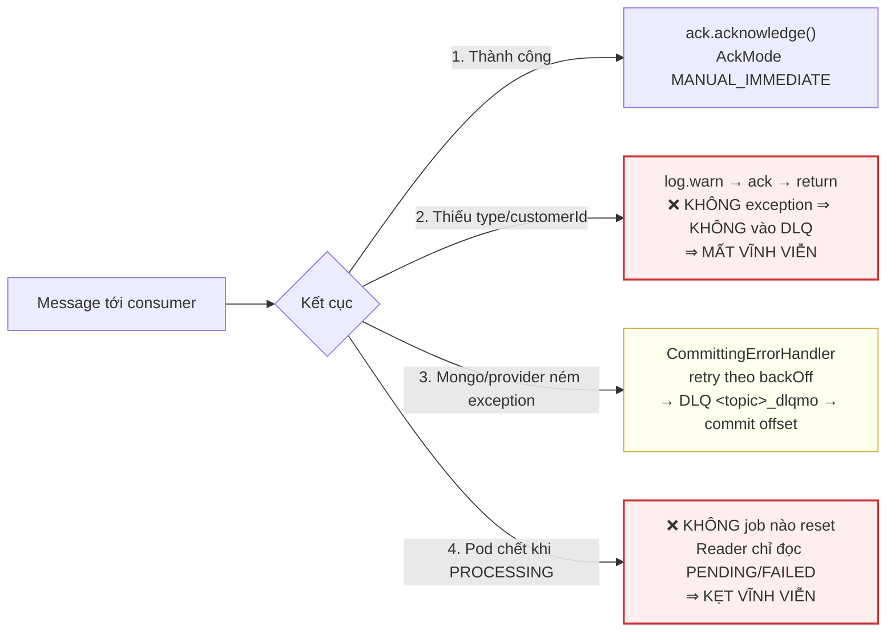

---

## 4. Tầng 2 — Pipeline gửi tin đầy đủ

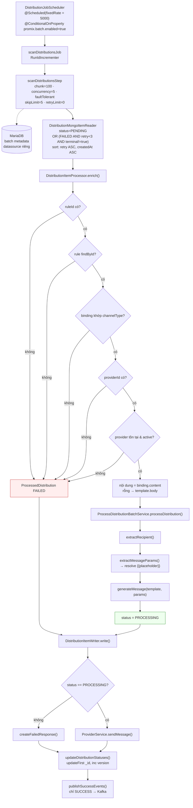

### 4.1 — Xác định người nhận

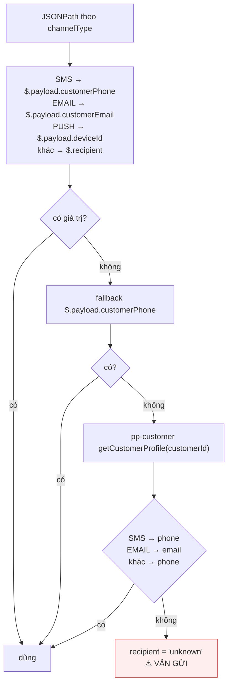

### 4.2 — Resolve `{{placeholder}}`

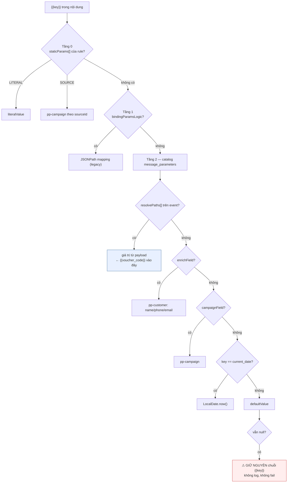

### 4.3 — Gửi và phân loại kết quả

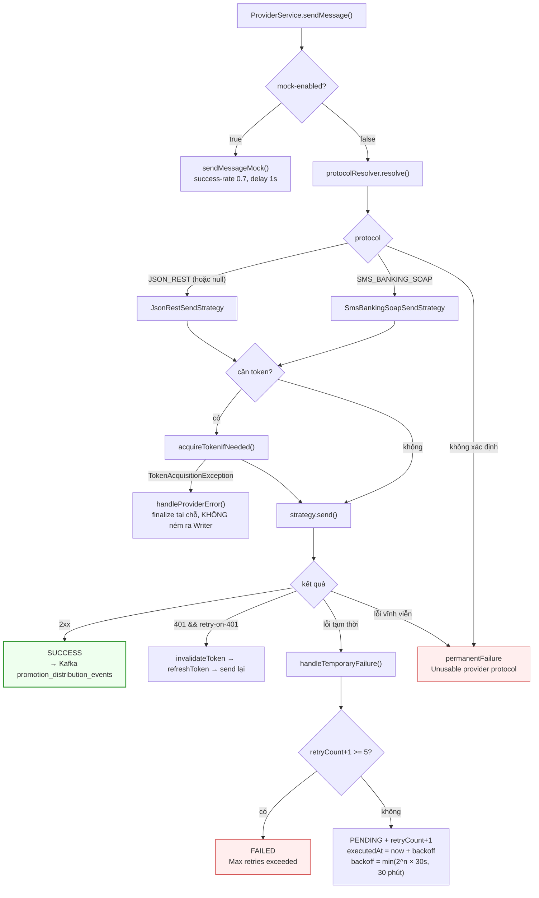

---

## 5. Vòng đời trạng thái `Distribution`

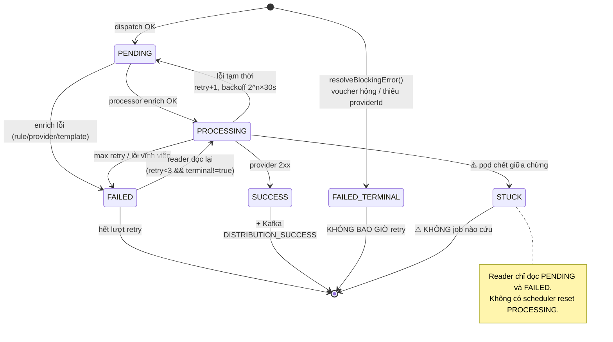

> ⚠️ **Hai ngưỡng retry lệch nhau**: reader lọc `retry < 3`
> (`distribution.batch.max-retries=3`) nhưng `ProviderService` chỉ đánh FAILED khi
> `retry >= 5` (`distribution.retry.max-attempts=5`). Bản ghi đạt `retry = 3` và 4
> bị **reader bỏ qua trong khi ProviderService vẫn coi là còn lượt** → nằm im ở
> `PENDING`/`FAILED` mà không ai xử lý.

---

## 6. Sequence đầy đủ (nhánh SEND_VOUCHER)

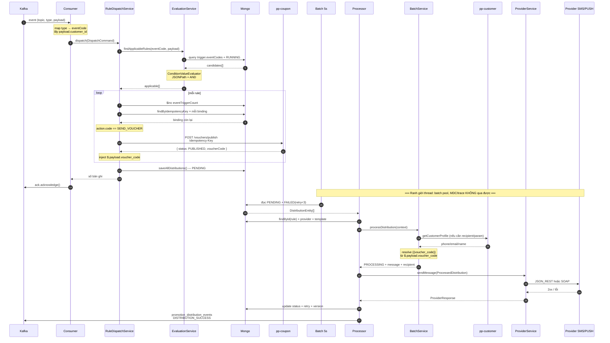

---

## 7. Ranh giới thread và ngữ cảnh log

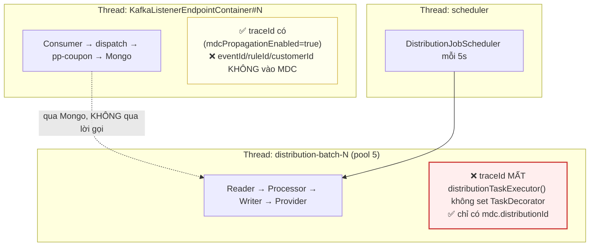

Hai tầng **không nối nhau bằng lời gọi hàm** mà qua bảng `distributions`. Cộng với
việc batch pool không propagate context ⇒ **không thể trace một event từ Kafka tới
lúc tin được gửi bằng `traceId`**. Hiện chỉ nối được thủ công qua
`distributionId` / `idempotencyKey`.

---

## 8. Bảng tham số vận hành

| Tham số | Giá trị | Nguồn |
|---|---|---|
| Chu kỳ batch | **5 giây** | `DistributionJobScheduler:41` `@Scheduled(fixedRate = 5000)` |
| Bật/tắt batch | `promix.batch.enabled=true` | `application.properties:54` |
| ⚠ Property chết | `distribution.batch.enabled=false` | `:198` — **không code nào đọc**, đặt `false` không tắt được batch |
| Chunk size | 100 | `promix.batch.chunk-size` `:55` |
| Concurrency | 5 luồng | `promix.batch.concurrency-limit` `:56` |
| Skip limit | 5 | `DistributionBatchConfig` `.skipLimit(5)` |
| Retry của Spring Batch | **0** (tắt) | `.retryLimit(0)` — retry do `ProviderService` lo |
| Reader lọc retry | `< 3` | `distribution.batch.max-retries=3` `:202` |
| Provider max retry | **5** | `distribution.retry.max-attempts=5` `:212` ⚠ lệch với trên |
| Backoff | `min(2^n × 30s, 30 phút)` | `:213-214` |
| Timeout provider | 30 000 ms | `:206` |
| Timeout pp-coupon | 15 s | `distribution.coupon-service.timeout-seconds` |
| Mock mode | `false` | `:209` (success-rate 0.7 khi bật) |
| Retry on 401 | `true` | `:216` |
| Kafka AckMode | `MANUAL_IMMEDIATE` | `:141` |
| DLQ | **bật**, suffix `_dlqmo` | `:155-156` |
| Batch metadata DB | **MariaDB riêng** | `promix.batch.datasource.*` `:57-61` |
| Topic kết quả | `promotion_distribution_events` | `KafkaEventPublisher:23` |

> Batch metadata nằm ở **MariaDB** trong khi dữ liệu nghiệp vụ ở **MongoDB**.
> MariaDB chết ⇒ job không chạy ⇒ `distributions` dồn `PENDING` dù Mongo vẫn khoẻ.

---

## 9. Bản đồ điểm gãy

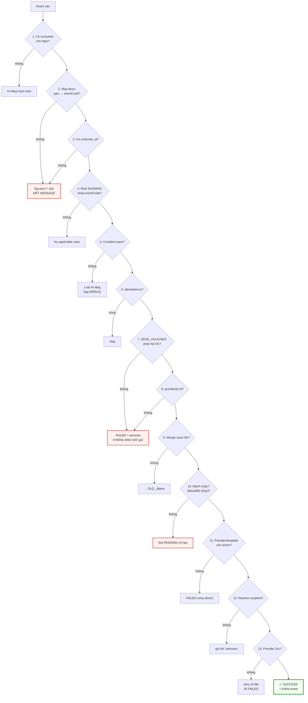

| Điểm gãy | Dấu hiệu nhận biết |
|---|---|
| 1 | Không log gì cả |
| 2, 3 | `log.warn` trong consumer, **không có bản ghi nào** |
| 4 | `[DISPATCHING-VOUCHER-EVENT] No applicable rules` |
| 5 | log DEBUG `Path {} not found in payload` |
| 6 | `Idempotency hit — skip key=` |
| 7, 8 | `Distribution không gửi được — reason=` + `terminal:true` trong Mongo |
| 9 | Message nằm ở topic `<topic>_dlqmo` |
| 10 | `distributions` dồn `PENDING`, **không có** log `Writing N distribution items` |
| 11 | `Distribution X cannot be dispatched: Provider inactive/not found` |
| 12 | `Could not extract recipient ... returning unknown` |
| 13 | `Scheduling retry for distribution` rồi `Max retry attempts reached` |

---

## 10. Liên kết

- [Phần 1 — Tạo rule](01-TAO-RULE.md)
- [Phần 2 — Event nào trigger](02-EVENT-NAO-TRIGGER.md)
- [Phần 3 — Luồng dispatch](03-LUONG-DISPATCH.md)
- [Phần 4 — SEND_VOUCHER](04-ACTION-SEND-VOUCHER.md)
- [Phần 5 — SEND_NOTIFICATION](05-ACTION-SEND-NOTIFICATION.md)
- [Phần 6 — Pipeline gửi tin](06-PIPELINE-GUI-TIN.md)
- [Phần 7 — Rủi ro & checklist](07-RUI-RO-VA-CHECKLIST.md)
- Đánh giá log: [`docs-log-evaluation/`](../docs-log-evaluation/KIEM-CHUNG-V1-V9.md)
