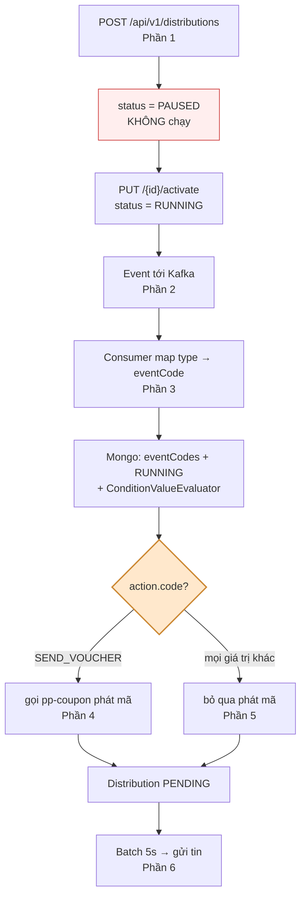

# Phân tích Distribution Rule — `p2_promotion-distribution`

> Tài liệu phân tích luồng đầy đủ: **tạo rule → bật → event trigger → gửi tin**.
> Ngày phân tích: 2026-09-19 · Nhánh: `staging`

---

## Đọc theo thứ tự

| # | File | Nội dung |
|---|---|---|
| 1 | [01-TAO-RULE.md](01-TAO-RULE.md) | API `POST /api/v1/distributions` — validate, resolve catalog, persist, outbox |
| 2 | [02-EVENT-NAO-TRIGGER.md](02-EVENT-NAO-TRIGGER.md) | Rule bật xong bắt được những event nào, điều kiện đánh giá ra sao |
| 3 | [03-LUONG-DISPATCH.md](03-LUONG-DISPATCH.md) | Kafka → chọn rule → idempotency → sinh bản ghi `distributions` |
| 4 | [04-ACTION-SEND-VOUCHER.md](04-ACTION-SEND-VOUCHER.md) | Nhánh phát mã: gọi pp-coupon, bơm `voucher_code`, dấu vết phát hành |
| 5 | [05-ACTION-SEND-NOTIFICATION.md](05-ACTION-SEND-NOTIFICATION.md) | Nhánh gửi tin thường — luồng **mặc định** |
| 6 | [06-PIPELINE-GUI-TIN.md](06-PIPELINE-GUI-TIN.md) | Spring Batch 5s: reader → processor → resolve placeholder → provider |
| 7 | [07-RUI-RO-VA-CHECKLIST.md](07-RUI-RO-VA-CHECKLIST.md) | 20 rủi ro xếp theo mức độ + checklist debug + đề xuất sửa |

---

## Tóm tắt một trang

### 5 điều cần nhớ

1. **Rule mới luôn `PAUSED`** — phải `activate` mới chạy. Không có cache nên bật
   là có hiệu lực ngay.
2. **Catalog có ~28 event nhưng chỉ 9 code có consumer.** `ORDER_PAID` **không**
   nằm trong số đó dù CMS cho chọn.
3. **Chỉ `SEND_VOUCHER` có xử lý riêng.** `SEND_NOTIFICATION` và mọi giá trị khác
   đi chung một đường mặc định.
4. **`providerId` rỗng lúc tạo rule = rule chết**, nhưng API vẫn trả 201.
5. **Hai tầng độc lập**: dispatch (Kafka, tạo bản ghi) và gửi (batch 5s). Bản ghi
   `PENDING` tồn đọng nghĩa là tầng 2 hỏng, không phải lỗi rule.

---

## Tài liệu liên quan trong module

Nằm ở `p2_promotion-distribution/`:

| File | Nội dung |
|---|---|
| `PROVIDER_SEND_FLOW.md` | Chi tiết `ProviderService` — endpoint, body, auth, người nhận |
| `DISTRIBUTION_BATCH_JOB_FLOW.md` | Luồng batch job cấp trên |
| `CASHBACK_TO_DISTRIBUTION_FLOW.md` | Luồng cashback → distribution |
| `PUSH_NOTIFICATION_FLOW.md` | Luồng push notification |
| `SOAP_REFACTOR_FLOW.md` | Refactor SOAP strategy |
| `DEAD_CODE_AUDIT.md`, `DEPRECATED_FIELDS.md` | Audit code chết / field deprecated |

---

## File nguồn chính

| Vai trò | Đường dẫn (từ `p2_promotion-distribution/src/main/java/vn/viettel/vds/promotion/distribution/`) |
|---|---|
| Controller | `adapter/in/web/DistributionRuleController.java:124` |
| Service CRUD | `application/service/DistributionRuleService.java:149` |
| Consumer Kafka | `adapter/in/messaging/*Consumer.java` |
| Dispatch runtime | `application/service/RuleDispatchService.java:51` |
| Chọn rule | `application/service/DistributionRuleEvaluationService.java` |
| Đánh giá điều kiện | `domain/service/ConditionValueEvaluator.java` |
| Phát voucher | `adapter/out/external/coupon/CouponPublishAdapter.java` |
| Batch scheduler | `batch/scheduler/DistributionJobScheduler.java:41` |
| Batch enrich | `batch/processor/DistributionItemProcessor.java` |
| Sinh nội dung | `application/service/ProcessDistributionBatchService.java` |
| Gửi thật | `batch/service/ProviderService.java:73` |
| Seed catalog event | `infrastructure/persistence/mongock/EventCatalogSeedData.java:181` |
| Seed catalog action | `infrastructure/persistence/mongock/SeedActionsCatalogChangeLog.java` |
