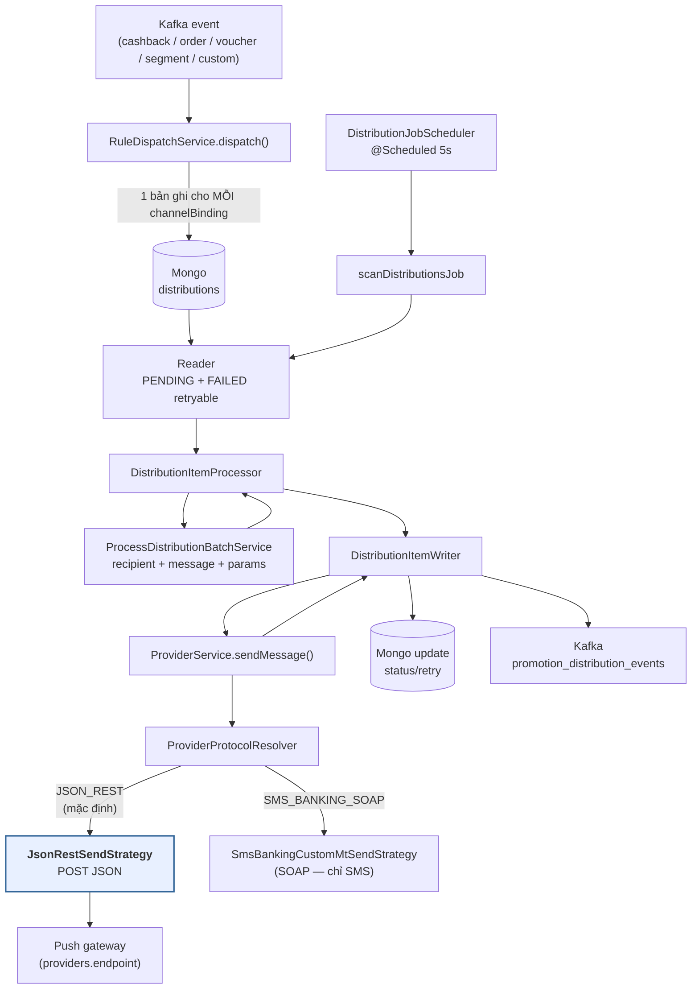

# Phân tích luồng gửi Push Notification — `staging_promotion-distribution`

> Trả lời cụ thể: **PUSH đi qua đường nào, ai chọn provider, người nhận lấy ở đâu,
> body request dựng thế nào, `title` / `iconUrl` / `deepLink` có tới được gateway không**
> — và những chỗ đang hỏng.
>
> Tài liệu bổ trợ cho `PROVIDER_SEND_FLOW.md` (tầng gọi HTTP) và
> `DISTRIBUTION_BATCH_JOB_FLOW.md` (luồng job cấp trên).
> Ngày phân tích: 2026-09-08 · Nhánh: `tamntt25/fix-build-uat`

---

## 0. Kết luận ngắn

| # | Kết luận | Mức độ |
|---|---|---|
| 1 | **Không có adapter push riêng.** PUSH dùng đúng cùng một đường `JsonRestSendStrategy` như mọi kênh khác — POST một JSON body do `providers.payload_mapping` quyết định. Không có FCM SDK, không có Insider, không có device-token registry. | — |
| 2 | Chỉ **3 thứ** phân biệt PUSH với SMS trong toàn bộ code: `channelType` trên bản ghi, JSONPath lấy recipient, và việc bỏ qua gọi `pp-customer`. | — |
| 3 | `title` / `iconUrl` / `deepLink` **cấu hình được qua API, lưu được vào Mongo, nhưng không bao giờ tới gateway** — chết ở tầng `DistributionItemProcessor`. | 🔴 P1 |
| 4 | Recipient path của PUSH là `$.payload.deviceId` (camelCase) nhưng schema event duy nhất có device lại khai `$.payload.device_id` (snake_case) → **luôn fallback về `customerId`**. | 🔴 P2 |
| 5 | Bất kỳ HTTP 2xx đều được ghi `SUCCESS` mà không đọc body → FCM trả 200 kèm `failure: 1` vẫn tính là gửi thành công. | 🟠 P3 |

Nói cách khác: **hiện trạng gửi được PUSH đúng nghĩa "POST một JSON tới một URL"**, và nội dung
duy nhất tới được gateway là `recipient` + `message` (một chuỗi text đã render). Mọi thứ mang
tính "notification" (tiêu đề, icon, deeplink) chưa có đường đi.

---

## 1. Toàn cảnh



**Không có nhánh nào rẽ riêng cho PUSH trong sơ đồ trên.** Đó là điểm cốt lõi của tài liệu này.

---

## 2. Chặng 1 — Sinh bản ghi phân phối

`RuleDispatchService.buildDistributionsForRule()`

- Mỗi `rule.channelBindings[]` sinh **1 bản ghi `distributions` độc lập**. Rule có cả SMS lẫn
  PUSH ⇒ 2 bản ghi, 2 lần gửi, 2 trạng thái riêng.
- Idempotency key: `topic:eventId:ruleId:channelType` — có `channelType` nên PUSH và SMS không
  đè nhau (`RuleDispatchService.buildIdempotencyKey`).
- Rule action `SEND_VOUCHER`: mã voucher phát **1 lần cho cả rule** (khoá
  `eventId:ruleId:customerId`, không kèm channel) rồi bơm vào `$.payload.voucher_code` của
  event JSON ⇒ SMS và PUSH dùng chung một mã.
- Binding thiếu `providerId` bị đánh `FAILED` + `terminal=true` ngay lúc dispatch, không xếp
  hàng chờ (`resolveBlockingError`).

Bản ghi lưu lại **chỉ 4 thứ liên quan tới nội dung**: `channelType`, `customerId`, `event`
(JSON gốc), `voucherCode`. Không lưu title/deeplink — đây là mắt đầu tiên của chuỗi mất dữ liệu ở P1.

---

## 3. Chặng 2 — Batch job

| Thuộc tính | Giá trị | Nguồn |
|---|---|---|
| Cổng bật/tắt job | `promix.batch.enabled=true` | `DistributionBatchConfig:33` (`@ConditionalOnProperty`) |
| Chu kỳ | `@Scheduled(fixedRate = 5000)` — 5s | `DistributionJobScheduler:41` |
| Cổng scheduler | `distribution.batch.scheduler.enabled` (default `true`) | `DistributionJobScheduler:35-36` |
| Chunk size | `distribution.batch.chunk-size=10` | `application.properties:200` |
| Thread pool step | core 3 / max 10 / queue 25 | `DistributionBatchConfig.distributionTaskExecutor()` |
| Reader lấy gì | `status=PENDING` **hoặc** `status=FAILED AND retry < 3 AND terminal != true` | `DistributionMongoItemReader` |

Reader **không lọc theo `channelType`** — PUSH và SMS nằm chung một hàng đợi, chung một
thread pool, chung `skipLimit(5)`.

---

## 4. Chặng 3 — Processor: cái gì được chuẩn bị cho PUSH

`DistributionItemProcessor.process()` → `ProcessDistributionBatchService.processDistribution()`

### 4.1. Validate channel

`isValidChannelType()` (`ProcessDistributionBatchService:570`) nhận cả 4 giá trị
`SMS / EMAIL / PUSH / IN_APP` ⇒ PUSH qua cổng validate bình thường.

### 4.2. Người nhận

`getRecipientPath()` (`ProcessDistributionBatchService:577-583`):

| `channelType` | JSONPath trên event | Fallback khi không tìm thấy |
|---|---|---|
| `SMS` | `$.payload.customerPhone` | gọi `pp-customer` → `profile.phone()` |
| `EMAIL` | `$.payload.customerEmail` | gọi `pp-customer` → `profile.email()` |
| `PUSH` | `$.payload.deviceId` | **trả thẳng `customerId`**, không gọi `pp-customer` (`:222`) |
| `IN_APP` | `$.recipient` ← *rơi vào `default`, không có case riêng* | **trả thẳng `customerId`** (`:222`) |

Không resolve được cả hai bước ⇒ recipient `"unknown"`, và **việc gửi vẫn tiếp tục**.
`SmsBankingCustomMtSendStrategy` chặn giá trị này (qua `MsisdnNormalizer`), còn
`JsonRestSendStrategy` **không kiểm tra recipient một lần nào** — nếu `payload_mapping` có trỏ
`$.recipient` thì chuỗi `"unknown"` được POST thẳng lên gateway.

> **Phát hiện P2**: schema event duy nhất khai báo device là `APP_INSTALLED` với
> `$.payload.device_id` (`EventPayloadSchemas:231`) — **snake_case**. Recipient path lại đọc
> `$.payload.deviceId` — **camelCase**. Không có event nào trong catalog đặt `deviceId`, nên
> nhánh JSONPath của PUSH thực tế **chưa bao giờ khớp**; recipient của PUSH luôn là `customerId`.

### 4.3. Nội dung

Nội dung PUSH resolve **giống hệt SMS**, không có gì riêng:

1. `channelBinding.content` nếu admin nhập tay, ngược lại `templates.message`
   (`DistributionItemProcessor.enrich()`).
2. Placeholder `{{key}}` resolve theo thứ tự: `staticParams` (tầng 0, thắng tất cả) →
   `bindingParamLogic` (JSONPath) → catalog `message_parameters`
   (`resolvePaths` → enrich `pp-customer` → campaign lookup → `current_date` → `defaultValue`).
3. Kết quả là **một chuỗi duy nhất** `message`.

Không có chỗ nào render `title`. Push notification cần tối thiểu (title, body) — luồng này chỉ
sinh được body.

---

## 5. Chặng 4 — Writer → ProviderService → strategy

`DistributionItemWriter.write()` gọi `providerService.sendMessage(item)` **tuần tự từng item
trong chunk** (`:45-47`); song song chỉ có ở mức chunk qua `taskExecutor`.

### 5.1. Chọn strategy

`ProviderService:83-84`:

```
protocol = protocolResolver.resolve(providers.protocol, providers.payload_mapping)
strategy = strategy đầu tiên có supports(protocol) == true
```

`ProviderProtocol` chỉ có **2 giá trị**: `JSON_REST` (mặc định khi `protocol` null/blank) và
`SMS_BANKING_SOAP`. **Không có giá trị nào cho push.** Provider push để trống `protocol` ⇒
`JSON_REST` ⇒ `JsonRestSendStrategy` (`supports()` trả `true` cho cả `null` và `JSON_REST`).

### 5.2. Xác thực

`acquireTokenIfNeeded()` (`ProviderService:138`) — `JSON_REST` là **protocol duy nhất** được lấy
token, nên push có đủ cơ chế auth: tra `auth_configs` theo `providerId`, hỗ trợ
`NONE / BASIC / BEARER / OAUTH2 / API_KEY`, cache token, tự refresh khi 401
(`distribution.token.retry-on-401=true`). `tokenType` khác Basic/Bearer thì dùng làm **tên
header** (vd `X-API-Key`) — đủ để gọi một push gateway nội bộ.

Đây là phần **duy nhất** của luồng push đã sẵn sàng dùng thật.

### 5.3. Dựng body

`JsonRestSendStrategy.createPayload()` (`:121`): lấy `providers.payload_mapping` làm khuôn JSON,
mỗi giá trị string bắt đầu bằng `$` được thay bằng kết quả JSONPath trên một **merged document**:

```
merged = {
   ...toàn bộ field của ProcessedDistribution (serialize bằng Jackson),
   "event": <event JSON đã parse>
}
```

`payload_mapping` rỗng ⇒ `PayloadMappingException` ⇒ `ProviderService` finalize `FAILED` vĩnh viễn.

**Những gì template push tham chiếu được:**

| JSONPath | Giá trị |
|---|---|
| `$.recipient` | deviceId (thực tế: `customerId` — xem P2) |
| `$.message` | nội dung đã render placeholder |
| `$.templateCode` | snapshot `templates.code`, `"N/A"` nếu binding không gắn template |
| `$.channelType` | `"PUSH"` |
| `$.distributionId`, `$.providerId`, `$.idempotencyKey`, `$.retryCount` | metadata |
| `$.event.*` | **toàn bộ** event JSON gốc — kể cả `$.event.payload.voucher_code` |
| `$.extendData.serviceId`, `$.extendData.sender` | chỉ 2 key này, lấy từ `providers` |

**Những gì KHÔNG tham chiếu được:**

| Cần cho push | Vì sao không có |
|---|---|
| `title` | không có trong `ProcessedDistribution` |
| `iconUrl` | không có trong `ProcessedDistribution` |
| `deepLink` | không có trong `ProcessedDistribution` |
| tham số động đã resolve | `messageParams` bị hard-code `"{}"` (`DistributionItemProcessor:187`, `:229`) |
| device token / deviceOs / platform | không có khái niệm nào trong service |

Cách duy nhất hiện nay để đẩy title/deeplink tới gateway là **hard-code chuỗi tĩnh trong
`payload_mapping`** (giá trị không bắt đầu bằng `$` được giữ nguyên) — nghĩa là mọi rule dùng
provider đó chia sẻ đúng một title, đúng một deeplink. Không dùng được ô admin đã nhập.

---

## 6. Bảng truy vết: cấu hình PUSH có tới gateway không?

| Field | API nhận | Mongo lưu | Domain đọc lại | Vào `ProcessedDistribution` | Tới gateway |
|---|---|---|---|---|---|
| `channelType` | ✅ `ChannelBindingRequest` | ✅ `channelBindings[].channelType` | ✅ | ✅ | ✅ |
| `content` | ✅ | ✅ | ✅ | ✅ (thành `message`) | ✅ |
| `providerId` | ✅ (optional, auto-resolve) | ✅ | ✅ | ✅ | ✅ |
| `templateId` | ✅ (optional) | ✅ | ✅ | ✅ (`templateCode`) | ✅ |
| `bindingParamLogic` | ✅ | ✅ | ✅ | — (dùng để resolve params) | gián tiếp |
| **`title`** | ✅ `@Size(max=255)` | ✅ | ✅ `ChannelBinding:101` | ❌ | ❌ |
| **`iconUrl`** | ✅ `@Size(max=2048)` | ✅ | ✅ `ChannelBinding:109` | ❌ | ❌ |
| **`deepLink`** | ✅ `@Size(max=2048)` | ✅ | ✅ `ChannelBinding:117` | ❌ | ❌ |

3 field cuối chỉ được đọc ở **CRUD/response**, không ở đường gửi. Toàn bộ nơi dùng:

```
DistributionRuleMapper:182,199        entity ↔ domain
DistributionRuleService:297,715-717   build response / resolveChannelBindings
DistributionRuleService:946           build response
```

`DistributionItemProcessor.mapToProcessedItem()` (`:174-199`) đọc `binding.getChannelType()` và
`binding.getTemplateCode()` — **không đọc** `getTitle()` / `getIconUrl()` / `getDeepLink()`.
Chuỗi dữ liệu kết thúc tại đó.

---

## 7. Kết quả gửi & retry

| Tình huống | Kết cục |
|---|---|
| HTTP 2xx | `SUCCESS` — **không đọc body** (`JsonRestSendStrategy:102`), lấy `providerId` từ `id`/`messageId`/`sid` nếu có |
| HTTP 5xx / 429 | `PENDING` + backoff `2^retry × 30s`, cap 30 phút, tối đa `distribution.retry.max-attempts=5` |
| HTTP 4xx (trừ 401) | `FAILED`, `shouldRetry=false` |
| HTTP 401 | invalidate token → refresh → gửi lại 1 lần |
| Timeout / connection reset | `PENDING` + backoff (`isTransport()` nhận theo type + chuỗi message) |
| Body sai / `payload_mapping` rỗng | `FAILED` vĩnh viễn |

Gửi thành công ⇒ `DistributionItemWriter.publishSuccessEvents()` bắn
`promotion_distribution_events` với `eventType=DISTRIBUTION_SUCCESS`. Event này **không mang
`channelType`**, nên phía tiêu thụ không phân biệt được push với sms.

---

## 8. Vấn đề phát hiện

### 🔴 P1 — `title` / `iconUrl` / `deepLink` là dead-end

Admin nhập được, validate được, lưu được, đọc lại được ở màn hình — nhưng gateway không bao giờ
nhận. Push gửi ra sẽ **không có tiêu đề** (hoặc dùng title tĩnh hard-code trong
`payload_mapping`) và **tap vào không điều hướng đi đâu**.

Đây là loại lỗi tệ nhất về mặt vận hành: UI báo cấu hình thành công, không có log cảnh báo nào,
chỉ phát hiện khi nhìn notification thật trên máy khách.

**Sửa**: thêm `title` / `iconUrl` / `deepLink` vào `ProcessedDistribution`, đẩy qua
`BatchProcessingContext` + `BatchProcessingResult` (để title cũng resolve được `{{placeholder}}`
như content), map trong `DistributionItemProcessor.mapToProcessedItem()`. Khi đó
`payload_mapping` mới trỏ được `$.title`, `$.deepLink`, `$.iconUrl`.

### 🔴 P2 — Recipient path của PUSH không khớp schema nào

`$.payload.deviceId` (code) vs `$.payload.device_id` (schema `APP_INSTALLED`). Hệ quả: recipient
của PUSH luôn là `customerId`. Nếu gateway push nhận `customerId` thì luồng "vô tình đúng"; nếu
nó cần device token thì mọi bản ghi PUSH đều gửi sai địa chỉ mà vẫn báo `SUCCESS` (vì 2xx).

**Sửa**: quyết định dứt khoát định danh người nhận của PUSH là gì. Nếu là `customerId` thì bỏ
JSONPath `$.payload.deviceId` cho khỏi gây hiểu nhầm; nếu là device token thì phải bổ sung nguồn
lấy token (pp-customer hoặc device registry) — hiện service **không có** cả hai.

### 🟠 P3 — Mọi 2xx đều là `SUCCESS`

Push gateway kiểu FCM trả `200 {"success":0,"failure":1,"results":[{"error":"NotRegistered"}]}`.
Luồng hiện tại ghi `SUCCESS`, bắn event thành công, không retry. Báo cáo tỷ lệ gửi thành công vì
vậy **không phản ánh thực tế**.

Javadoc của `JsonRestSendStrategy` đã tự ghi nhận điều này ("treating any 2xx as success without
inspecting the body... Changing that is a separate piece of work").

**Sửa**: giống cách `SmsBankingResponseParser` làm cho SOAP — cho phép provider khai một
JSONPath "success predicate" trên body, hoặc thêm `ProviderProtocol.FCM_PUSH` với strategy đọc
`results[]`.

### 🟡 P4 — `IN_APP` không có recipient path riêng

`getRecipientPath()` không có `case CHANNEL_IN_APP` nên rơi vào `default -> "$.recipient"` —
một path không event nào có. `isValidChannelType()` lại chấp nhận `IN_APP`, và
`enrichRecipientFromCustomerService()` có nhánh riêng cho nó. Tức là `IN_APP` được hỗ trợ nửa
vời: qua được validate, nhưng recipient luôn fallback `customerId`.

### 🟡 P5 — `messageParams` hard-code `"{}"`

`DistributionItemProcessor:187` và `:229`. Tham số động đã resolve xong ở
`ProcessDistributionBatchService.extractMessageParams()` nhưng bị bỏ, chỉ giữ lại chuỗi
`message` đã render. Push muốn gửi structured data (vd `{"voucher_code": "ABC"}` cho app tự
render) thì phải đi đường vòng qua `$.event.payload.*`.

### 🟡 P6 — Chưa có provider PUSH nào được seed

Không changelog Mongock nào tạo document `providers` với `type: "PUSH"`; `AuthConfigChangeLog`
chỉ seed auth cho một provider SMS (`auth-config-ewallet3-sms`). Nếu môi trường có provider PUSH
thì đó là dữ liệu nhập tay, không nằm trong migration ⇒ không tái tạo được môi trường từ code.

`DistributionRuleService.resolveProvider()` khi FE không chọn provider sẽ lấy **provider active
đầu tiên** theo `type = channelType` và trả `null` nếu không có ⇒ binding PUSH được tạo với
`providerId = null` ⇒ `resolveBlockingError()` đánh `FAILED` + `terminal` ngay. Nghĩa là **không
có provider PUSH thì mọi rule có kênh PUSH đều fail ngay lúc dispatch**, im lặng ở phía admin.

### 🟢 P7 — `distribution.batch.enabled=false` là property chết

`application.properties:198` đặt `distribution.batch.enabled=false` nhưng **không có code nào
đọc nó** (đã grep toàn bộ `src/main`). Cổng thật là `promix.batch.enabled=true` (dòng 54). Ai
đọc file config sẽ tưởng batch đang tắt trong khi nó đang chạy mỗi 5 giây.

### 🟢 P8 — `EMAIL` cùng tình trạng như PUSH

`ChannelType.EMAIL` có recipient path và nhánh enrich riêng, nhưng không có transport nào ngoài
`JsonRestSendStrategy`. Gửi email = POST JSON tới một URL. Không có SMTP, không có subject
(cùng lý do như P1 — không có `title`).

---

## 9. Muốn PUSH chạy thật thì cần gì

Theo thứ tự phụ thuộc:

| # | Việc | Chặn cái gì | Độ phức tạp |
|---|---|---|---|
| 1 | Chốt định danh người nhận của PUSH (`customerId` hay device token) | P2, và quyết định cả #4 | Quyết định nghiệp vụ |
| 2 | Seed provider `type=PUSH` + `auth_configs` + `payload_mapping` bằng Mongock | P6 — không có provider thì rule PUSH fail ngay | Thấp |
| 3 | Đưa `title` / `iconUrl` / `deepLink` xuống `ProcessedDistribution` | P1 — push không có tiêu đề / deeplink | Trung bình |
| 4 | Nguồn device token (nếu #1 chọn token) | P2 | Cao — cần service/collection mới |
| 5 | Đọc body để phân loại thành công thật | P3 — báo cáo sai | Trung bình |
| 6 | Bỏ `distribution.batch.enabled`, thêm `case CHANNEL_IN_APP` | P7, P4 | Rất thấp |

Việc #2 và #6 làm được ngay, độc lập. #3 là thay đổi có giá trị nhất và không phụ thuộc quyết
định nghiệp vụ nào.

---

## 10. Đối chiếu với `campaign-kafka-consumer`

Repo cũ đã có push notification chạy production. So sánh để thấy khoảng cách:

| | `campaign-kafka-consumer` | `staging_promotion-distribution` |
|---|---|---|
| Nhà cung cấp | FCM (qua `content-delivery-service`) + Insider | không có adapter riêng — POST JSON generic |
| Topic / trigger | `CAMPAIGN_PRJ_PUSH_NOTI`, `CAMPAIGN_PRJ_PUSH_NOTI_INSIDER` | bản ghi Mongo `distributions`, batch quét 5s |
| Người nhận | `msisdn` (Insider: SHA-256 làm `uuid`) | `customerId` (do P2) |
| Payload | `AppPushMessageRequestDTO`: `title`, `content`, `deepLinkAndroid`, `deepLinkIos`, `media[]`, `button[]`, `mediaOption`, `buttonStyle`, `isQuietHours`, `byPassFrequency`, `settingDelivery`, `nearestBlockSending` | `recipient` + `message` (+ chuỗi tĩnh hard-code trong `payload_mapping`) |
| Deeplink | tách riêng Android / iOS | không có đường đi (P1) |
| Frequency capping | `byPassFrequency`, `frequencyCappingMap`, khung giờ chặn | không có |
| Chống gửi trùng | Redis `SETNX` theo `instanceId:msisdn` | idempotency key trên Mongo (`topic:eventId:ruleId:channel`) — **chắc chắn hơn** |
| Ghi vết kết quả | Elasticsearch + Kafka BI `F1-CM-EVENT-LOG` | `distributions.status` + Kafka `promotion_distribution_events` (không có `channelType`) |
| In-app message | có kênh riêng (`CAMPAIGN_PRJ_PUSH_INAPP`) | `ChannelType.IN_APP` hỗ trợ nửa vời (P4) |

Điểm mạnh của service mới: idempotency bền (Mongo thay vì Redis TTL 60s), retry có backoff và
đếm lượt, tách rule/template/provider thành catalog. Điểm còn thiếu: **toàn bộ phần "notification"
của push notification.**

> Chi tiết luồng cũ: `campaign-kafka-consumer/PHAN-TICH-LUONG-GUI-THONG-BAO.md` §1.2.

---

## Phụ lục — bản đồ file theo chặng

```
adapter/in/messaging/
├── CashbackEventConsumer.java        # 5 consumer, tất cả gọi RuleDispatchUseCase
├── CustomEventConsumer.java          # generic — $.type làm catalog code
├── OrderEventConsumer.java
├── VoucherEventConsumer.java
├── SegmentMembershipConsumer.java
└── RedemptionConfirmedConsumer.java

application/service/
├── RuleDispatchService.java          # 1 binding = 1 bản ghi distributions
└── ProcessDistributionBatchService.java
                                      # :577 getRecipientPath  ← P2
                                      # :222 bỏ qua pp-customer cho PUSH/IN_APP
                                      # :570 isValidChannelType ← P4

batch/
├── reader/DistributionMongoItemReader.java     # không lọc channelType
├── processor/DistributionItemProcessor.java    # :174 mapToProcessedItem ← P1, P5
├── writer/DistributionItemWriter.java          # gọi ProviderService tuần tự
├── service/ProviderService.java                # :83 chọn strategy, :138 token
└── config/ProviderWebClientConfig.java         # providerWebClient (timeout 30s)

adapter/out/provider/strategy/
├── JsonRestSendStrategy.java         # đường đi thực tế của PUSH  ← P3
├── ProviderProtocolResolver.java     # chỉ JSON_REST | SMS_BANKING_SOAP  ← P6
├── SmsBankingCustomMtSendStrategy.java   # SOAP — chỉ SMS
└── SmsBankingSoapSendStrategy.java       # @Deprecated, không còn là bean

domain/
├── enums/ChannelType.java            # SMS, EMAIL, PUSH, IN_APP
├── object_value/ChannelBinding.java  # :101/:109/:117 title/iconUrl/deepLink  ← P1
└── model/ProcessedDistribution.java  # KHÔNG có title/iconUrl/deepLink  ← P1
```
