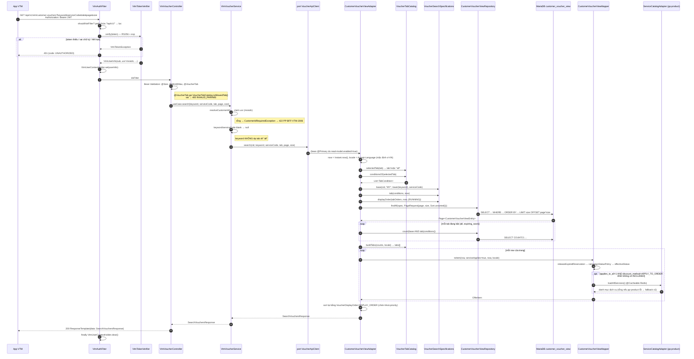
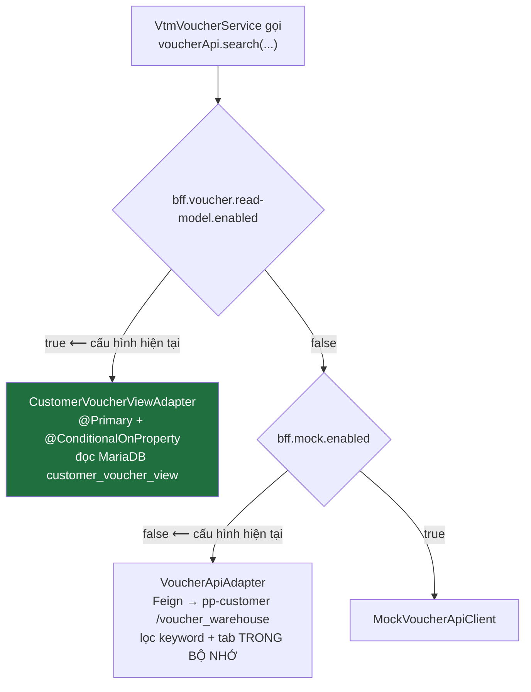
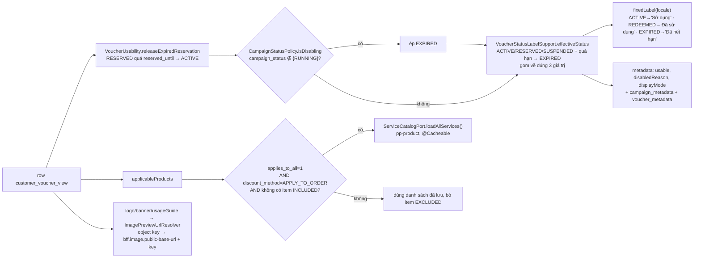
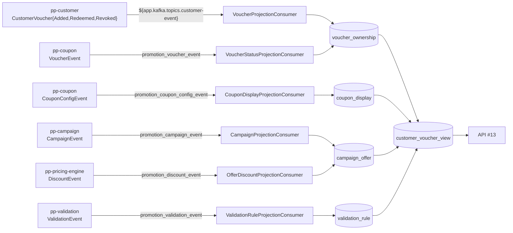

# API #13 — Search Customer Vouchers: luồng xử lý đầy đủ

> `GET /promotion/promotion-vtm-bff/api/v1/vtm/customer-vouchers`
> Entry point: `VtmVoucherController.search` (`adapter/in/web/VtmVoucherController.java:57`)
> Tài liệu dựng theo **cấu hình hiện tại trong `src/main/resources/application.properties`** (profile mặc định, không phải `application-uat.properties`).

---

## 1. Tóm tắt một dòng

Request → `VtmAuthFilter` verify JWT RS256 lấy msisdn từ claim `usr` → `VtmVoucherService` chuẩn hoá tham số → port `VoucherApiClient` → **`CustomerVoucherViewAdapter`** (đang được chọn) đọc thẳng VIEW `customer_voucher_view` trên MariaDB bằng JPA Specification động dựng từ danh mục tab → map sang `OfferItem` → trả `SearchVouchersResponse` bọc trong `ResponseTemplate`.

**Không có lời gọi downstream đồng bộ nào trong luồng chính**, trừ một nhánh phụ (`pp-product`, có cache) chỉ kích hoạt cho voucher áp dụng cho mọi dịch vụ.

---

## 2. Cấu hình quyết định luồng (trích `application.properties`)

| Khoá | Giá trị | Ảnh hưởng |
|---|---|---|
| `spring.application.context-path` | `/promotion/promotion-vtm-bff` | Tiền tố URL của controller |
| `bff.voucher.read-model.enabled` | `true` | **Chọn `CustomerVoucherViewAdapter`** (đọc DB) làm implementation `VoucherApiClient` |
| `bff.mock.enabled` | `false` | `VoucherApiAdapter` (Feign) vẫn được tạo bean nhưng bị `@Primary` của read-model che; `MockVoucherApiClient` không được tạo |
| `bff.vtm.auth.enabled` | `true` | Bật `VtmAuthFilter` |
| `bff.vtm.auth.public-key` | RSA X.509 base64 | Verify chữ ký RS256 |
| `bff.eligible.expire-warning-days` | **không khai → mặc định `7`** | Ngưỡng "sắp hết hạn", đồng thời là `expireWarningDate` echo về client |
| `bff.voucher.search.tabs[*]` | **không khai → dùng `VoucherTabCatalog.builtInDefaults(7)`** | Thanh tab = `all` + `expiring_soon` dựng sẵn trong code |
| `bff.voucher.campaign-usable-statuses` | **không khai → mặc định `RUNNING`** | Chỉ voucher thuộc campaign `RUNNING` được coi là dùng được |
| `bff.image.public-base-url` | `https://api24cdn.vtmoney.vn/promotion-campaign` | Base URL dựng link logo/banner |
| `spring.datasource.url` | MariaDB `sequential://10.208.81.119:4006,...120,...121/promotion_vtm_bff` | Nguồn đọc read model |
| `spring.datasource.hikari.maximum-pool-size` | `20` | Trần đồng thời thực tế của API này |
| `spring.jpa.open-in-view` | `false` | Session đóng khi ra khỏi `@Transactional(readOnly = true)` |
| `app.downstream.product.base-url` | `http://10.207.201.204:8083/uatmm` | `pp-product` cho nhánh `applies_to_all` |
| `promix.cache.redisson.*` | CLUSTER, TTL 30m | Cache danh mục dịch vụ `bff-vtm-service-catalog` |

Ba khoá "không khai" ở trên là điểm dễ hiểu nhầm nhất: hành vi tab và ngưỡng hết hạn **không** đến từ file properties mà từ giá trị mặc định hard-code.

---

## 3. Sơ đồ luồng chính



---

## 4. Chọn implementation của port `VoucherApiClient`



Với `application.properties` hiện tại, **nhánh đang chạy là `CustomerVoucherViewAdapter`**. Hai nhánh còn lại được mô tả ở §10.

---

## 5. Chi tiết từng chặng

### 5.1 `VtmAuthFilter` — xác thực (`adapter/in/web/auth/`)

| Thuộc tính | Nguồn | Giá trị hiệu lực |
|---|---|---|
| Đăng ký | `VtmAuthConfig.vtmAuthFilterRegistration` | urlPatterns `/*`, order `HIGHEST_PRECEDENCE + 10` |
| Path được bảo vệ | `bff.vtm.auth.protected-path-prefixes` (không khai) | `["/api/v1/"]`, so khớp bằng `path.contains(prefix)` |
| Header | `bff.vtm.auth.token-header` | `Authorization` |
| Tiền tố | `bff.vtm.auth.token-prefix` | `Bearer ` |
| Verify issuer | `bff.vtm.auth.verify-issuer` (không khai) | `false` |
| Base64 lenient | `bff.vtm.auth.lenient-base64-signature` (không khai) | `false` |

Thành công → `VtmUserInfo` vào `VtmUserContextHolder` (ThreadLocal), luôn `clear()` ở `finally`.
Thất bại → **401** body `ResponseTemplate{status:401, code:"UNAUTHORIZED", message:"Yêu cầu chưa được xác thực"}`.

### 5.2 Controller — validate tham số

| Tham số | Ràng buộc | Mặc định |
|---|---|---|
| `keyword` | `@Size(max = 255)` | — (null) |
| `serviceCode` | `@Size(max = 64)` | — (null) |
| `tab` | `@Size(max = 32)` + `@VoucherTab` | — (→ tab mặc định `all`) |
| `page` | `@Min(0)` | `0` |
| `size` | `@Min(1) @Max(100)` | `10` |

`@VoucherTab` → `VoucherTabValidator` → `VoucherTabCatalog.isAllowedTab()`: rỗng hoặc thuộc danh mục tab **đang cấu hình** (không hard-code). Vi phạm bất kỳ → `InvalidParamsExceptionHandler` → **400** `{code: "INVALID_PARAMS", errors:[{field, message tiếng Việt}]}`.

### 5.3 `VtmVoucherService` — orchestration mỏng

```
cid              = VtmUserContextHolder.get().msisdn()   // claim "usr", KHÔNG phải "sub"
normalizedKeyword = blank ? null : trim(keyword)          // không có độ dài tối thiểu
normalizedServiceCode = blank ? null : trim(serviceCode)  // "" sẽ tạo LIKE '%,,%' → phải về null
```

Hai điểm hợp đồng cần nhớ:
- **Client không được truyền `customerId`** — luôn lấy từ token.
- **`keyword` không đổi tab.** Trước v1.19 service ép `tab=all` khi có keyword; quy tắc đó đã bỏ.

`msisdn` rỗng → `CustomerIdRequiredException` (extends `BusinessRuleException` của promix) → `PlatformExceptionHandler` → **422** `{code: "PP-BFF-VTM-2006"}`.

### 5.4 `CustomerVoucherViewAdapter.search` — trái tim của API

`@Transactional(readOnly = true)`. Bốn việc, theo thứ tự:

1. **Dựng specification**
   ```
   base     = VoucherSearchSpecifications.base(cid, "MY", lower(keyword), serviceCode)
   selected = base
            AND tab(tabCatalog.conditionsOf(selectedTab), now)
            AND displayOrder(tabOrdersOf(selectedTab), now, campaignStatusPolicy.usableStatuses())
   ```
2. **Truy vấn trang**: `repository.findAll(selected, PageRequest.of(page, size, Sort.unsorted()))`
   `Sort.unsorted()` là **cố ý** — Spring Data sẽ ghi đè `orderBy` của specification nếu `Pageable` mang sort, mà khoá nhóm ưu đãi là biểu thức `CASE` không khai được bằng tên thuộc tính.
3. **Đếm badge**: mỗi tab đang bật = **một câu `COUNT`** trên `base AND tab(conditions của tab đó)` — bỏ qua phân trang và bỏ qua tab đang chọn. Với bộ tab mặc định là **2 câu COUNT + 1 câu SELECT + 1 câu COUNT của `Page`** ⇒ ~4 round-trip DB mỗi request.
4. **Map + sắp lại**: `mapper.toItem(...)` rồi `.sorted(VoucherDisplayOrder.DISPLAY_ORDER)` trên nội dung *một trang* — chỉ để chèn khoá phụ `priority` (parse từ JSON metadata, không có cột).

### 5.5 Mệnh đề WHERE sinh ra

```sql
-- base (luôn có)
customer_source_id = :cid
AND group_type = 'MY'

-- nếu keyword != null  (đã lower-case ở adapter)
AND ( title_normalized         LIKE CONCAT('%', :kw, '%')
   OR merchant_name_normalized LIKE CONCAT('%', :kw, '%')
   OR LOWER(voucher_code)      =  :kw )          -- ⚠ mã voucher khớp TUYỆT ĐỐI

-- nếu serviceCode != null
AND ( applies_to_all = 1 OR applicable_service_codes LIKE CONCAT('%,', :svc, ',%') )
AND ( excluded_service_codes IS NULL
   OR excluded_service_codes NOT LIKE CONCAT('%,', :svc, ',%') )
```

Ký tự đại diện người dùng gõ (`%`, `_`) **không** được thoát — giữ nguyên hành vi của câu JPQL cũ.

Phần tab (bộ mặc định, `expiring_soon`, `now` = thời điểm request, `expireWarningDays` = 7):

```sql
AND expiration_date <= :now + INTERVAL 7 DAY     -- endDate LTE 7 DAYS
AND expiration_date >= :now                      -- endDate GTE 0 DAYS
AND status IN ('ACTIVE','AVAILABLE','PARTIALLY_USED')
AND ( campaign_status IS NULL
   OR campaign_status NOT IN ('INITIALIZING','ACTIVE','ENABLING','DISABLING','UPDATING',
                              'PAUSED','EXPIRED','ERROR','DELETING','DELETED','DISABLED') )
```

Quy ước NULL, do `VoucherSearchSpecifications.toPredicate` áp:
- **Phép khẳng định** (`EQ`/`IN`/`CONTAINS`/so sánh): NULL bị loại theo ngữ nghĩa SQL ba trạng thái. Vì thế tab `expiring_soon` không cần khai `endDate IS NOT NULL` — voucher vô thời hạn tự rớt.
- **Phép loại trừ** (`NEQ`/`NOT_IN`): NULL **được cho qua** (`path IS NULL OR NOT IN (...)`), nếu không thì mọi voucher chưa nhận event trạng thái chiến dịch sẽ biến mất.
- `include-null=true` bọc thêm `OR path IS NULL`, chỉ khai được cho phép khẳng định (`VoucherTabCatalog` chặn từ lúc khởi động).

### 5.6 Mệnh đề ORDER BY sinh ra

`VoucherSearchSpecifications.displayOrder` chỉ áp cho câu SELECT (câu COUNT trả `Long` nên bỏ qua):

```sql
ORDER BY
  /* 1. nhóm ưu đãi — SRS Mức 2, phải là khoá NGOÀI CÙNG */
  CASE
    WHEN campaign_status IS NOT NULL AND TRIM(campaign_status) <> ''
         AND UPPER(campaign_status) NOT IN ('RUNNING')            THEN 3   -- EXPIRED
    WHEN UPPER(status) = 'REDEEMED'                               THEN 2
    WHEN ( UPPER(status) = 'ACTIVE'
        OR (UPPER(status)='RESERVED' AND reserved_until IS NOT NULL AND reserved_until < :now) )
         AND (expiration_date IS NULL OR expiration_date >= :now) THEN 1   -- ACTIVE
    ELSE 3
  END ASC,
  /* 2. voucher vô thời hạn xuống cuối NHÓM (MariaDB xếp NULL lên đầu với ASC) */
  CASE WHEN expiration_date IS NULL THEN 1 ELSE 0 END ASC,
  /* 3. khoá sort của tab — bộ mặc định: endDate ASC */
  expiration_date ASC,
  /* 4. tie-breaker giữ phân trang ổn định */
  created_at DESC
```

Danh sách `('RUNNING')` đến thẳng từ `bff.voucher.campaign-usable-statuses` — cùng một nguồn với `CampaignStatusPolicy` mà mapper dùng, để thứ tự SQL không lệch trạng thái khách nhìn thấy.

> **Lưu ý về tính đúng của phân trang:** thứ tự nhóm được dựng ở SQL nên phân trang đúng trên toàn tập (PROM-1398). Nhưng comparator `VoucherDisplayOrder.DISPLAY_ORDER` chạy lại **trong phạm vi một trang** để chèn `priority`; nếu `priority` phân biệt được hai hàng mà SQL coi là bằng nhau, thứ tự giữa các trang có thể không nhất quán tuyệt đối.

---

## 6. Danh mục tab

Vì `bff.voucher.search.tabs[*]` không được khai, `VoucherTabCatalog` dùng `builtInDefaults(7)`:

| code | default | order | filter | sort |
|---|---|---|---|---|
| `all` | ✅ | 1 | (không có) | `endDate ASC` |
| `expiring_soon` | | 2 | `endDate LTE 7 DAYS`, `endDate GTE 0 DAYS`, `status IN (ACTIVE,AVAILABLE,PARTIALLY_USED)`, `campaignStatus NOT_IN (11 trạng thái)` | `endDate ASC` |

Nếu về sau có khai cấu hình, `VoucherTabCatalog` validate **ngay trong constructor**:
- `code` bắt buộc, không trùng; `label-i18n` không rỗng
- đúng **một** tab `default-tab=true`, và tab đó phải `enabled=true`
- `field` phải thuộc whitelist `TabField` (14 field), `operator` thuộc `TabOperator` (9 toán tử), và operator phải hợp kiểu với field
- `unit` chỉ nhận `DAYS` và chỉ cho field kiểu `INSTANT`
- `include-null` không dùng với `NEQ`/`NOT_IN`
- `value` phải parse được ngay lúc khởi động

Cấu hình sai → ném `IllegalStateException`, **nhưng** `VoucherTabCatalog` bắt lại (`catch (Exception)`) và lùi về bộ mặc định kèm `log.warn`, nên service vẫn start. `VoucherSearchPropertiesConfig` cũng bind thủ công có try-catch vì cú pháp placeholder `-${...}` làm Spring Cloud Config trên staging vỡ.

`TabField` là ranh giới an toàn: tên field trong properties không bao giờ đi thẳng vào câu query (Criteria API luôn bind tham số), và chỉ trỏ được vào cột đã whitelist.

---

## 7. Map row → `OfferItem` (`CustomerVoucherViewMapper.toItem`)



Chi tiết đáng nhớ:
- `expiredTimeNumber = ChronoUnit.DAYS.between(now, expiration_date)` — **có thể âm** với voucher đã hết hạn.
- `voucher.id` phơi ra là `voucher_id`; nhưng #01/#13 ở nơi khác phơi `campaign_id`, nên API #12 phải tra cả hai (xem `findByCustomerSourceIdAndVoucherId` → fallback `findFirstByCustomerSourceIdAndCampaignIdOrderByCreatedAtDesc`).
- `serviceApplies` luôn `true` ở #13 vì `serviceCode` đã được lọc ở SQL.
- Ngày tháng format theo `Asia/Ho_Chi_Minh` (`ISO_LOCAL`, `dd/MM/yyyy`, `dd/MM/yyyy HH:mm:ss`) dù `spring.jackson.time-zone=UTC` — hai thứ độc lập, vì mapper tự format ra `String`.
- `guideline` trả về **đoạn HTML** đã bọc thẻ (`UsageGuideHtmlRenderer`), không phải link ảnh (PROM-1419).

Locale: `VtmLocaleConfig` đặt `AcceptHeaderLocaleResolver` với default `vi-VN` và chỉ hỗ trợ `vi-VN`/`en-US` — không có bean này thì máy chủ locale `en` sẽ trả nhãn tiếng Anh cho request không gửi `Accept-Language`.

---

## 8. Response

`@ResponseWrapper` trên controller → toàn bộ `SearchVouchersResponse` nằm trong `data` của `ResponseTemplate`:

```jsonc
{
  "status": 200, "code": "...", "success": true, "message": "...", "timestamp": "...",
  "data": {
    "keyword": "...",            // echo
    "serviceCode": null,         // echo, LUÔN serialize kể cả null
    "expireWarningDate": 7,      // = bff.eligible.expire-warning-days
    "defaultTab": "all",
    "selectedTab": "all",
    "tabs": [
      { "code": "all", "label": "Tất cả", "labelI18n": {...}, "default": true,
        "order": 1, "count": 42, "sort": [{"field":"endDate","direction":"ASC"}] },
      { "code": "expiring_soon", "label": "Sắp hết hạn", "default": false, "order": 2,
        "count": 3,
        "filter": { "conditions": [
          {"field":"endDate","operator":"LTE","value":"7","unit":"DAYS"},
          {"field":"endDate","operator":"GTE","value":"0","unit":"DAYS"},
          {"field":"status","operator":"IN","value":"ACTIVE,AVAILABLE,PARTIALLY_USED"},
          {"field":"campaignStatus","operator":"NOT_IN","value":"INITIALIZING,..."} ] },
        "sort": [{"field":"endDate","direction":"ASC"}] }
    ],
    "content": [ /* OfferItem[] — cùng khuôn với data của API #12 */ ],
    "pageable": {...}, "totalElements": 42, "totalPages": 5,
    "first": true, "last": false, "size": 10, "number": 0,
    "numberOfElements": 10, "empty": false, "sort": {...}
  }
}
```

`tabs[].filter` được echo từ **chính** `TabCondition` đang thực thi (`toFilterCondition()`), nên mô tả gửi client không thể lệch với query.

---

## 9. Bảng lỗi

| Tình huống | Nơi phát sinh | HTTP | `code` |
|---|---|---|---|
| Thiếu / sai tiền tố / rỗng header `Authorization` | `VtmAuthFilter` | 401 | `UNAUTHORIZED` |
| Token sai chữ ký / hết hạn / sai định dạng / sai issuer | `VtmTokenVerifier` | 401 | `UNAUTHORIZED` |
| `tab` ngoài danh mục, `size` > 100, `page` < 0, `keyword` > 255 ký tự… | `InvalidParamsExceptionHandler` | 400 | `INVALID_PARAMS` (+ `errors[]`) |
| Token hợp lệ nhưng claim `usr` rỗng | `VtmVoucherService.resolveCustomerId` | 422 | `PP-BFF-VTM-2006` |
| Khách chưa có voucher nào | — | 200 | `content: []`, `empty: true`, badge = 0 |
| Endpoint không tồn tại | `EndpointNotFoundExceptionHandler` | 404 | — |

**Không có nhánh `CUSTOMER_NOT_FOUND`** ở #13: `customer_voucher_view` là kho voucher, không phải danh bạ khách. Danh tính đã do filter xác thực; không có dòng nào = ví rỗng.

**Không có rate limit** trên đường này (xem phân tích riêng): không filter throttle, `@RateLimiter` của promix chưa có aspect. Trần đồng thời thực tế chỉ là Hikari pool 20 kết nối.

---

## 10. Hai nhánh thay thế (không chạy với cấu hình hiện tại)

### `VoucherApiAdapter` — khi `bff.voucher.read-model.enabled=false`
Gọi `CustomerVoucherFeignClient.listVouchers(customerId, "available", null, page, size)` sang **pp-customer** (`voucher_warehouse`), rồi lọc keyword + tab **trong bộ nhớ, chỉ trên trang đã lấy về**. Hệ quả đã biết:
- `totalElements` lấy từ downstream (chưa lọc) nhưng `content` đã lọc → tổng và nội dung không khớp.
- Badge `expiring_soon` đếm trên trang hiện tại, `all` = tổng downstream.
- Keyword khớp một phần trên `title`/`brand.name`/`content`/`description` — **khác** hẳn read model (mã voucher khớp tuyệt đối, khớp trên cột normalized).
- Dùng `VoucherSearchSupport` (tab hard-code `all`/`expiring_soon`), **không** đọc `VoucherTabCatalog`, nên cấu hình tab không có tác dụng ở nhánh này.
- Feign lỗi → nuốt, trả trang rỗng.

### `MockVoucherApiClient` — khi `bff.mock.enabled=true`
Dữ liệu tĩnh cho local dev.

---

## 11. Read model đến từ đâu

VIEW `customer_voucher_view` (changeset `020-validation-order-bounds.xml`):

```sql
FROM voucher_ownership o
LEFT JOIN campaign_offer  ofr ON ofr.campaign_id    = o.campaign_id
LEFT JOIN coupon_display  d   ON d.coupon_config_id = o.coupon_config_id
LEFT JOIN validation_rule vr  ON vr.rule_id         = ofr.validation_rule_id
```

Cột quan trọng cho #13: `title_normalized` / `merchant_name_normalized` (từ `coupon_display`), `expiration_date = COALESCE(o.expiration_date, ofr.expiration_date)`, `campaign_status` / `applicable_service_codes` / `excluded_service_codes` / `applies_to_all` (từ `campaign_offer`), `status` / `reserved_until` / `redeemed_at` / `created_at` (từ `voucher_ownership`).

Bốn bảng gốc được nuôi bằng Kafka projection (`app.kafka.groups.bff-projection = promotion-vtm-bff`):



Nghĩa là: **độ trễ và độ đầy đủ của #13 phụ thuộc hoàn toàn vào projection**, không phụ thuộc downstream lúc đọc. Một chiến dịch vừa đổi trạng thái mà event chưa tới thì `campaign_status` vẫn là giá trị cũ và voucher vẫn hiện theo giá trị cũ.

---

## 12. Module liên quan — trạng thái clone

Toàn bộ module cần để hiểu luồng #13 **đã có sẵn trong workspace**, không cần clone thêm:

| Vai trò trong luồng #13 | Repo | Có sẵn |
|---|---|---|
| BFF, chủ thể của API | `p2_promotion-vtm-bff` | ✅ |
| Starter `@ResponseWrapper`, `ResponseTemplate`, `PlatformExceptionHandler`, `BusinessRuleException`, cache Redisson | `p2_promotion-promix-platform` | ✅ |
| Hợp đồng event Avro/POJO (`customer.event`, `coupon.event`, `campaign.event`, `couponconfig.event`, `pricingengine.event`, `validation.event`) | `p2_schema-service` | ✅ |
| Nguồn `voucher_ownership` (event `CustomerVoucher*`) + nhánh Feign dự phòng `voucher_warehouse` | `p2_promotion-customer` | ✅ |
| Nguồn `coupon_display` + trạng thái mã voucher | `p2_promotion-coupon` | ✅ |
| Nguồn `campaign_offer` (`campaign_status`, service codes, `applies_to_all`) | `p2_promotion-campaign` | ✅ |
| Nguồn `discount_*` của `campaign_offer` (`DiscountEvent`) | `p2_promotion-discount` | ✅ |
| Nguồn `validation_rule` (`vr_min_order_value`, `vr_max_order_value`) | `p2_promotion-validation` | ✅ |
| `ServiceCatalogPort` — bung `applicableProducts` cho voucher `applies_to_all` | `p2_promotion-product` | ✅ |

Không nằm trong luồng #13 (chỉ dùng cho API #01/#03/#12): `p2_promotion-redemption`.

**Thứ thực sự thiếu không phải repo Java mà là cấu hình ngoài repo:**

1. **`app.kafka.topics.customer-event` không được khai ở bất kỳ file properties nào trong repo**, trong khi `VoucherProjectionConsumer` dùng nó làm `topics`. Giá trị này phải đến từ Spring Cloud Config / biến môi trường bên ngoài; thiếu nó thì consumer không resolve được placeholder. Cần file cấu hình của config server (hoặc manifest Swarm/K8s) để đối chiếu.
2. **Định nghĩa SQL thật của VIEW trên môi trường**: `spring.liquibase.enabled=false`, nên changelog trong repo chỉ là mô tả, không phải thứ đang chạy. Muốn chắc chắn thì `SHOW CREATE VIEW customer_voucher_view` trên `promotion_vtm_bff`.
3. **Spec nghiệp vụ `13-search-customer-vouchers.md`** được trích dẫn khắp code (§4.2, §6.2, §6.7, §7.2, SRS `PRM_KBNV_MOB_001`) nhưng không có trong `docs/`. Có file này thì đối chiếu được hợp đồng tab/sort.

---

## 13. Quan sát trong lúc đọc code

- **Số câu truy vấn tăng tuyến tính theo số tab**: mỗi tab cấu hình thêm là thêm một câu `COUNT` trên toàn tập của khách, mỗi request. Bộ mặc định 2 tab đã là ~4 round-trip.
- **`@CircuitBreaker` / `@Retry` của resilience4j trong `VoucherApiAdapter` không có aspect** (repo chỉ kéo `resilience4j-annotations`, thiếu `resilience4j-spring-boot3`), nên block `resilience4j.*` trong `application.properties` không được bind. Điều này chỉ ảnh hưởng nhánh Feign — nhánh đang chạy (read model) không dùng tới.
- **`LIKE '%kw%'` trên `title_normalized` / `merchant_name_normalized`** không dùng được index tiền tố. Với `customer_source_id` đã lọc trước thì tập quét nhỏ, nhưng đây là điểm cần theo dõi khi một khách giữ nhiều voucher.
- **`groupRank` ở SQL và `VoucherDisplayOrder.groupOf` + `VoucherStatusLabelSupport.effectiveStatus` ở Java là hai bản sao của cùng một luật.** Javadoc đã cảnh báo "lệch một vế thì thứ tự SQL không khớp trạng thái khách nhìn thấy" — mọi thay đổi phải sửa đồng thời hai nơi.
- **Javadoc của `VoucherTabCatalog` nói ngược với code**: phần mở đầu khẳng định "cấu hình sai làm service **không start**", nhưng constructor bọc `validate(...)` trong `try/catch (Exception)` và lùi về bộ tab mặc định kèm `log.warn`. Hành vi thật là fail-soft, không fail-fast — một cấu hình tab sai sẽ đi vào production dưới dạng "thanh tab bỗng quay về mặc định" chứ không phải một lần start hỏng.
